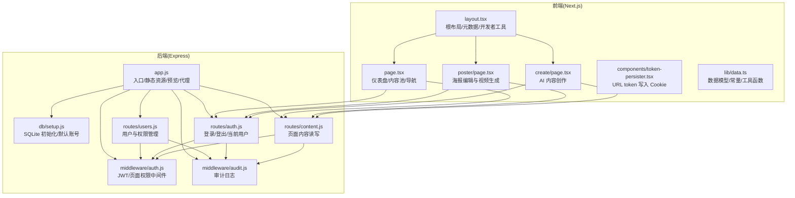
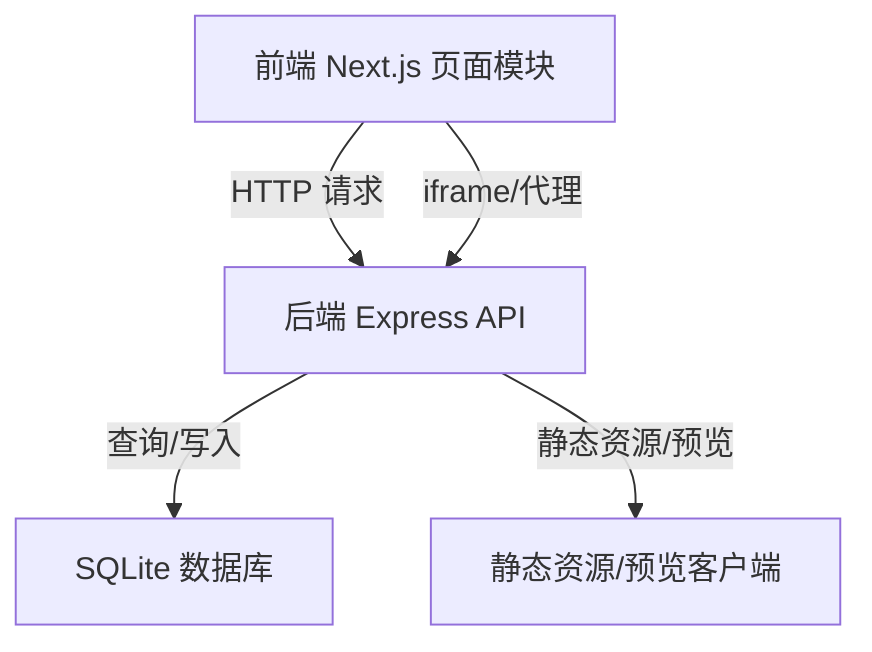
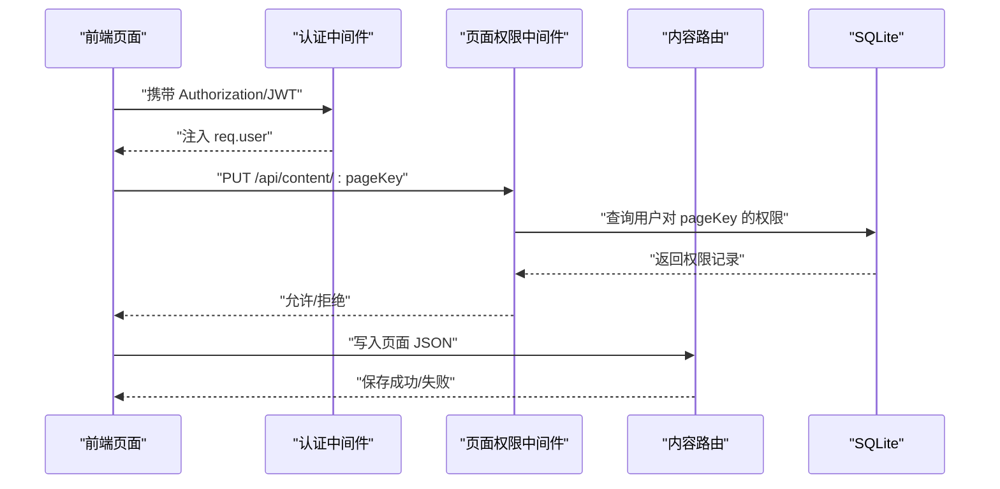
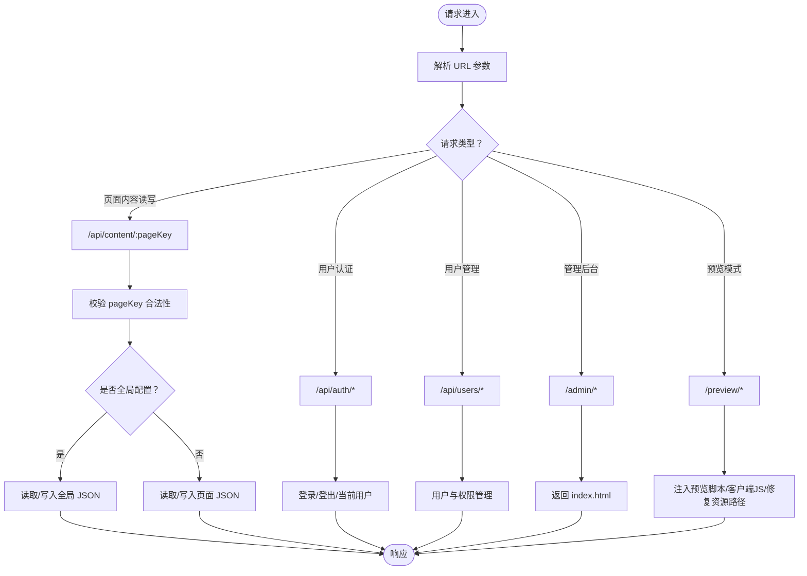
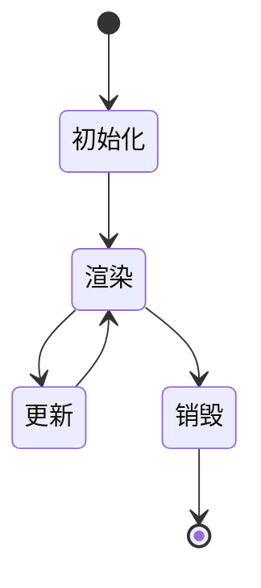
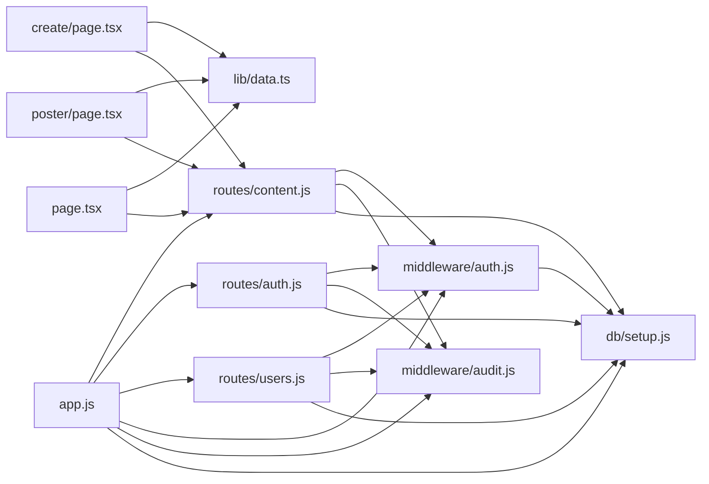

# 页面模块管理

<cite>
**本文引用的文件**
- [ai-content-project/src/app/page.tsx](file://ai-content-project/src/app/page.tsx)
- [ai-content-project/src/app/layout.tsx](file://ai-content-project/src/app/layout.tsx)
- [ai-content-project/src/app/create/page.tsx](file://ai-content-project/src/app/create/page.tsx)
- [ai-content-project/src/app/poster/page.tsx](file://ai-content-project/src/app/poster/page.tsx)
- [ai-content-project/src/lib/data.ts](file://ai-content-project/src/lib/data.ts)
- [ai-content-project/src/components/token-persister.tsx](file://ai-content-project/src/components/token-persister.tsx)
- [business-core/cms-server/app.js](file://business-core/cms-server/app.js)
- [business-core/cms-server/middleware/auth.js](file://business-core/cms-server/middleware/auth.js)
- [business-core/cms-server/routes/content.js](file://business-core/cms-server/routes/content.js)
- [business-core/cms-server/routes/auth.js](file://business-core/cms-server/routes/auth.js)
- [business-core/cms-server/routes/users.js](file://business-core/cms-server/routes/users.js)
- [business-core/cms-server/middleware/audit.js](file://business-core/cms-server/middleware/audit.js)
- [business-core/cms-server/db/setup.js](file://business-core/cms-server/db/setup.js)
</cite>

## 目录
1. [简介](#简介)
2. [项目结构](#项目结构)
3. [核心组件](#核心组件)
4. [架构总览](#架构总览)
5. [详细组件分析](#详细组件分析)
6. [依赖关系分析](#依赖关系分析)
7. [性能考量](#性能考量)
8. [故障排查指南](#故障排查指南)
9. [结论](#结论)
10. [附录](#附录)

## 简介
本文件面向“页面模块管理系统”，围绕以下主题展开：
- 页面模块的定义与组织：前端 Next.js 页面路由、模块配置结构、动态加载与生命周期。
- 权限控制体系：页面级权限验证、角色访问控制、操作权限管理。
- 动态路由生成：URL 映射、路由参数解析、嵌套路由处理。
- 生命周期管理：初始化、渲染、更新、销毁。
- 模块扩展与自定义页面类型：如何新增页面类型与模块。

本系统采用前后端分离：
- 前端：Next.js 应用，负责页面渲染、交互与动态内容生成。
- 后端：Express 服务，提供认证、权限校验、页面内容读写、审计日志与静态资源托管。

## 项目结构
- 前端应用位于 ai-content-project，包含页面路由、UI 组件、工具函数与样式。
- 后端应用位于 business-core/cms-server，包含路由、中间件、数据库初始化与审计日志。

图表来源
- [ai-content-project/src/app/layout.tsx:15-33](file://ai-content-project/src/app/layout.tsx#L15-L33)
- [ai-content-project/src/app/page.tsx:45-197](file://ai-content-project/src/app/page.tsx#L45-L197)
- [ai-content-project/src/app/create/page.tsx:59-760](file://ai-content-project/src/app/create/page.tsx#L59-L760)
- [ai-content-project/src/app/poster/page.tsx:203-800](file://ai-content-project/src/app/poster/page.tsx#L203-L800)
- [ai-content-project/src/components/token-persister.tsx:15-37](file://ai-content-project/src/components/token-persister.tsx#L15-L37)
- [ai-content-project/src/lib/data.ts:1-218](file://ai-content-project/src/lib/data.ts#L1-L218)
- [business-core/cms-server/app.js:15-315](file://business-core/cms-server/app.js#L15-L315)
- [business-core/cms-server/middleware/auth.js:21-85](file://business-core/cms-server/middleware/auth.js#L21-L85)
- [business-core/cms-server/middleware/audit.js:22-74](file://business-core/cms-server/middleware/audit.js#L22-L74)
- [business-core/cms-server/db/setup.js:14-110](file://business-core/cms-server/db/setup.js#L14-L110)
- [business-core/cms-server/routes/content.js:48-101](file://business-core/cms-server/routes/content.js#L48-L101)
- [business-core/cms-server/routes/auth.js:22-96](file://business-core/cms-server/routes/auth.js#L22-L96)
- [business-core/cms-server/routes/users.js:26-151](file://business-core/cms-server/routes/users.js#L26-L151)

章节来源
- [ai-content-project/src/app/layout.tsx:15-33](file://ai-content-project/src/app/layout.tsx#L15-L33)
- [business-core/cms-server/app.js:15-315](file://business-core/cms-server/app.js#L15-L315)

## 核心组件
- 前端页面模块
  - 根布局与元数据：负责全局样式、开发者工具与子组件挂载。
  - 仪表盘页面：内容池展示、搜索过滤、状态统计与操作入口。
  - AI 内容创作页面：聊天式交互、快捷提示词、文章/海报两种内容类型生成与使用。
  - 海报编辑页面：可视化编辑、背景图/音频、截图与视频生成。
  - 数据与工具：统一的数据模型、颜色映射、标签生成等。
  - Token 持久化：从 URL 参数读取 token 并写入 Cookie，解决 iframe 场景下的认证传递问题。
- 后端服务
  - 应用入口：静态资源托管、预览模式、JWT 代理、管理后台兜底路由。
  - 认证中间件：JWT 校验、超级管理员校验、页面权限校验。
  - 路由层：内容读写、登录/登出/当前用户、用户与权限管理。
  - 审计日志：写入审计日志表，支持自动拦截写操作。
  - 数据库初始化：SQLite 表结构、默认超级管理员与权限分配。

章节来源
- [ai-content-project/src/app/layout.tsx:15-33](file://ai-content-project/src/app/layout.tsx#L15-L33)
- [ai-content-project/src/app/page.tsx:45-197](file://ai-content-project/src/app/page.tsx#L45-L197)
- [ai-content-project/src/app/create/page.tsx:59-760](file://ai-content-project/src/app/create/page.tsx#L59-L760)
- [ai-content-project/src/app/poster/page.tsx:203-800](file://ai-content-project/src/app/poster/page.tsx#L203-L800)
- [ai-content-project/src/lib/data.ts:1-218](file://ai-content-project/src/lib/data.ts#L1-L218)
- [ai-content-project/src/components/token-persister.tsx:15-37](file://ai-content-project/src/components/token-persister.tsx#L15-L37)
- [business-core/cms-server/app.js:15-315](file://business-core/cms-server/app.js#L15-L315)
- [business-core/cms-server/middleware/auth.js:21-85](file://business-core/cms-server/middleware/auth.js#L21-L85)
- [business-core/cms-server/routes/content.js:48-101](file://business-core/cms-server/routes/content.js#L48-L101)
- [business-core/cms-server/routes/auth.js:22-96](file://business-core/cms-server/routes/auth.js#L22-L96)
- [business-core/cms-server/routes/users.js:26-151](file://business-core/cms-server/routes/users.js#L26-L151)
- [business-core/cms-server/middleware/audit.js:22-74](file://business-core/cms-server/middleware/audit.js#L22-L74)
- [business-core/cms-server/db/setup.js:14-110](file://business-core/cms-server/db/setup.js#L14-L110)

## 架构总览
系统采用“前端页面模块 + 后端 API 服务”的分层架构：
- 前端 Next.js 页面模块通过路由组织，使用 Suspense、状态管理与本地存储实现动态加载与渲染。
- 后端 Express 路由通过中间件完成认证与权限校验，读写页面 JSON 配置与用户权限数据。
- 预览模式与代理机制支持 iframe 场景下的认证与资源访问。

图表来源
- [business-core/cms-server/app.js:15-315](file://business-core/cms-server/app.js#L15-L315)
- [business-core/cms-server/routes/content.js:48-101](file://business-core/cms-server/routes/content.js#L48-L101)
- [business-core/cms-server/db/setup.js:14-110](file://business-core/cms-server/db/setup.js#L14-L110)

## 详细组件分析

### 页面模块定义与组织
- 页面路由组织
  - 仪表盘：/（page.tsx），负责内容池展示与导航。
  - AI 创作：/create（create/page.tsx），支持文章与海报两种类型。
  - 海报编辑：/poster（poster/page.tsx），可视化编辑与视频生成。
  - 其他页面：/logs、/article 等（在前端目录中存在对应 page.tsx 文件）。
- 模块配置结构
  - 页面内容以 JSON 存储于后端 content 目录，键为 pageKey（如 home、visa、saudi-visa 等）。
  - 全局配置（nav/footer/consultation）与页面配置分离，便于权限控制与批量管理。
- 动态加载机制
  - 前端通过 Next.js 路由懒加载页面组件；部分功能（如海报视频生成）采用惰性加载第三方库（如 ffmpeg.wasm）。
  - Token 持久化组件在客户端读取 URL 参数中的 token 并写入 Cookie，保证后续导航的认证有效性。

章节来源
- [ai-content-project/src/app/page.tsx:45-197](file://ai-content-project/src/app/page.tsx#L45-L197)
- [ai-content-project/src/app/create/page.tsx:59-760](file://ai-content-project/src/app/create/page.tsx#L59-L760)
- [ai-content-project/src/app/poster/page.tsx:203-800](file://ai-content-project/src/app/poster/page.tsx#L203-L800)
- [business-core/cms-server/routes/content.js:28-65](file://business-core/cms-server/routes/content.js#L28-L65)
- [ai-content-project/src/components/token-persister.tsx:15-37](file://ai-content-project/src/components/token-persister.tsx#L15-L37)

### 权限控制系统
- 角色与页面权限
  - 角色：super_admin（超级管理员）、editor（编辑者）。
  - 页面权限：page_permissions 表记录用户对各 pageKey 的授权。
  - 默认超级管理员：首次初始化自动创建 admin 账号并授予所有页面权限。
- 页面级权限验证
  - requirePagePerm(pageKey) 中间件：校验用户是否具备某页面编辑权限。
  - 内容写入路由在非超级管理员时调用该中间件进行权限校验。
- 操作权限管理
  - 用户管理路由仅超级管理员可访问，支持新建账号、重置密码、修改页面权限。
  - 审计日志记录关键操作（登录、创建用户、重置密码、更新权限、更新页面/全局配置）。

图表来源
- [business-core/cms-server/middleware/auth.js:21-63](file://business-core/cms-server/middleware/auth.js#L21-L63)
- [business-core/cms-server/routes/content.js:68-101](file://business-core/cms-server/routes/content.js#L68-L101)
- [business-core/cms-server/routes/users.js:107-133](file://business-core/cms-server/routes/users.js#L107-L133)
- [business-core/cms-server/db/setup.js:72-104](file://business-core/cms-server/db/setup.js#L72-L104)

章节来源
- [business-core/cms-server/middleware/auth.js:21-85](file://business-core/cms-server/middleware/auth.js#L21-L85)
- [business-core/cms-server/routes/content.js:37-101](file://business-core/cms-server/routes/content.js#L37-L101)
- [business-core/cms-server/routes/users.js:26-151](file://business-core/cms-server/routes/users.js#L26-L151)
- [business-core/cms-server/db/setup.js:14-110](file://business-core/cms-server/db/setup.js#L14-L110)

### 动态路由生成与参数解析
- URL 映射
  - 前端 Next.js 页面通过文件系统路由自动映射到 /create、/poster 等路径。
  - 后端 Express 路由通过 app.use 注册 /api/auth、/api/users、/api/content、/api/logs、/api/ai-channels 等。
- 路由参数解析
  - /api/content/:pageKey：解析 pageKey，区分全局配置与页面配置，校验合法值。
  - /poster 页面接收 pageCount、ratio、source、title 等参数，用于海报生成与预览。
- 嵌套路由处理
  - 后端管理后台 SPA 路由兜底：/admin/* 返回 index.html，交由前端处理。
  - 预览模式：/preview/* 将前端 HTML 注入预览脚本与客户端 JS，并修复资源相对路径。

图表来源
- [business-core/cms-server/routes/content.js:48-101](file://business-core/cms-server/routes/content.js#L48-L101)
- [business-core/cms-server/routes/auth.js:22-96](file://business-core/cms-server/routes/auth.js#L22-L96)
- [business-core/cms-server/routes/users.js:26-151](file://business-core/cms-server/routes/users.js#L26-L151)
- [business-core/cms-server/app.js:155-231](file://business-core/cms-server/app.js#L155-L231)
- [business-core/cms-server/app.js:103-153](file://business-core/cms-server/app.js#L103-L153)

章节来源
- [business-core/cms-server/routes/content.js:28-101](file://business-core/cms-server/routes/content.js#L28-L101)
- [business-core/cms-server/app.js:155-231](file://business-core/cms-server/app.js#L155-L231)

### 页面模块生命周期管理
- 初始化
  - 前端：RootLayout 设置元数据、开发者工具与 Token 持久化组件挂载。
  - 后端：启动时初始化数据库，创建表结构与默认超级管理员。
- 渲染
  - 仪表盘：根据 Cookie 渲染用户信息，过滤与搜索内容项，展示统计卡片与内容池。
  - AI 创作：根据 URL tab 参数预填提示词，支持快捷提示词与类型切换。
  - 海报编辑：从 sessionStorage 读取预排版数据，支持背景图上传与音频生成。
- 更新
  - 页面内容更新：PUT /api/content/:pageKey，非超级管理员需具备页面权限。
  - 用户权限更新：PUT /api/users/:id/permissions，仅超级管理员可操作。
- 销毁/清理
  - 海报编辑：生成视频后释放 URL 对象，清理临时文件。
  - Token 持久化：仅在必要时写入 Cookie，避免重复写入。

图表来源
- [ai-content-project/src/app/layout.tsx:15-33](file://ai-content-project/src/app/layout.tsx#L15-L33)
- [business-core/cms-server/db/setup.js:14-110](file://business-core/cms-server/db/setup.js#L14-L110)
- [ai-content-project/src/app/page.tsx:45-197](file://ai-content-project/src/app/page.tsx#L45-L197)
- [ai-content-project/src/app/create/page.tsx:59-760](file://ai-content-project/src/app/create/page.tsx#L59-L760)
- [ai-content-project/src/app/poster/page.tsx:203-800](file://ai-content-project/src/app/poster/page.tsx#L203-L800)

章节来源
- [ai-content-project/src/app/layout.tsx:15-33](file://ai-content-project/src/app/layout.tsx#L15-L33)
- [business-core/cms-server/db/setup.js:14-110](file://business-core/cms-server/db/setup.js#L14-L110)
- [ai-content-project/src/app/page.tsx:45-197](file://ai-content-project/src/app/page.tsx#L45-L197)
- [ai-content-project/src/app/create/page.tsx:59-760](file://ai-content-project/src/app/create/page.tsx#L59-L760)
- [ai-content-project/src/app/poster/page.tsx:203-800](file://ai-content-project/src/app/poster/page.tsx#L203-L800)

### 模块扩展机制与自定义页面类型
- 新增页面类型
  - 在前端 Next.js 中新增 page.tsx 文件，即可自动成为页面路由。
  - 在后端 content/global 与 content/pages 下新增对应的 JSON 文件，或通过 /api/content 接口写入。
- 权限与角色
  - 为新页面定义 pageKey，并在数据库中为用户授予相应权限。
  - 超级管理员可绕过页面权限限制。
- 审计与安全
  - 所有写操作均记录审计日志，便于追踪与合规。
  - 认证与权限中间件贯穿所有写操作路由。

章节来源
- [business-core/cms-server/routes/content.js:28-101](file://business-core/cms-server/routes/content.js#L28-L101)
- [business-core/cms-server/middleware/auth.js:21-63](file://business-core/cms-server/middleware/auth.js#L21-L63)
- [business-core/cms-server/middleware/audit.js:22-74](file://business-core/cms-server/middleware/audit.js#L22-L74)
- [business-core/cms-server/db/setup.js:72-104](file://business-core/cms-server/db/setup.js#L72-L104)

## 依赖关系分析
- 前端依赖
  - Next.js 路由与客户端状态管理（useState/useEffect/useRouter/useSearchParams）。
  - UI 组件库（Button、Input、Card、Badge 等）。
  - 第三方库：html2canvas、JSZip、@ffmpeg/ffmpeg、@ffmpeg/util。
- 后端依赖
  - Express、better-sqlite3、jsonwebtoken、bcrypt、multer、http-proxy-middleware。
  - 中间件：认证、审计、权限校验。
- 关系图

图表来源
- [ai-content-project/src/app/create/page.tsx:59-760](file://ai-content-project/src/app/create/page.tsx#L59-L760)
- [ai-content-project/src/app/poster/page.tsx:203-800](file://ai-content-project/src/app/poster/page.tsx#L203-L800)
- [ai-content-project/src/app/page.tsx:45-197](file://ai-content-project/src/app/page.tsx#L45-L197)
- [ai-content-project/src/lib/data.ts:1-218](file://ai-content-project/src/lib/data.ts#L1-L218)
- [business-core/cms-server/routes/content.js:48-101](file://business-core/cms-server/routes/content.js#L48-L101)
- [business-core/cms-server/routes/auth.js:22-96](file://business-core/cms-server/routes/auth.js#L22-L96)
- [business-core/cms-server/routes/users.js:26-151](file://business-core/cms-server/routes/users.js#L26-L151)
- [business-core/cms-server/middleware/auth.js:21-85](file://business-core/cms-server/middleware/auth.js#L21-L85)
- [business-core/cms-server/middleware/audit.js:22-74](file://business-core/cms-server/middleware/audit.js#L22-L74)
- [business-core/cms-server/db/setup.js:14-110](file://business-core/cms-server/db/setup.js#L14-L110)
- [business-core/cms-server/app.js:15-315](file://business-core/cms-server/app.js#L15-L315)

章节来源
- [ai-content-project/src/app/create/page.tsx:59-760](file://ai-content-project/src/app/create/page.tsx#L59-L760)
- [ai-content-project/src/app/poster/page.tsx:203-800](file://ai-content-project/src/app/poster/page.tsx#L203-L800)
- [ai-content-project/src/app/page.tsx:45-197](file://ai-content-project/src/app/page.tsx#L45-L197)
- [ai-content-project/src/lib/data.ts:1-218](file://ai-content-project/src/lib/data.ts#L1-L218)
- [business-core/cms-server/routes/content.js:48-101](file://business-core/cms-server/routes/content.js#L48-L101)
- [business-core/cms-server/routes/auth.js:22-96](file://business-core/cms-server/routes/auth.js#L22-L96)
- [business-core/cms-server/routes/users.js:26-151](file://business-core/cms-server/routes/users.js#L26-L151)
- [business-core/cms-server/middleware/auth.js:21-85](file://business-core/cms-server/middleware/auth.js#L21-L85)
- [business-core/cms-server/middleware/audit.js:22-74](file://business-core/cms-server/middleware/audit.js#L22-L74)
- [business-core/cms-server/db/setup.js:14-110](file://business-core/cms-server/db/setup.js#L14-L110)
- [business-core/cms-server/app.js:15-315](file://business-core/cms-server/app.js#L15-L315)

## 性能考量
- 前端
  - 图片与视频生成采用惰性加载与异步处理，避免阻塞主线程。
  - html2canvas 截图使用较高 scale，注意内存占用；生成完成后及时释放 URL 对象。
  - ffmpeg.wasm 按需加载，减少初始包体积。
- 后端
  - 静态资源启用禁用缓存策略，确保预览客户端与 HTML 的实时性。
  - JWT 令牌有效期为 7 天，降低频繁刷新成本。
  - 审计日志采用异步写入，避免阻塞响应。
- 数据库
  - SQLite 事务批量插入页面权限，提升初始化与权限更新效率。

[本节为通用指导，不涉及具体文件分析]

## 故障排查指南
- 认证相关
  - 401 未提供认证令牌：检查 Authorization 头或 Cookie 是否包含有效 token。
  - 401 令牌已失效：检查 JWT 过期时间与签名密钥。
  - 403 无页面编辑权限：确认用户角色与 page_permissions 表记录。
- 预览与代理
  - iframe 场景 401：确认 URL 参数 token 已写入 Cookie，且代理转发包含 Cookie。
  - 预览页面资源路径异常：检查 /preview/* 路由对资源路径的修复逻辑。
- 写入失败
  - 写入页面 JSON 失败：检查文件权限与磁盘空间；查看后端错误响应。
  - 用户权限更新失败：确认 permissions 为数组且非超级管理员不可删除自身账号。

章节来源
- [business-core/cms-server/middleware/auth.js:21-63](file://business-core/cms-server/middleware/auth.js#L21-L63)
- [business-core/cms-server/app.js:168-225](file://business-core/cms-server/app.js#L168-L225)
- [business-core/cms-server/routes/content.js:68-101](file://business-core/cms-server/routes/content.js#L68-L101)
- [business-core/cms-server/routes/users.js:135-151](file://business-core/cms-server/routes/users.js#L135-L151)

## 结论
本系统通过前后端协作实现了页面模块的完整生命周期管理：从页面路由与配置结构，到权限控制与动态加载，再到审计与扩展机制。前端以 Next.js 为核心，后端以 Express 为基础，配合 SQLite 数据库存储与 JWT 认证，形成稳定、可扩展的内容生产与分发体系。建议在生产环境中强化密钥管理、监控与备份策略，并持续完善权限与审计能力。

[本节为总结性内容，不涉及具体文件分析]

## 附录
- 关键页面与路由
  - /create：AI 内容创作，支持文章/海报生成。
  - /poster：海报编辑与视频生成。
  - /api/content/:pageKey：页面内容读写。
  - /api/auth/login：登录。
  - /api/users：用户与权限管理。
- 数据模型与常量
  - ContentItem、ContentSource、ContentType、ContentStatus 等类型定义。
  - 标签生成、颜色映射、分享平台等工具函数。

章节来源
- [ai-content-project/src/app/create/page.tsx:59-760](file://ai-content-project/src/app/create/page.tsx#L59-L760)
- [ai-content-project/src/app/poster/page.tsx:203-800](file://ai-content-project/src/app/poster/page.tsx#L203-L800)
- [ai-content-project/src/lib/data.ts:1-218](file://ai-content-project/src/lib/data.ts#L1-L218)
- [business-core/cms-server/routes/content.js:48-101](file://business-core/cms-server/routes/content.js#L48-L101)
- [business-core/cms-server/routes/auth.js:22-96](file://business-core/cms-server/routes/auth.js#L22-L96)
- [business-core/cms-server/routes/users.js:26-151](file://business-core/cms-server/routes/users.js#L26-L151)