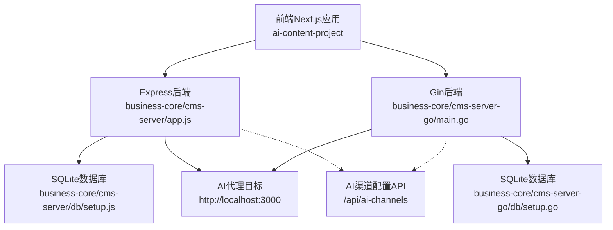
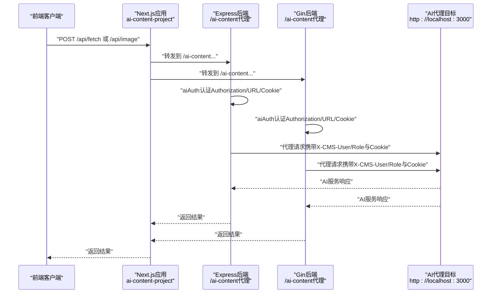
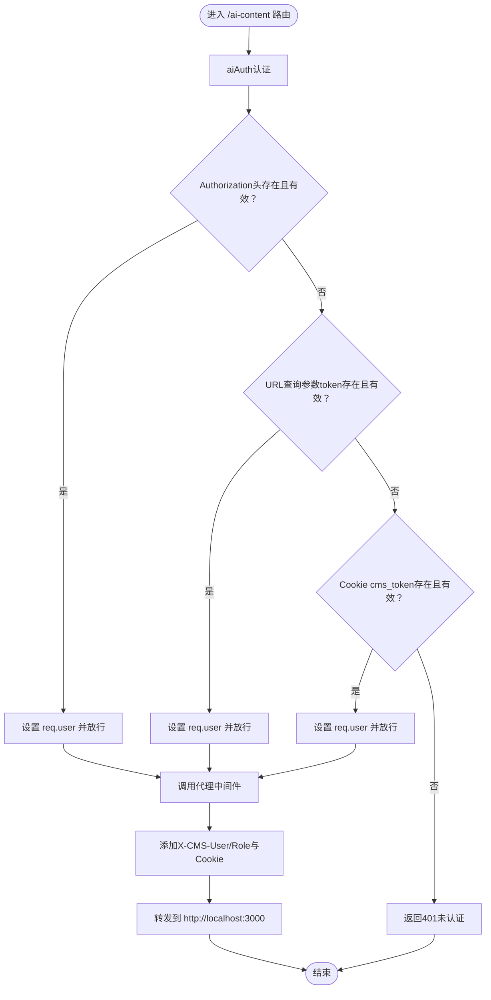
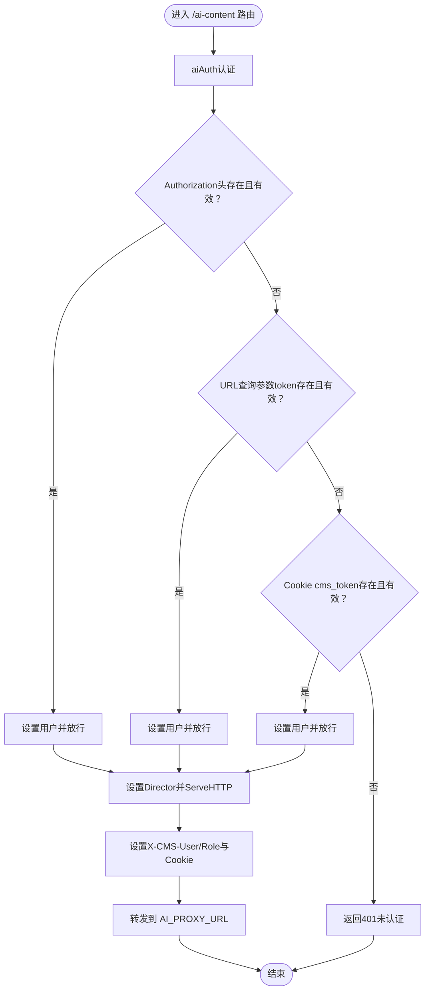
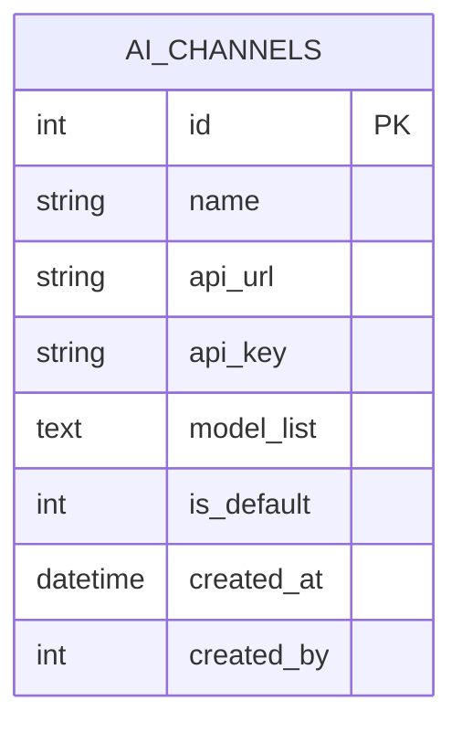
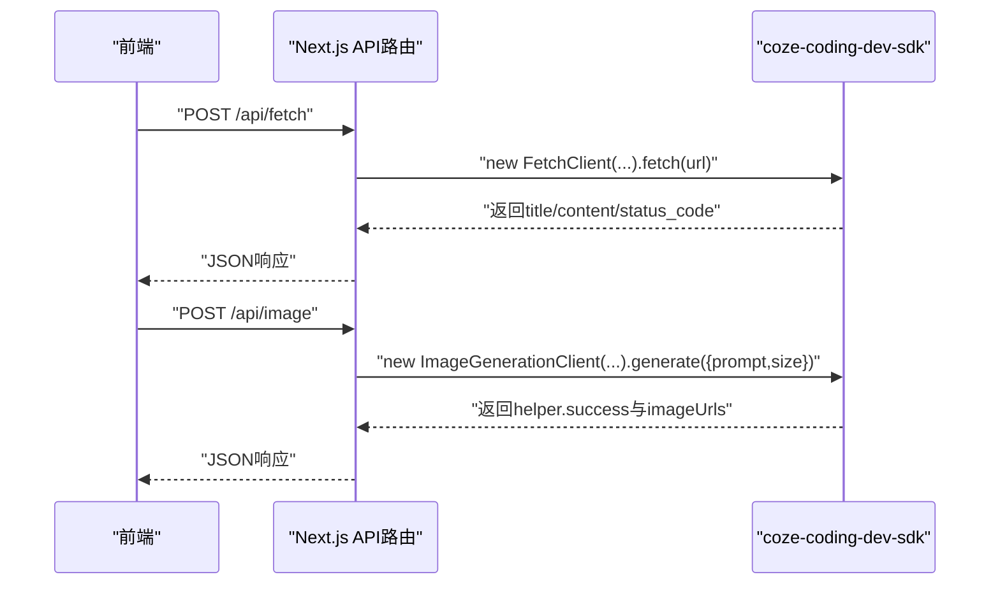
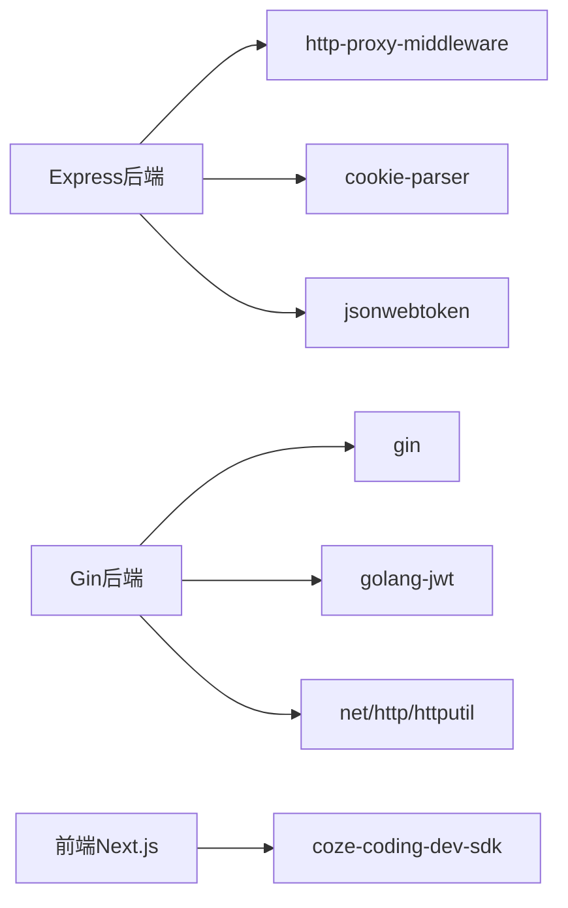

# AI生成数据流

<cite>
**本文引用的文件**
- [business-core/cms-server/app.js](file://business-core/cms-server/app.js)
- [business-core/cms-server/routes/ai-channels.js](file://business-core/cms-server/routes/ai-channels.js)
- [business-core/cms-server/middleware/auth.js](file://business-core/cms-server/middleware/auth.js)
- [business-core/cms-server/db/setup.js](file://business-core/cms-server/db/setup.js)
- [business-core/cms-server-go/main.go](file://business-core/cms-server-go/main.go)
- [business-core/cms-server-go/config/config.go](file://business-core/cms-server-go/config/config.go)
- [business-core/cms-server-go/routes/ai_channels.go](file://business-core/cms-server-go/routes/ai_channels.go)
- [business-core/cms-server-go/db/setup.go](file://business-core/cms-server-go/db/setup.go)
- [ai-content-project/src/app/api/fetch/route.ts](file://ai-content-project/src/app/api/fetch/route.ts)
- [ai-content-project/src/app/api/image/route.ts](file://ai-content-project/src/app/api/image/route.ts)
- [ai-content-project/src/server.ts](file://ai-content-project/src/server.ts)
- [ai-content-project/package.json](file://ai-content-project/package.json)
</cite>

## 目录
1. [简介](#简介)
2. [项目结构](#项目结构)
3. [核心组件](#核心组件)
4. [架构总览](#架构总览)
5. [详细组件分析](#详细组件分析)
6. [依赖分析](#依赖分析)
7. [性能考虑](#性能考虑)
8. [故障排除指南](#故障排除指南)
9. [结论](#结论)
10. [附录](#附录)

## 简介
本文件面向ZSTS-CMS的AI生成数据流，聚焦“AI内容生成代理”的完整链路与实现细节。文档覆盖以下要点：
- 前端请求到CMS认证、令牌传递、代理转发、AI服务响应、结果返回的完整链路
- aiAuth认证函数的三种认证方式：Authorization头、URL查询参数token、Cookie回退
- Cookie设置与用户信息透传机制（X-CMS-User、X-CMS-Role、cms_user）
- WebSocket连接处理、错误重试与超时控制策略
- AI渠道配置、代理中间件设置与性能优化建议
- AI数据流图与常见问题排查

## 项目结构
ZSTS-CMS采用前后端分离架构：
- 前端Next.js应用位于ai-content-project，提供AI抓取与图像生成功能
- 后端Express/Gin分别提供REST API与AI代理服务
- 数据库存储用户、页面权限与AI渠道配置

图表来源
- [business-core/cms-server/app.js:163-225](file://business-core/cms-server/app.js#L163-L225)
- [business-core/cms-server-go/main.go:86-289](file://business-core/cms-server-go/main.go#L86-L289)
- [business-core/cms-server/db/setup.js:55-68](file://business-core/cms-server/db/setup.js#L55-L68)
- [business-core/cms-server-go/db/setup.go:92-105](file://business-core/cms-server-go/db/setup.go#L92-L105)

章节来源
- [business-core/cms-server/app.js:163-225](file://business-core/cms-server/app.js#L163-L225)
- [business-core/cms-server-go/main.go:86-289](file://business-core/cms-server-go/main.go#L86-L289)
- [business-core/cms-server/db/setup.js:55-68](file://business-core/cms-server/db/setup.js#L55-L68)
- [business-core/cms-server-go/db/setup.go:92-105](file://business-core/cms-server-go/db/setup.go#L92-L105)

## 核心组件
- Express后端AI代理中间件：负责aiAuth认证与代理转发
- Gin后端AI代理中间件：负责aiAuth认证与代理转发（Go版本）
- AI渠道配置API：提供渠道增删改查与默认渠道设置
- 前端Next.js API路由：fetch抓取与image图像生成
- 数据库：存储用户、页面权限与AI渠道配置

章节来源
- [business-core/cms-server/app.js:168-196](file://business-core/cms-server/app.js#L168-L196)
- [business-core/cms-server-go/main.go:209-289](file://business-core/cms-server-go/main.go#L209-L289)
- [business-core/cms-server/routes/ai-channels.js:25-110](file://business-core/cms-server/routes/ai-channels.js#L25-L110)
- [ai-content-project/src/app/api/fetch/route.ts:4-24](file://ai-content-project/src/app/api/fetch/route.ts#L4-L24)
- [ai-content-project/src/app/api/image/route.ts:4-35](file://ai-content-project/src/app/api/image/route.ts#L4-L35)

## 架构总览
AI生成数据流的关键路径如下：
- 前端通过Next.js API发起请求
- Express或Gin后端在/ai-content前缀下进行aiAuth认证
- 认证通过后，将用户信息透传至代理目标（http://localhost:3000）
- 代理目标返回AI服务响应，后端统一返回给前端

图表来源
- [business-core/cms-server/app.js:168-225](file://business-core/cms-server/app.js#L168-L225)
- [business-core/cms-server-go/main.go:209-289](file://business-core/cms-server-go/main.go#L209-L289)
- [ai-content-project/src/app/api/fetch/route.ts:4-24](file://ai-content-project/src/app/api/fetch/route.ts#L4-L24)
- [ai-content-project/src/app/api/image/route.ts:4-35](file://ai-content-project/src/app/api/image/route.ts#L4-L35)

## 详细组件分析

### Express后端AI代理中间件与认证
- aiAuth认证流程
  - Authorization头：Bearer Token优先校验
  - URL查询参数token：iframe等场景使用
  - Cookie回退：Next.js自身回传cms_token
- 用户信息透传
  - 设置X-CMS-User与X-CMS-Role头部
  - 设置Cookie: cms_user=username
- 代理配置
  - 目标地址：http://localhost:3000
  - 支持WebSocket
  - 使用cookie-parser中间件读取Cookie

图表来源
- [business-core/cms-server/app.js:168-225](file://business-core/cms-server/app.js#L168-L225)

章节来源
- [business-core/cms-server/app.js:168-225](file://business-core/cms-server/app.js#L168-L225)

### Gin后端AI代理中间件与认证
- aiAuth认证流程与Express一致
- 使用httputil.NewSingleHostReverseProxy进行代理
- 在Director中修正Host头
- 透传用户信息与Cookie逻辑一致

图表来源
- [business-core/cms-server-go/main.go:209-289](file://business-core/cms-server-go/main.go#L209-L289)

章节来源
- [business-core/cms-server-go/main.go:209-289](file://business-core/cms-server-go/main.go#L209-L289)

### AI渠道配置API
- Express版本
  - GET /api/ai-channels：列出渠道并解析model_list
  - POST/PUT/DELETE：超级管理员权限
  - PUT /api/ai-channels/:id/set-default：设为默认渠道
- Gin版本
  - 路由注册与鉴权中间件一致
  - 列表、创建、更新、设默认、删除均实现

图表来源
- [business-core/cms-server/routes/ai-channels.js:25-110](file://business-core/cms-server/routes/ai-channels.js#L25-L110)
- [business-core/cms-server-go/routes/ai_channels.go:30-190](file://business-core/cms-server-go/routes/ai_channels.go#L30-L190)
- [business-core/cms-server/db/setup.js:55-68](file://business-core/cms-server/db/setup.js#L55-L68)
- [business-core/cms-server-go/db/setup.go:92-105](file://business-core/cms-server-go/db/setup.go#L92-L105)

章节来源
- [business-core/cms-server/routes/ai-channels.js:25-110](file://business-core/cms-server/routes/ai-channels.js#L25-L110)
- [business-core/cms-server-go/routes/ai_channels.go:30-190](file://business-core/cms-server-go/routes/ai_channels.go#L30-L190)
- [business-core/cms-server/db/setup.js:55-68](file://business-core/cms-server/db/setup.js#L55-L68)
- [business-core/cms-server-go/db/setup.go:92-105](file://business-core/cms-server-go/db/setup.go#L92-L105)

### 前端Next.js API路由
- /api/fetch：基于coze-coding-dev-sdk的FetchClient抓取网页并返回标题、内容、状态码
- /api/image：基于ImageGenerationClient生成图像，返回首张图片URL或错误信息

图表来源
- [ai-content-project/src/app/api/fetch/route.ts:4-24](file://ai-content-project/src/app/api/fetch/route.ts#L4-L24)
- [ai-content-project/src/app/api/image/route.ts:4-35](file://ai-content-project/src/app/api/image/route.ts#L4-L35)

章节来源
- [ai-content-project/src/app/api/fetch/route.ts:4-24](file://ai-content-project/src/app/api/fetch/route.ts#L4-L24)
- [ai-content-project/src/app/api/image/route.ts:4-35](file://ai-content-project/src/app/api/image/route.ts#L4-L35)

### 认证中间件与权限控制
- Express认证中间件
  - requireAuth：校验JWT并注入req.user
  - requireSuperAdmin：requireAuth + 角色校验
  - requirePagePerm：页面权限校验
- Gin认证中间件
  - RequireAuth/RequireSuperAdmin/RequirePagePerm（在Go版本中通过中间件实现）

章节来源
- [business-core/cms-server/middleware/auth.js:20-63](file://business-core/cms-server/middleware/auth.js#L20-L63)
- [business-core/cms-server-go/main.go:292-316](file://business-core/cms-server-go/main.go#L292-L316)

## 依赖分析
- Express后端依赖
  - http-proxy-middleware：反向代理
  - cookie-parser：读取Cookie
  - jsonwebtoken：JWT校验
- Gin后端依赖
  - gin：Web框架
  - golang-jwt：JWT校验
  - net/http/httputil：反向代理
- 前端依赖
  - coze-coding-dev-sdk：AI抓取与图像生成SDK

图表来源
- [business-core/cms-server/app.js:164-166](file://business-core/cms-server/app.js#L164-L166)
- [business-core/cms-server-go/main.go:18-20](file://business-core/cms-server-go/main.go#L18-L20)
- [ai-content-project/package.json:51](file://ai-content-project/package.json#L51)

章节来源
- [business-core/cms-server/app.js:164-166](file://business-core/cms-server/app.js#L164-L166)
- [business-core/cms-server-go/main.go:18-20](file://business-core/cms-server-go/main.go#L18-L20)
- [ai-content-project/package.json:51](file://ai-content-project/package.json#L51)

## 性能考虑
- 请求体大小限制
  - Express：JSON与URL编码限制为10MB
  - Gin：MaxMultipartMemory限制为10MB
- 代理目标与超时
  - Express：未显式设置超时；可通过http-proxy-middleware选项增加timeout
  - Gin：未显式设置超时；可在自定义代理配置中增加超时控制
- WebSocket支持
  - Express：开启ws:true
  - Gin：未见显式WebSocket配置，如需支持需扩展
- 缓存与静态资源
  - Express：预览客户端JS禁用缓存
  - Gin：预览客户端JS禁用缓存
- 数据库
  - SQLite：ai_channels表结构简单，查询与写入性能良好；注意并发写入时的锁竞争

章节来源
- [business-core/cms-server/app.js:20-22](file://business-core/cms-server/app.js#L20-L22)
- [business-core/cms-server-go/main.go:48-49](file://business-core/cms-server-go/main.go#L48-L49)
- [business-core/cms-server/app.js:198-213](file://business-core/cms-server/app.js#L198-L213)
- [business-core/cms-server/app.js:85-99](file://business-core/cms-server/app.js#L85-L99)
- [business-core/cms-server-go/main.go:131-144](file://business-core/cms-server-go/main.go#L131-L144)

## 故障排除指南
- 401未认证
  - 检查Authorization头是否为Bearer Token
  - 检查URL查询参数token是否有效
  - 检查Cookie cms_token是否存在且有效
  - 确认JWT_SECRET一致
- 代理目标不可达
  - 检查AI_PROXY_URL或Express代理目标http://localhost:3000是否运行
  - 检查网络连通性与防火墙
- WebSocket异常
  - Express已开启ws:true，确认客户端WebSocket握手与升级
  - Gin版本未见WebSocket配置，如需支持需补充
- 图像生成失败
  - 检查prompt参数是否为空且为字符串
  - 查看helper.errorMessages获取具体错误
- 抓取失败
  - 检查输入URL有效性与可访问性
  - 查看返回的status_code与错误信息

章节来源
- [business-core/cms-server/app.js:168-196](file://business-core/cms-server/app.js#L168-L196)
- [business-core/cms-server-go/main.go:209-289](file://business-core/cms-server-go/main.go#L209-L289)
- [ai-content-project/src/app/api/image/route.ts:8-30](file://ai-content-project/src/app/api/image/route.ts#L8-L30)
- [ai-content-project/src/app/api/fetch/route.ts:6-23](file://ai-content-project/src/app/api/fetch/route.ts#L6-L23)

## 结论
ZSTS-CMS的AI生成数据流通过Express与Gin双后端实现统一的AI代理能力，结合多通道认证与用户信息透传，满足前端Next.js应用的AI抓取与图像生成需求。建议在生产环境中：
- 明确超时与重试策略（尤其是WebSocket）
- 统一JWT密钥与环境变量管理
- 对代理目标增加健康检查与熔断保护
- 在Gin版本中补充WebSocket支持与超时控制

## 附录
- 环境变量与配置
  - Express：PORT、JWT_SECRET、AI_PROXY_URL（通过process.env读取）
  - Gin：PORT、JWT_SECRET、AI_PROXY_URL、DB_PATH、UPLOAD_DIR、CONTENT_DIR、GLOBAL_DIR、ADMIN_DIR、PROJECT_ROOT
- 数据库初始化
  - users、page_permissions、audit_log、ai_channels表
- 前端开发与启动
  - Next.js应用通过src/server.ts启动，支持开发与生产环境

章节来源
- [business-core/cms-server/app.js:163-166](file://business-core/cms-server/app.js#L163-L166)
- [business-core/cms-server-go/config/config.go:26-56](file://business-core/cms-server-go/config/config.go#L26-L56)
- [business-core/cms-server/db/setup.js:14-108](file://business-core/cms-server/db/setup.js#L14-L108)
- [business-core/cms-server-go/db/setup.go:18-175](file://business-core/cms-server-go/db/setup.go#L18-L175)
- [ai-content-project/src/server.ts:5-35](file://ai-content-project/src/server.ts#L5-L35)