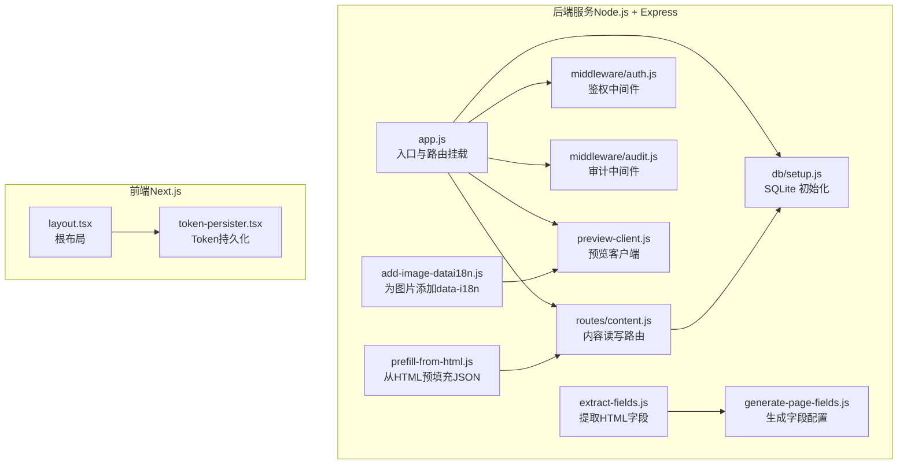
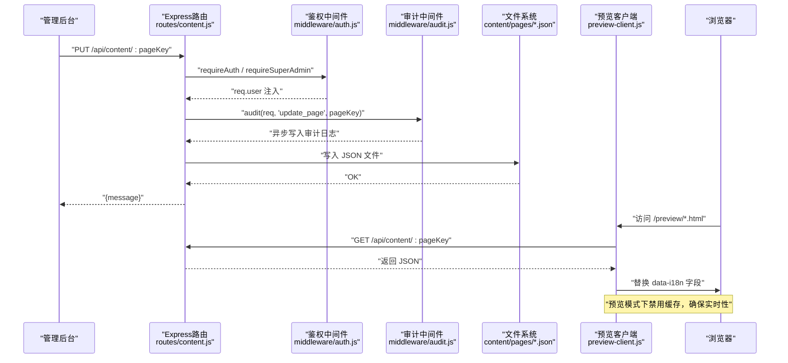
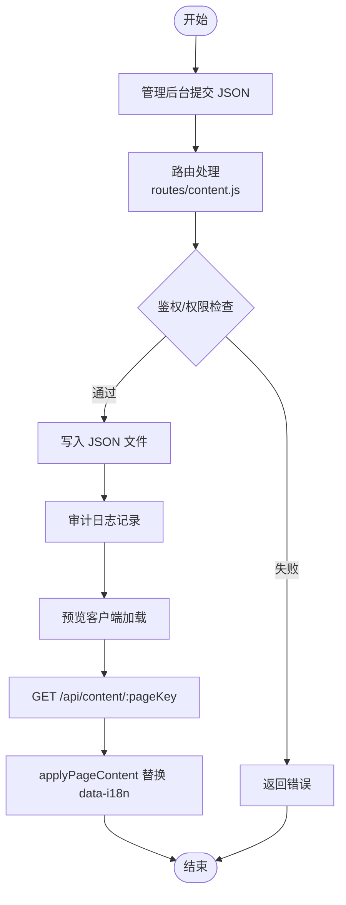
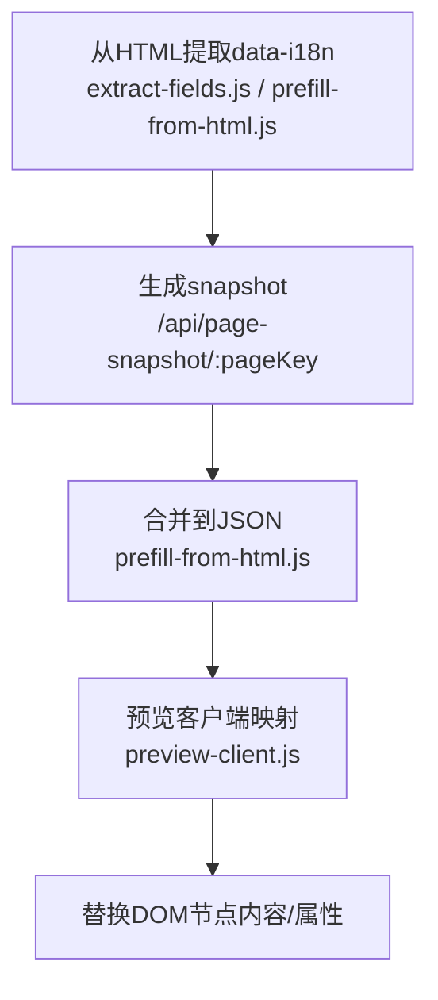
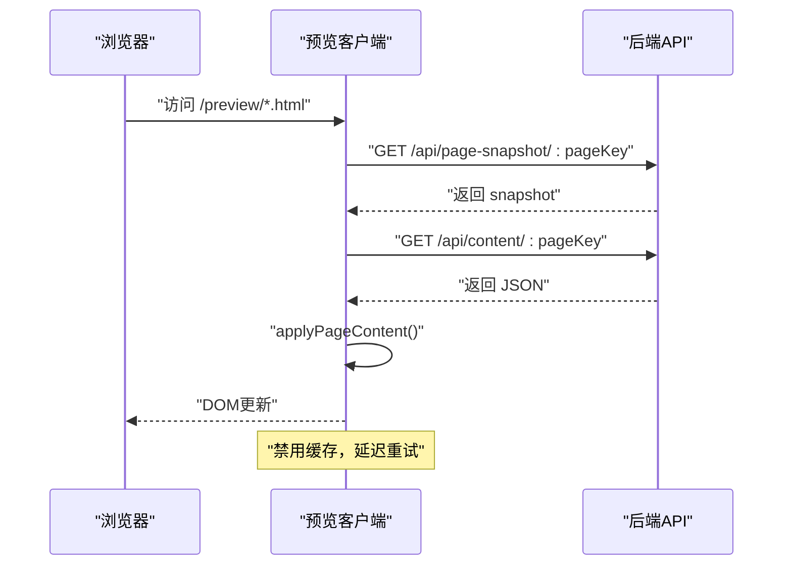
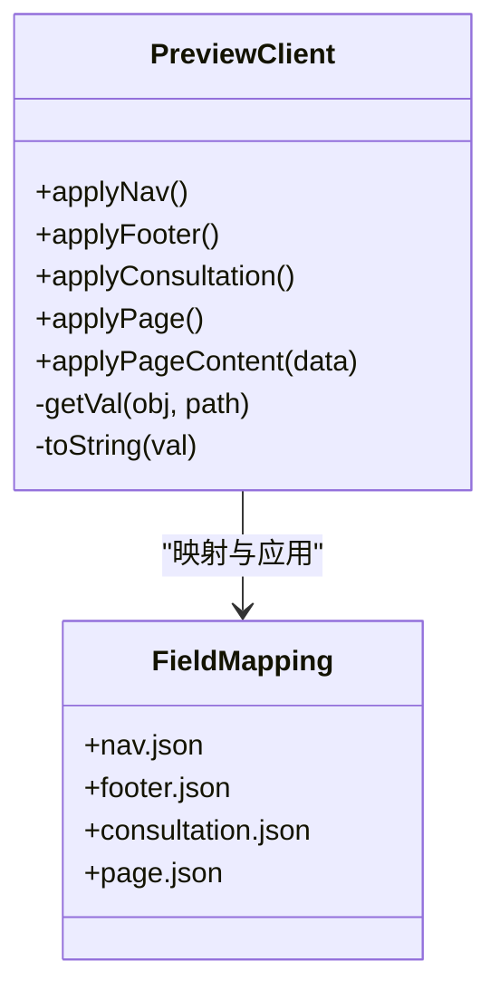
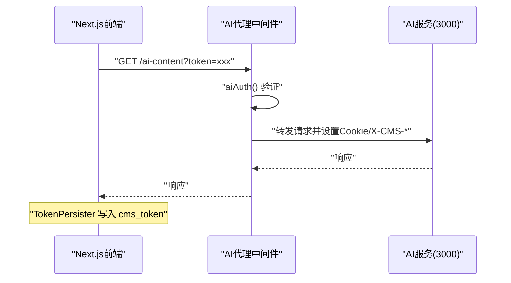
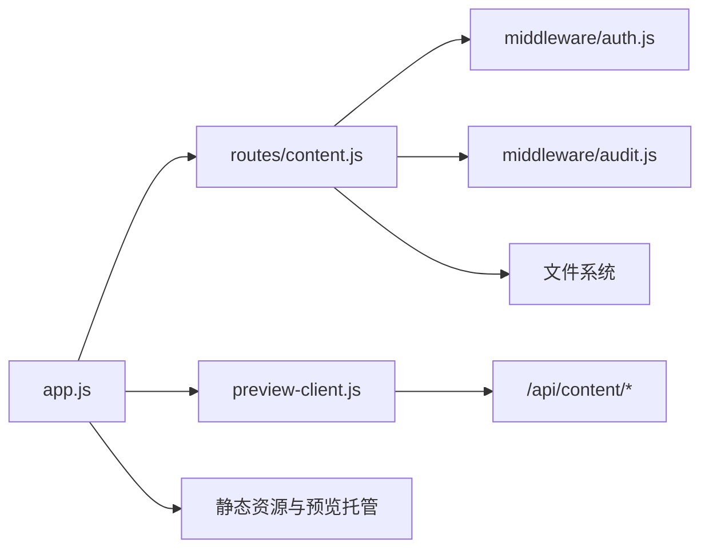

# 内容数据流

<cite>
**本文引用的文件**
- [app.js](file://business-core/cms-server/app.js)
- [routes/content.js](file://business-core/cms-server/routes/content.js)
- [db/setup.js](file://business-core/cms-server/db/setup.js)
- [middleware/auth.js](file://business-core/cms-server/middleware/auth.js)
- [middleware/audit.js](file://business-core/cms-server/middleware/audit.js)
- [preview-client.js](file://business-core/cms-server/preview-client.js)
- [extract-fields.js](file://business-core/cms-server/extract-fields.js)
- [generate-page-fields.js](file://business-core/cms-server/generate-page-fields.js)
- [add-image-datai18n.js](file://business-core/cms-server/add-image-datai18n.js)
- [prefill-from-html.js](file://business-core/cms-server/prefill-from-html.js)
- [layout.tsx](file://ai-content-project/src/app/layout.tsx)
- [token-persister.tsx](file://ai-content-project/src/components/token-persister.tsx)
</cite>

## 目录
1. [引言](#引言)
2. [项目结构](#项目结构)
3. [核心组件](#核心组件)
4. [架构总览](#架构总览)
5. [详细组件分析](#详细组件分析)
6. [依赖分析](#依赖分析)
7. [性能考虑](#性能考虑)
8. [故障排查指南](#故障排查指南)
9. [结论](#结论)
10. [附录](#附录)

## 引言
本技术文档围绕 ZSTS-CMS 的“内容数据流”进行系统化梳理，重点覆盖以下方面：
- 管理后台提交 → API 验证 → 数据库存储 → 预览客户端实时更新 → 静态页面生成的完整流程
- data-i18n 标记系统的工作原理：HTML 字段提取、默认值处理与内容合并算法
- 页面快照机制、内容同步策略与缓存更新机制
- 数据转换过程、字段映射关系与一致性保证方案
- 内容数据结构示例与常见问题解决方案

## 项目结构
该仓库包含两大部分：
- 后端服务（business-core/cms-server）：基于 Node.js + Express 的 CMS 服务，提供内容读写、鉴权、审计、预览与静态资源托管
- 内容生成前端（ai-content-project）：基于 Next.js 的 AI 内容生成与管理界面，负责与后端交互与认证传递

图表来源
- [app.js:1-315](file://business-core/cms-server/app.js#L1-L315)
- [routes/content.js:1-104](file://business-core/cms-server/routes/content.js#L1-L104)
- [middleware/auth.js:1-86](file://business-core/cms-server/middleware/auth.js#L1-L86)
- [middleware/audit.js:1-75](file://business-core/cms-server/middleware/audit.js#L1-L75)
- [db/setup.js:1-115](file://business-core/cms-server/db/setup.js#L1-L115)
- [preview-client.js:1-308](file://business-core/cms-server/preview-client.js#L1-L308)
- [extract-fields.js:1-112](file://business-core/cms-server/extract-fields.js#L1-L112)
- [generate-page-fields.js:1-419](file://business-core/cms-server/generate-page-fields.js#L1-L419)
- [add-image-datai18n.js:1-99](file://business-core/cms-server/add-image-datai18n.js#L1-L99)
- [prefill-from-html.js:1-110](file://business-core/cms-server/prefill-from-html.js#L1-L110)
- [layout.tsx:1-34](file://ai-content-project/src/app/layout.tsx#L1-L34)
- [token-persister.tsx:1-38](file://ai-content-project/src/components/token-persister.tsx#L1-L38)

章节来源
- [app.js:1-315](file://business-core/cms-server/app.js#L1-L315)
- [routes/content.js:1-104](file://business-core/cms-server/routes/content.js#L1-L104)
- [middleware/auth.js:1-86](file://business-core/cms-server/middleware/auth.js#L1-L86)
- [middleware/audit.js:1-75](file://business-core/cms-server/middleware/audit.js#L1-L75)
- [db/setup.js:1-115](file://business-core/cms-server/db/setup.js#L1-L115)
- [preview-client.js:1-308](file://business-core/cms-server/preview-client.js#L1-L308)
- [extract-fields.js:1-112](file://business-core/cms-server/extract-fields.js#L1-L112)
- [generate-page-fields.js:1-419](file://business-core/cms-server/generate-page-fields.js#L1-L419)
- [add-image-datai18n.js:1-99](file://business-core/cms-server/add-image-datai18n.js#L1-L99)
- [prefill-from-html.js:1-110](file://business-core/cms-server/prefill-from-html.js#L1-L110)
- [layout.tsx:1-34](file://ai-content-project/src/app/layout.tsx#L1-L34)
- [token-persister.tsx:1-38](file://ai-content-project/src/components/token-persister.tsx#L1-L38)

## 核心组件
- 内容读写路由：提供页面与全局配置的 JSON 读写接口，支持权限校验与审计日志
- 预览客户端：在预览模式下注入并替换 DOM 中的 data-i18n 字段，拦截业务翻译函数以避免覆盖
- 静态资源与预览托管：提供 /preview/* 页面托管、/preview-client-v4.js 缓存禁用版本与 /uploads/* 资源访问
- 鉴权与审计：JWT 验证、超级管理员限制、页面权限检查与操作日志
- 数据库初始化：SQLite 表结构定义、默认管理员创建与权限分配
- 字段提取与生成：从 HTML 提取 data-i18n 字段，生成字段配置模板，为图片添加 data-i18n，从 HTML 预填充 JSON

章节来源
- [routes/content.js:1-104](file://business-core/cms-server/routes/content.js#L1-L104)
- [preview-client.js:1-308](file://business-core/cms-server/preview-client.js#L1-L308)
- [app.js:103-153](file://business-core/cms-server/app.js#L103-L153)
- [middleware/auth.js:1-86](file://business-core/cms-server/middleware/auth.js#L1-L86)
- [middleware/audit.js:1-75](file://business-core/cms-server/middleware/audit.js#L1-L75)
- [db/setup.js:1-115](file://business-core/cms-server/db/setup.js#L1-L115)
- [extract-fields.js:1-112](file://business-core/cms-server/extract-fields.js#L1-L112)
- [generate-page-fields.js:1-419](file://business-core/cms-server/generate-page-fields.js#L1-L419)
- [add-image-datai18n.js:1-99](file://business-core/cms-server/add-image-datai18n.js#L1-L99)
- [prefill-from-html.js:1-110](file://business-core/cms-server/prefill-from-html.js#L1-L110)

## 架构总览
下图展示了“管理后台提交 → API 验证 → 数据库存储 → 预览客户端实时更新 → 静态页面生成”的端到端流程。

图表来源
- [routes/content.js:48-101](file://business-core/cms-server/routes/content.js#L48-L101)
- [middleware/auth.js:20-44](file://business-core/cms-server/middleware/auth.js#L20-L44)
- [middleware/audit.js:22-40](file://business-core/cms-server/middleware/audit.js#L22-L40)
- [app.js:103-153](file://business-core/cms-server/app.js#L103-L153)
- [preview-client.js:267-290](file://business-core/cms-server/preview-client.js#L267-L290)

## 详细组件分析

### 内容编辑数据流（管理后台 → API → 存储 → 预览 → 静态）
- 管理后台发起 PUT 请求至 /api/content/:pageKey，携带 JSON 内容
- 路由层执行 requireAuth 与 requireSuperAdmin（全局配置）或页面权限检查
- 成功后写入 content/pages/:pageKey.json 或 content/global/:key.json
- 审计中间件异步记录操作日志
- 预览客户端通过 /preview/* 获取 HTML，并注入 /preview-client-v4.js
- 预览客户端拉取 /api/content/:pageKey，将 JSON 值映射到 data-i18n 对应节点，实现实时更新

图表来源
- [routes/content.js:67-101](file://business-core/cms-server/routes/content.js#L67-L101)
- [middleware/auth.js:20-63](file://business-core/cms-server/middleware/auth.js#L20-L63)
- [middleware/audit.js:22-72](file://business-core/cms-server/middleware/audit.js#L22-L72)
- [preview-client.js:224-290](file://business-core/cms-server/preview-client.js#L224-L290)

章节来源
- [routes/content.js:48-101](file://business-core/cms-server/routes/content.js#L48-L101)
- [middleware/auth.js:20-63](file://business-core/cms-server/middleware/auth.js#L20-L63)
- [middleware/audit.js:22-72](file://business-core/cms-server/middleware/audit.js#L22-L72)
- [preview-client.js:267-290](file://business-core/cms-server/preview-client.js#L267-L290)

### data-i18n 标记系统工作原理
- HTML 字段提取：从 HTML 中提取所有 data-i18n 属性，支持文本、图片 src 与背景图 url
- 默认值处理：通过 /api/page-snapshot/:pageKey 抓取当前 HTML 中的 data-i18n 值，生成 snapshot
- 内容合并算法：prefill-from-html.js 将 snapshot 合并到现有 JSON，避免覆盖已有内容
- 预览客户端映射：preview-client.js 将 JSON 值映射到 DOM，优先取 zh，其次 en；图片字段仅接受 URL

图表来源
- [extract-fields.js:21-42](file://business-core/cms-server/extract-fields.js#L21-L42)
- [prefill-from-html.js:19-54](file://business-core/cms-server/prefill-from-html.js#L19-L54)
- [app.js:233-299](file://business-core/cms-server/app.js#L233-L299)
- [preview-client.js:45-67](file://business-core/cms-server/preview-client.js#L45-L67)

章节来源
- [extract-fields.js:1-112](file://business-core/cms-server/extract-fields.js#L1-L112)
- [prefill-from-html.js:1-110](file://business-core/cms-server/prefill-from-html.js#L1-L110)
- [app.js:233-299](file://business-core/cms-server/app.js#L233-L299)
- [preview-client.js:45-67](file://business-core/cms-server/preview-client.js#L45-L67)

### 页面快照机制、内容同步策略与缓存更新机制
- 页面快照：/api/page-snapshot/:pageKey 从 HTML 中抽取 data-i18n 的当前值，作为初始默认值
- 内容同步：预览客户端在 DOMContentLoaded 后拉取 JSON 并应用；延迟重试以应对其他脚本覆盖
- 缓存更新：/preview/* 返回禁用缓存的响应头；/preview-client-v4.js 通过变更文件名破坏缓存

图表来源
- [app.js:103-153](file://business-core/cms-server/app.js#L103-L153)
- [app.js:233-299](file://business-core/cms-server/app.js#L233-L299)
- [preview-client.js:267-290](file://business-core/cms-server/preview-client.js#L267-L290)

章节来源
- [app.js:103-153](file://business-core/cms-server/app.js#L103-L153)
- [app.js:233-299](file://business-core/cms-server/app.js#L233-L299)
- [preview-client.js:267-290](file://business-core/cms-server/preview-client.js#L267-L290)

### 数据转换过程、字段映射关系与一致性保证
- 字段映射：预览客户端针对不同区域（导航、页脚、咨询弹窗、页面内容）采用不同的映射规则
- 类型与语言优先级：toString 优先取 zh，若为空则取 en；图片字段仅接受 URL
- 一致性保证：预览客户端拦截业务翻译函数，避免业务脚本覆盖 CMS 注入内容；延迟重试确保最终一致性

图表来源
- [preview-client.js:69-290](file://business-core/cms-server/preview-client.js#L69-L290)

章节来源
- [preview-client.js:69-290](file://business-core/cms-server/preview-client.js#L69-L290)

### AI 内容生成代理与认证传递
- 代理路径：/ai-content 通过 http-proxy-middleware 转发到本地 3000 端口
- 多通道认证：Authorization Header、URL token、Cookie fallback，均通过 JWT 验证
- Cookie 传递：Next.js 客户端通过 TokenPersister 将 token 写入 cookie，解决客户端导航丢失问题

图表来源
- [app.js:163-225](file://business-core/cms-server/app.js#L163-L225)
- [token-persister.tsx:15-37](file://ai-content-project/src/components/token-persister.tsx#L15-L37)

章节来源
- [app.js:163-225](file://business-core/cms-server/app.js#L163-L225)
- [token-persister.tsx:1-38](file://ai-content-project/src/components/token-persister.tsx#L1-L38)

## 依赖分析
- 组件耦合
  - routes/content.js 依赖 middleware/auth.js 与 middleware/audit.js，以及文件系统
  - preview-client.js 依赖 /api/content/* 与 /api/page-snapshot/*
  - app.js 作为入口，串联路由、中间件与静态资源
- 外部依赖
  - better-sqlite3：SQLite 数据库
  - express、cors、multer、http-proxy-middleware：Web 服务与代理
  - bcrypt、jsonwebtoken：鉴权与加密

图表来源
- [routes/content.js:12-35](file://business-core/cms-server/routes/content.js#L12-L35)
- [middleware/auth.js:8-18](file://business-core/cms-server/middleware/auth.js#L8-L18)
- [middleware/audit.js:6-13](file://business-core/cms-server/middleware/audit.js#L6-L13)
- [preview-client.js:267-290](file://business-core/cms-server/preview-client.js#L267-L290)
- [app.js:103-153](file://business-core/cms-server/app.js#L103-L153)

章节来源
- [routes/content.js:12-35](file://business-core/cms-server/routes/content.js#L12-L35)
- [middleware/auth.js:8-18](file://business-core/cms-server/middleware/auth.js#L8-L18)
- [middleware/audit.js:6-13](file://business-core/cms-server/middleware/audit.js#L6-L13)
- [preview-client.js:267-290](file://business-core/cms-server/preview-client.js#L267-L290)
- [app.js:103-153](file://business-core/cms-server/app.js#L103-L153)

## 性能考虑
- 预览缓存禁用：/preview/* 与 /preview-client-v4.js 禁用浏览器缓存，确保实时更新
- JSON 写入：文件系统写入为同步操作，建议在高并发场景评估异步写入或队列化
- 正则解析：HTML 提取与替换使用正则，注意大规模 HTML 的性能影响
- 审计日志：异步写入，避免阻塞主请求

## 故障排查指南
- 预览页面空白或字段未更新
  - 检查 /preview/* 是否正确注入 /preview-client-v4.js
  - 确认 /api/content/:pageKey 返回 JSON 结构与 data-i18n 键一致
  - 查看浏览器控制台日志，确认 applyPageContent 是否执行
- 图片字段不生效
  - 确认值为有效 URL（以 /、http 开头或包含图片扩展名）
  - 检查预览客户端对图片 URL 的过滤逻辑
- 权限不足
  - 检查用户角色与页面权限表是否正确配置
  - 全局配置仅超级管理员可写
- 审计日志缺失
  - 确认审计中间件是否被正确挂载
  - 检查数据库连接与表是否存在

章节来源
- [preview-client.js:224-290](file://business-core/cms-server/preview-client.js#L224-L290)
- [routes/content.js:67-101](file://business-core/cms-server/routes/content.js#L67-L101)
- [middleware/auth.js:20-63](file://business-core/cms-server/middleware/auth.js#L20-L63)
- [middleware/audit.js:22-72](file://business-core/cms-server/middleware/audit.js#L22-L72)

## 结论
ZSTS-CMS 的内容数据流通过清晰的路由与中间件体系、严谨的鉴权与审计、灵活的 data-i18n 标记系统与预览客户端映射，实现了从管理后台到预览与静态页面的高效闭环。配合页面快照与预填充机制，确保编辑器首次打开即有默认值；通过禁用缓存与延迟重试，保障预览实时性与一致性。

## 附录

### 数据结构示例（概念性说明）
- 导航 nav.json
  - 结构：items: [{ key, label_zh, url }]
  - 映射：data-i18n="nav.home" 文本与链接
- 页脚 footer.json
  - 结构：{ description, phone, email, address, bottom_text, qr_codes:{wechat1, wechat2, whatsapp} }
  - 映射：footer.desc、footer.phone、footer.qrWechat1 等
- 咨询弹窗 consultation.json
  - 结构：{ title:{zh,en}, desc:{zh,en}, contact_phone, qr_codes:{wechat1, wechat2, whatsapp} }
- 页面内容 home.json 等
  - 结构：嵌套对象，键与 data-i18n 对应，值为字符串或 { zh, en } 或 { src, ... }

章节来源
- [preview-client.js:69-290](file://business-core/cms-server/preview-client.js#L69-L290)