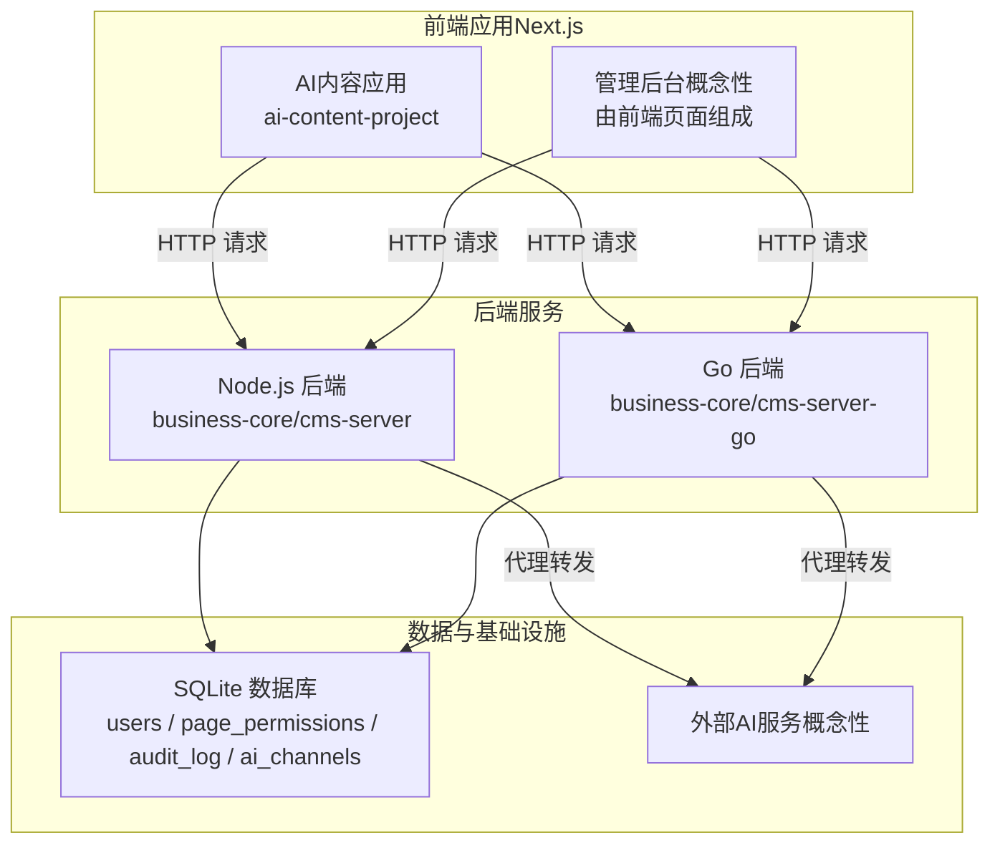
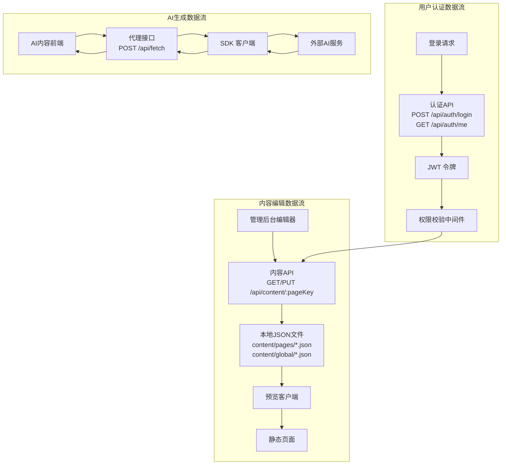
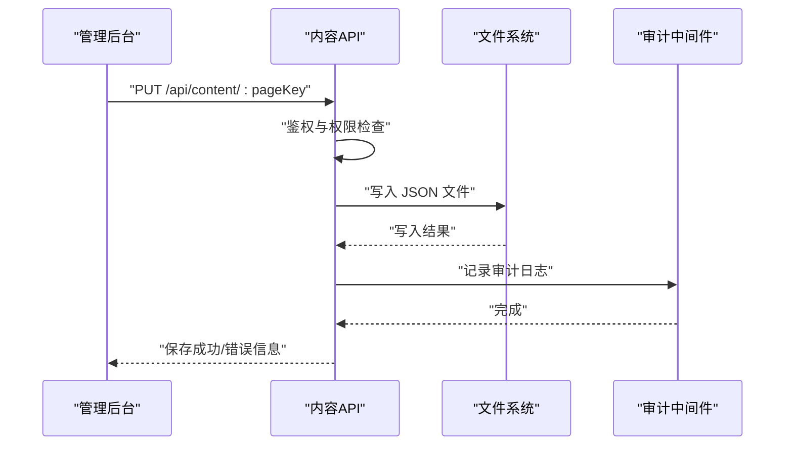
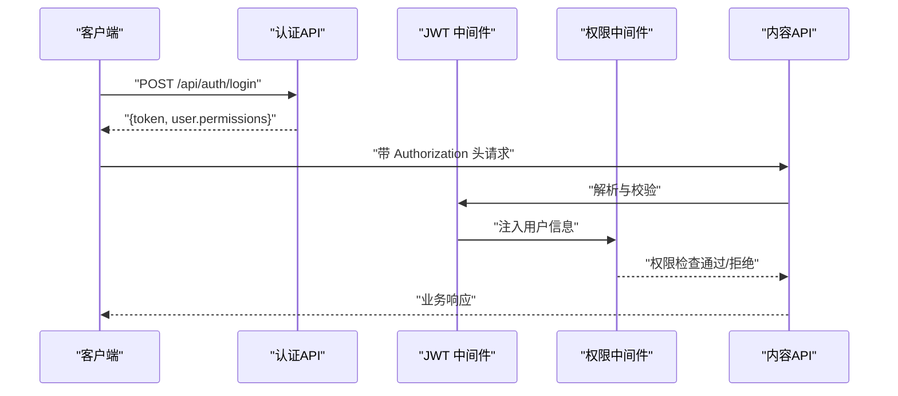
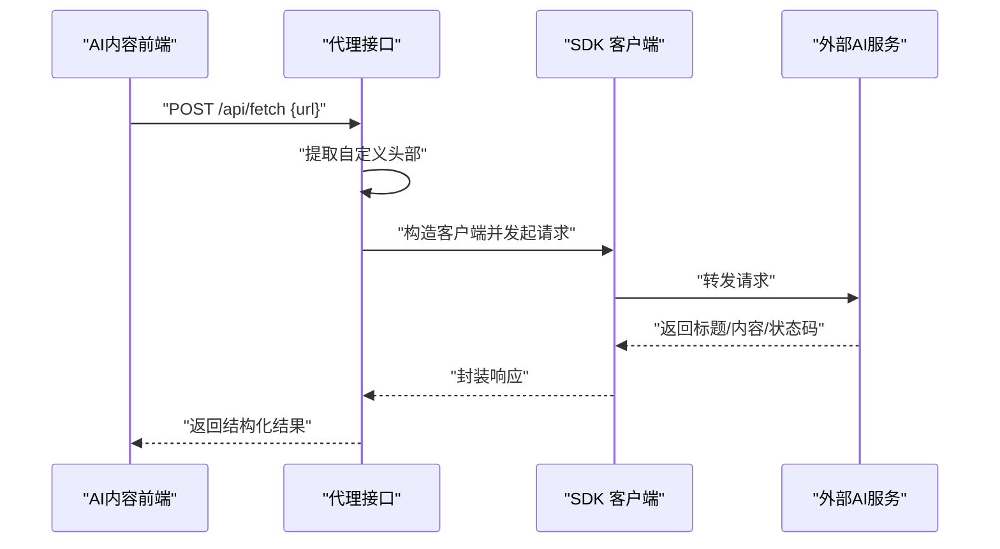
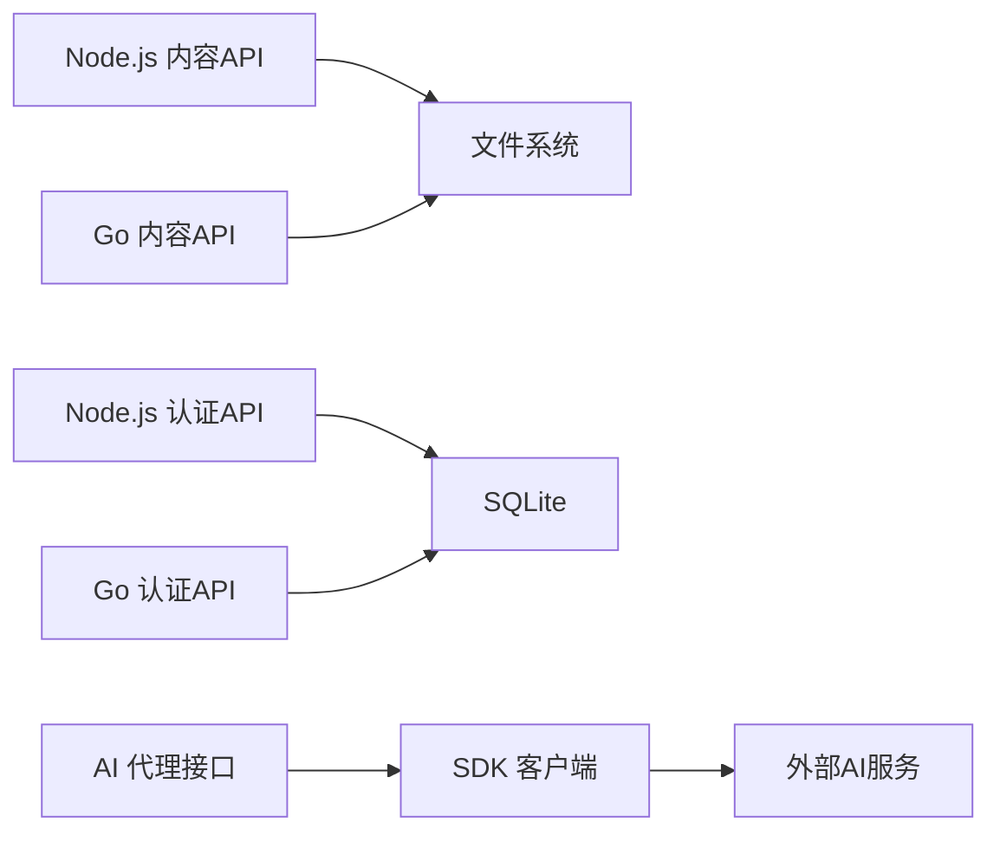

# 数据流设计

<cite>
**本文引用的文件**
- [business-core/cms-server/routes/content.js](file://business-core/cms-server/routes/content.js)
- [business-core/cms-server/routes/auth.js](file://business-core/cms-server/routes/auth.js)
- [business-core/cms-server/routes/ai-channels.js](file://business-core/cms-server/routes/ai-channels.js)
- [business-core/cms-server/db/setup.js](file://business-core/cms-server/db/setup.js)
- [business-core/cms-server/middleware/auth.js](file://business-core/cms-server/middleware/auth.js)
- [business-core/cms-server/middleware/audit.js](file://business-core/cms-server/middleware/audit.js)
- [business-core/cms-server-go/routes/content.go](file://business-core/cms-server-go/routes/content.go)
- [business-core/cms-server-go/routes/auth.go](file://business-core/cms-server-go/routes/auth.go)
- [business-core/cms-server-go/routes/ai_channels.go](file://business-core/cms-server-go/routes/ai_channels.go)
- [business-core/cms-server-go/db/setup.go](file://business-core/cms-server-go/db/setup.go)
- [business-core/cms-server-go/middleware/auth.go](file://business-core/cms-server-go/middleware/auth.go)
- [business-core/cms-server-go/middleware/audit.go](file://business-core/cms-server-go/middleware/audit.go)
- [ai-content-project/src/app/api/fetch/route.ts](file://ai-content-project/src/app/api/fetch/route.ts)
- [ai-content-project/src/components/token-persister.tsx](file://ai-content-project/src/components/token-persister.tsx)
- [ai-content-project/package.json](file://ai-content-project/package.json)
</cite>

## 目录
1. [引言](#引言)
2. [项目结构](#项目结构)
3. [核心组件](#核心组件)
4. [架构总览](#架构总览)
5. [详细组件分析](#详细组件分析)
6. [依赖分析](#依赖分析)
7. [性能考虑](#性能考虑)
8. [故障排查指南](#故障排查指南)
9. [结论](#结论)
10. [附录](#附录)

## 引言
本文件面向ZSTS-CMS的数据流设计，围绕三大核心数据流进行系统化梳理：内容编辑数据流（管理后台→API→数据库→预览客户端→静态页面）、用户认证数据流（登录请求→JWT令牌→权限验证→API访问）、AI生成数据流（前端请求→代理转发→AI服务→结果返回）。文档详细说明各流程中的数据转换、缓存策略与一致性保障，并给出数据流图、状态变化图、安全与备份恢复策略建议以及性能优化与监控方案。

## 项目结构
系统采用前后端分离与多语言实现的混合架构：
- 管理端与内容编辑：Node.js/Go双栈后端提供REST API；SQLite作为轻量持久层；前端Next.js应用负责页面内容编辑与预览。
- AI内容生成：Next.js应用内置代理接口，转发请求至外部AI服务；同时支持iframe嵌入场景下的令牌传递与持久化。
- 审计与权限：统一的JWT认证与权限中间件，配合审计日志表记录关键操作。

图表来源
- [business-core/cms-server/routes/content.js:1-104](file://business-core/cms-server/routes/content.js#L1-L104)
- [business-core/cms-server-go/routes/content.go:1-298](file://business-core/cms-server-go/routes/content.go#L1-L298)
- [business-core/cms-server/routes/auth.js:1-99](file://business-core/cms-server/routes/auth.js#L1-L99)
- [business-core/cms-server-go/routes/auth.go:1-174](file://business-core/cms-server-go/routes/auth.go#L1-L174)
- [business-core/cms-server/routes/ai-channels.js:1-113](file://business-core/cms-server/routes/ai-channels.js#L1-L113)
- [business-core/cms-server-go/routes/ai_channels.go:1-197](file://business-core/cms-server-go/routes/ai_channels.go#L1-L197)
- [ai-content-project/src/app/api/fetch/route.ts:1-25](file://ai-content-project/src/app/api/fetch/route.ts#L1-L25)
- [ai-content-project/src/components/token-persister.tsx:1-38](file://ai-content-project/src/components/token-persister.tsx#L1-L38)

章节来源
- [business-core/cms-server/routes/content.js:1-104](file://business-core/cms-server/routes/content.js#L1-L104)
- [business-core/cms-server-go/routes/content.go:1-298](file://business-core/cms-server-go/routes/content.go#L1-L298)
- [business-core/cms-server/routes/auth.js:1-99](file://business-core/cms-server/routes/auth.js#L1-L99)
- [business-core/cms-server-go/routes/auth.go:1-174](file://business-core/cms-server-go/routes/auth.go#L1-L174)
- [business-core/cms-server/routes/ai-channels.js:1-113](file://business-core/cms-server/routes/ai-channels.js#L1-L113)
- [business-core/cms-server-go/routes/ai_channels.go:1-197](file://business-core/cms-server-go/routes/ai_channels.go#L1-L197)
- [ai-content-project/src/app/api/fetch/route.ts:1-25](file://ai-content-project/src/app/api/fetch/route.ts#L1-L25)
- [ai-content-project/src/components/token-persister.tsx:1-38](file://ai-content-project/src/components/token-persister.tsx#L1-L38)

## 核心组件
- 内容路由（Node.js/Go）：提供页面内容的读取与更新接口，支持全局配置与页面级内容两类资源；具备权限校验与审计日志。
- 认证路由（Node.js/Go）：提供登录、登出、当前用户信息查询；基于JWT签发与校验，支持多种令牌传递方式（Header、URL、Cookie）。
- AI渠道路由（Node.js/Go）：维护AI服务渠道配置，支持默认渠道设置与权限控制。
- 数据库初始化（Node.js/Go）：创建用户、权限、审计、AI渠道等表，初始化默认超级管理员账号。
- 审计中间件（Node.js/Go）：统一记录写操作日志，异步落库，不影响主请求路径。
- AI代理接口（Next.js）：接收前端请求，提取自定义头部，转发至指定URL，返回标题、内容与状态码。
- 令牌持久化组件（Next.js）：从URL参数读取token并写入cookie，解决iframe内客户端导航导致的令牌丢失问题。

章节来源
- [business-core/cms-server/routes/content.js:1-104](file://business-core/cms-server/routes/content.js#L1-L104)
- [business-core/cms-server-go/routes/content.go:1-298](file://business-core/cms-server-go/routes/content.go#L1-L298)
- [business-core/cms-server/routes/auth.js:1-99](file://business-core/cms-server/routes/auth.js#L1-L99)
- [business-core/cms-server-go/routes/auth.go:1-174](file://business-core/cms-server-go/routes/auth.go#L1-L174)
- [business-core/cms-server/routes/ai-channels.js:1-113](file://business-core/cms-server/routes/ai-channels.js#L1-L113)
- [business-core/cms-server-go/routes/ai_channels.go:1-197](file://business-core/cms-server-go/routes/ai_channels.go#L1-L197)
- [business-core/cms-server/db/setup.js:1-115](file://business-core/cms-server/db/setup.js#L1-L115)
- [business-core/cms-server-go/db/setup.go:1-187](file://business-core/cms-server-go/db/setup.go#L1-L187)
- [business-core/cms-server/middleware/audit.js:1-75](file://business-core/cms-server/middleware/audit.js#L1-L75)
- [business-core/cms-server-go/middleware/audit.go:1-96](file://business-core/cms-server-go/middleware/audit.go#L1-L96)
- [ai-content-project/src/app/api/fetch/route.ts:1-25](file://ai-content-project/src/app/api/fetch/route.ts#L1-L25)
- [ai-content-project/src/components/token-persister.tsx:1-38](file://ai-content-project/src/components/token-persister.tsx#L1-L38)

## 架构总览
下图展示了三大数据流在系统中的交互位置与关键节点：

图表来源
- [business-core/cms-server/routes/content.js:48-101](file://business-core/cms-server/routes/content.js#L48-L101)
- [business-core/cms-server-go/routes/content.go:80-157](file://business-core/cms-server-go/routes/content.go#L80-L157)
- [business-core/cms-server/routes/auth.js:22-96](file://business-core/cms-server/routes/auth.js#L22-L96)
- [business-core/cms-server-go/routes/auth.go:27-173](file://business-core/cms-server-go/routes/auth.go#L27-L173)
- [ai-content-project/src/app/api/fetch/route.ts:4-24](file://ai-content-project/src/app/api/fetch/route.ts#L4-L24)

## 详细组件分析

### 内容编辑数据流（管理后台→API→数据库→预览客户端→静态页面）
- 流程要点
  - 管理后台发起PUT请求更新页面内容，后端根据pageKey定位全局配置或页面内容JSON文件。
  - 对于全局配置，仅超级管理员可写；对于页面内容，需具备对应页面权限或为超级管理员。
  - 写入成功后触发审计日志；预览阶段GET读取JSON文件，最终静态页面由构建产物生成。
- 关键数据节点
  - 请求体：JSON结构的内容对象。
  - 存储介质：content/global/*.json（全局）与content/pages/*.json（页面）。
  - 审计字段：操作类型、目标、详情、时间戳。
- 一致性与缓存
  - 采用文件系统作为“最终一致”的存储介质，适合小规模并发编辑。
  - 建议在高并发场景引入分布式锁或版本号机制以避免覆盖写冲突。
  - 预览阶段可使用浏览器缓存策略（ETag/Cache-Control），但需确保编辑后失效。
- 错误处理
  - 非法pageKey、权限不足、文件写入失败均返回相应HTTP状态码与错误信息。

图表来源
- [business-core/cms-server/routes/content.js:67-101](file://business-core/cms-server/routes/content.js#L67-L101)
- [business-core/cms-server-go/routes/content.go:110-157](file://business-core/cms-server-go/routes/content.go#L110-L157)
- [business-core/cms-server/middleware/audit.js:22-40](file://business-core/cms-server/middleware/audit.js#L22-L40)
- [business-core/cms-server-go/middleware/audit.go:16-46](file://business-core/cms-server-go/middleware/audit.go#L16-L46)

章节来源
- [business-core/cms-server/routes/content.js:1-104](file://business-core/cms-server/routes/content.js#L1-L104)
- [business-core/cms-server-go/routes/content.go:1-298](file://business-core/cms-server-go/routes/content.go#L1-L298)
- [business-core/cms-server/middleware/audit.js:1-75](file://business-core/cms-server/middleware/audit.js#L1-L75)
- [business-core/cms-server-go/middleware/audit.go:1-96](file://business-core/cms-server-go/middleware/audit.go#L1-L96)

### 用户认证数据流（登录请求→JWT令牌→权限验证→API访问）
- 流程要点
  - 登录接口校验用户名与密码，成功后签发JWT并返回用户权限列表。
  - 后续请求通过Authorization头携带JWT，中间件解析并注入用户信息。
  - 权限中间件根据角色与页面权限决定是否放行。
- 多通道令牌支持
  - Header：Authorization: Bearer <token>
  - URL：/api/...?token=<token>（iframe嵌入场景）
  - Cookie：Next.js客户端持久化cms_token，便于后续导航携带（与代理的HttpOnly cookie共存）。
- 安全与一致性
  - 使用强密钥与固定过期时间；建议生产环境启用HTTPS与安全Cookie属性。
  - 审计日志记录登录行为与用户信息变更，便于追踪。

图表来源
- [business-core/cms-server/routes/auth.js:22-96](file://business-core/cms-server/routes/auth.js#L22-L96)
- [business-core/cms-server-go/routes/auth.go:27-173](file://business-core/cms-server-go/routes/auth.go#L27-L173)
- [business-core/cms-server-go/middleware/auth.go:17-176](file://business-core/cms-server-go/middleware/auth.go#L17-L176)
- [ai-content-project/src/components/token-persister.tsx:15-37](file://ai-content-project/src/components/token-persister.tsx#L15-L37)

章节来源
- [business-core/cms-server/routes/auth.js:1-99](file://business-core/cms-server/routes/auth.js#L1-L99)
- [business-core/cms-server-go/routes/auth.go:1-174](file://business-core/cms-server-go/routes/auth.go#L1-L174)
- [business-core/cms-server-go/middleware/auth.go:1-203](file://business-core/cms-server-go/middleware/auth.go#L1-L203)
- [ai-content-project/src/components/token-persister.tsx:1-38](file://ai-content-project/src/components/token-persister.tsx#L1-L38)

### AI生成数据流（前端请求→代理转发→AI服务→结果返回）
- 流程要点
  - 前端向POST /api/fetch提交待抓取URL，后端提取自定义请求头并构造SDK客户端。
  - SDK客户端向指定URL发起请求，返回标题、内容、状态码等结构化数据。
  - Next.js应用通过coze-coding-dev-sdk与外部AI服务对接，支持iframe嵌入场景的令牌传递。
- 数据转换
  - 输入：前端请求体包含url字段。
  - 输出：标准化的响应结构（title、content、url、status_code）。
- 令牌传递与兼容
  - 代理支持Header、URL、Cookie三种令牌来源，优先级按顺序尝试。
  - TokenPersister组件在首次进入时将URL中的token写入浏览器cookie，解决客户端导航后丢失的问题。

图表来源
- [ai-content-project/src/app/api/fetch/route.ts:4-24](file://ai-content-project/src/app/api/fetch/route.ts#L4-L24)
- [business-core/cms-server-go/middleware/auth.go:134-176](file://business-core/cms-server-go/middleware/auth.go#L134-L176)
- [ai-content-project/src/components/token-persister.tsx:15-37](file://ai-content-project/src/components/token-persister.tsx#L15-L37)

章节来源
- [ai-content-project/src/app/api/fetch/route.ts:1-25](file://ai-content-project/src/app/api/fetch/route.ts#L1-L25)
- [business-core/cms-server-go/middleware/auth.go:134-176](file://business-core/cms-server-go/middleware/auth.go#L134-L176)
- [ai-content-project/src/components/token-persister.tsx:1-38](file://ai-content-project/src/components/token-persister.tsx#L1-L38)
- [ai-content-project/package.json:51-51](file://ai-content-project/package.json#L51-L51)

## 依赖分析
- 组件耦合
  - 内容API与文件系统耦合度较高，适合小规模部署；若扩展到多实例，需引入共享存储或数据库替代文件写入。
  - 认证与权限中间件在Node.js与Go两端实现一致，确保跨语言一致性。
  - AI代理依赖SDK与外部服务，需关注网络延迟与超时策略。
- 外部依赖
  - Next.js生态与UI组件库；SDK用于代理转发；SQLite用于本地开发与演示。

图表来源
- [business-core/cms-server/routes/content.js:21-26](file://business-core/cms-server/routes/content.js#L21-L26)
- [business-core/cms-server-go/routes/content.go:80-108](file://business-core/cms-server-go/routes/content.go#L80-L108)
- [business-core/cms-server/routes/auth.js:16-20](file://business-core/cms-server/routes/auth.js#L16-L20)
- [business-core/cms-server-go/routes/auth.go:35-40](file://business-core/cms-server-go/routes/auth.go#L35-L40)
- [ai-content-project/src/app/api/fetch/route.ts:2-2](file://ai-content-project/src/app/api/fetch/route.ts#L2-L2)

章节来源
- [business-core/cms-server/routes/content.js:1-104](file://business-core/cms-server/routes/content.js#L1-L104)
- [business-core/cms-server-go/routes/content.go:1-298](file://business-core/cms-server-go/routes/content.go#L1-L298)
- [business-core/cms-server/routes/auth.js:1-99](file://business-core/cms-server/routes/auth.js#L1-L99)
- [business-core/cms-server-go/routes/auth.go:1-174](file://business-core/cms-server-go/routes/auth.go#L1-L174)
- [ai-content-project/src/app/api/fetch/route.ts:1-25](file://ai-content-project/src/app/api/fetch/route.ts#L1-L25)

## 性能考虑
- 缓存策略
  - 预览阶段：对GET /api/content/:pageKey的响应添加ETag/Cache-Control，结合Last-Modified提升命中率。
  - 静态资源：CDN缓存与长缓存策略，构建产物指纹化。
- 并发与一致性
  - 文件写入易受并发影响，建议引入版本号或乐观锁；必要时迁移为数据库存储。
- 网络与代理
  - AI代理设置合理超时与重试；对SDK返回进行结构化校验与错误降级。
- 监控与可观测性
  - 基础指标：请求QPS、P95/P99延迟、错误率、鉴权失败率。
  - 进阶指标：内容写入耗时、文件系统IO等待、AI服务响应时间。
  - 日志：审计日志、错误堆栈、链路追踪ID。

## 故障排查指南
- 认证失败
  - 检查Authorization头格式与JWT签名密钥；确认用户是否存在且未被禁用。
  - 若使用iframe，确认URL参数token与cookie中cms_token一致。
- 权限不足
  - 核对用户角色与page_key权限映射；超级管理员应绕过页面权限检查。
- 内容写入失败
  - 检查目标JSON文件路径与权限；确认磁盘空间与文件系统可用性。
- 审计日志异常
  - 确认审计中间件已正确注册；检查数据库连接与表结构完整性。
- AI代理错误
  - 校验SDK配置与目标URL可达性；查看代理返回的错误信息与状态码。

章节来源
- [business-core/cms-server/middleware/auth.js:20-63](file://business-core/cms-server/middleware/auth.js#L20-L63)
- [business-core/cms-server-go/middleware/auth.go:17-176](file://business-core/cms-server-go/middleware/auth.go#L17-L176)
- [business-core/cms-server/routes/content.js:67-101](file://business-core/cms-server/routes/content.js#L67-L101)
- [business-core/cms-server-go/routes/content.go:110-157](file://business-core/cms-server-go/routes/content.go#L110-L157)
- [business-core/cms-server/middleware/audit.js:22-72](file://business-core/cms-server/middleware/audit.js#L22-L72)
- [business-core/cms-server-go/middleware/audit.go:16-95](file://business-core/cms-server-go/middleware/audit.go#L16-L95)
- [ai-content-project/src/app/api/fetch/route.ts:20-23](file://ai-content-project/src/app/api/fetch/route.ts#L20-L23)

## 结论
本设计文档系统化梳理了ZSTS-CMS的三大数据流：内容编辑、用户认证与AI生成。通过明确的数据节点、转换逻辑与一致性保障，结合安全与性能优化建议，可为后续扩展与运维提供清晰指引。建议在生产环境中强化令牌安全、引入数据库替代文件写入、完善监控体系与灾备方案。

## 附录
- 数据安全传输
  - 强制HTTPS；敏感头与令牌避免明文日志；Cookie设置Secure与SameSite属性。
- 加密存储
  - 敏感配置（如AI渠道API Key）建议加密存储并在运行时解密。
- 备份恢复
  - 定期导出SQLite数据库；对content目录进行增量备份；建立演练恢复流程。
- 监控与告警
  - 关键指标纳入Prometheus/Grafana；异常请求与鉴权失败触发告警。