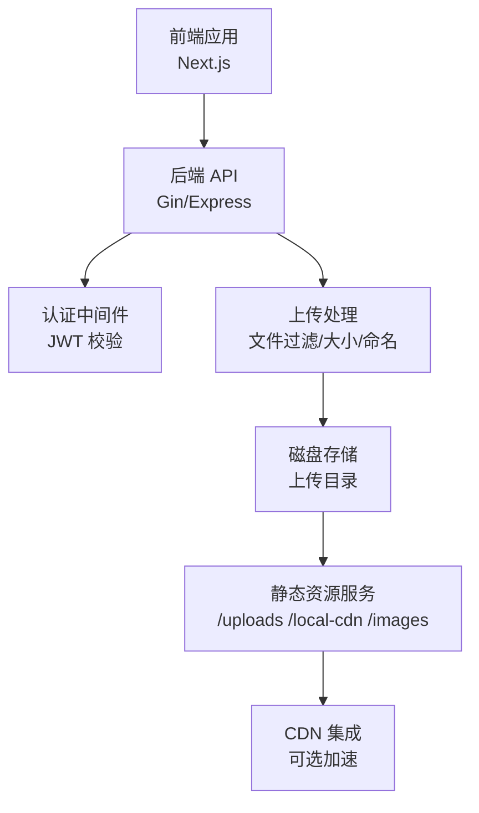
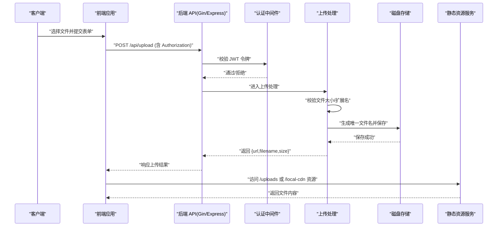
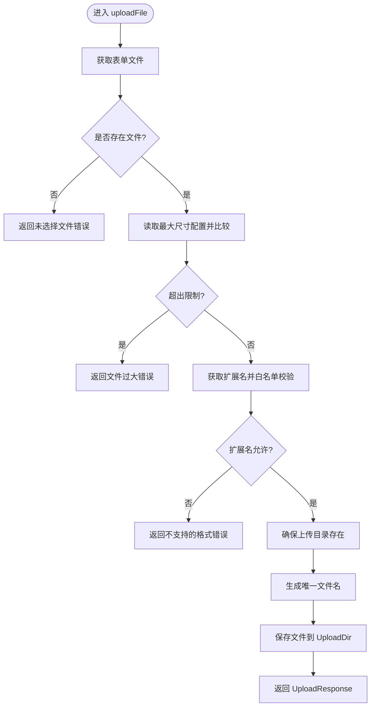
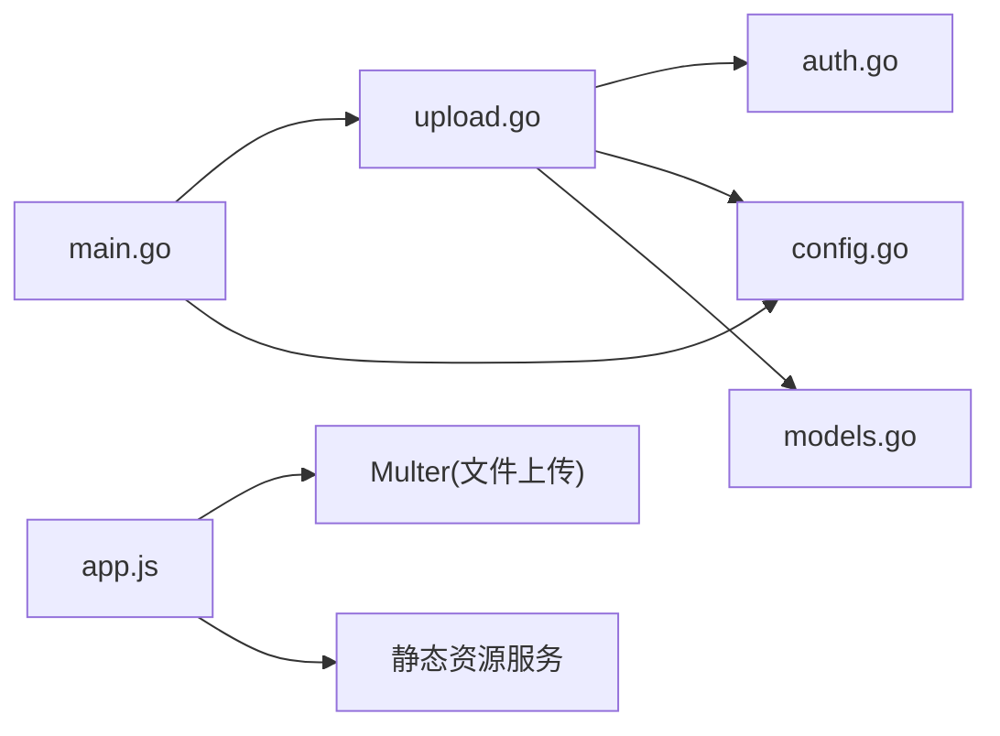

# 文件上传数据流

<cite>
**本文引用的文件**
- [business-core/cms-server-go/routes/upload.go](file://business-core/cms-server-go/routes/upload.go)
- [business-core/cms-server-go/middleware/auth.go](file://business-core/cms-server-go/middleware/auth.go)
- [business-core/cms-server-go/config/config.go](file://business-core/cms-server-go/config/config.go)
- [business-core/cms-server-go/models/models.go](file://business-core/cms-server-go/models/models.go)
- [business-core/cms-server-go/main.go](file://business-core/cms-server-go/main.go)
- [business-core/cms-server/app.js](file://business-core/cms-server/app.js)
- [ai-content-project/src/app/api/image/route.ts](file://ai-content-project/src/app/api/image/route.ts)
</cite>

## 目录
1. [简介](#简介)
2. [项目结构](#项目结构)
3. [核心组件](#核心组件)
4. [架构总览](#架构总览)
5. [详细组件分析](#详细组件分析)
6. [依赖关系分析](#依赖关系分析)
7. [性能考量](#性能考量)
8. [故障排查指南](#故障排查指南)
9. [结论](#结论)
10. [附录](#附录)

## 简介
本文件围绕 ZSTS-CMS 的文件上传数据流进行系统化梳理，覆盖从前端表单提交到后端认证校验、文件过滤与大小限制、磁盘存储、URL 生成与静态资源访问的完整链路。同时说明 Multer 配置、文件类型限制、大小控制、命名策略，以及上传目录结构、文件权限与安全防护措施；并给出文件访问控制、CDN 集成与缓存策略建议，最后提供上传流程图与常见问题解决方案。

## 项目结构
ZSTS-CMS 采用前后端分离架构：
- 后端 Go/Gin 实现：提供 /api/upload 接口、JWT 认证中间件、静态资源服务与 CDN 路由。
- 后端 Node.js Express 实现：提供传统 /api/upload 接口、Multer 配置与静态资源服务。
- 前端 Next.js 应用：提供图像生成 API（非上传）与 UI 组件。

图表来源
- [business-core/cms-server-go/main.go:51-58](file://business-core/cms-server-go/main.go#L51-L58)
- [business-core/cms-server/app.js:55-62](file://business-core/cms-server/app.js#L55-L62)

章节来源
- [business-core/cms-server-go/main.go:51-58](file://business-core/cms-server-go/main.go#L51-L58)
- [business-core/cms-server/app.js:55-62](file://business-core/cms-server/app.js#L55-L62)

## 核心组件
- 上传路由与处理
  - Go 版本：注册 /api/upload，使用 RequireAuth 中间件，执行文件大小、扩展名校验与保存。
  - Node 版本：注册 /api/upload，使用 requireAuth 中间件，结合 Multer 进行文件过滤、大小限制与命名。
- 认证中间件
  - Go 版本：RequireAuth 解析 Authorization 头中的 Bearer Token，校验 JWT 并注入用户信息。
  - Node 版本：requireAuth 同样基于 JWT 校验，支持多通道（Header、Query、Cookie）。
- 配置与模型
  - 配置项：端口、JWT 密钥、数据库路径、上传目录、内容目录、全局目录、管理后台目录、项目根目录、AI 代理地址、上传最大尺寸等。
  - 模型：UploadResponse 返回 url、filename、size。
- 静态资源与 CDN
  - Go 版本：r.Static 暴露 /uploads、/local-cdn、/images 等路径；Node 版本：express.static 暴露相同路径。
  - CDN 集成：通过 /local-cdn 路径映射本地或外部 CDN 资源。

章节来源
- [business-core/cms-server-go/routes/upload.go:22-75](file://business-core/cms-server-go/routes/upload.go#L22-L75)
- [business-core/cms-server-go/middleware/auth.go:17-63](file://business-core/cms-server-go/middleware/auth.go#L17-L63)
- [business-core/cms-server-go/config/config.go:10-94](file://business-core/cms-server-go/config/config.go#L10-L94)
- [business-core/cms-server-go/models/models.go:112-117](file://business-core/cms-server-go/models/models.go#L112-L117)
- [business-core/cms-server-go/main.go:51-58](file://business-core/cms-server-go/main.go#L51-L58)
- [business-core/cms-server/app.js:24-44](file://business-core/cms-server/app.js#L24-L44)

## 架构总览
以下序列图展示了从“前端表单提交”到“静态资源访问”的完整数据流，涵盖认证、过滤、存储与 URL 生成环节。

图表来源
- [business-core/cms-server-go/routes/upload.go:27-75](file://business-core/cms-server-go/routes/upload.go#L27-L75)
- [business-core/cms-server-go/middleware/auth.go:17-63](file://business-core/cms-server-go/middleware/auth.go#L17-L63)
- [business-core/cms-server-go/main.go:51-58](file://business-core/cms-server-go/main.go#L51-L58)
- [business-core/cms-server/app.js:46-53](file://business-core/cms-server/app.js#L46-L53)

## 详细组件分析

### 上传路由与处理（Go 版本）
- 路由注册：/api/upload 使用 RequireAuth 中间件保护。
- 文件获取与校验：
  - 必填字段校验（未选择文件时返回错误）。
  - 大小限制：读取配置项 UPLOAD_MAX_SIZE_MB（默认 5MB）。
  - 扩展名白名单：仅允许 .jpg、.jpeg、.png、.gif、.webp、.svg。
  - 若原始文件无扩展名，默认补 .png。
- 存储策略：
  - 确保上传目录存在（权限 0755）。
  - 生成唯一文件名：img_{时间戳}{6位随机}{扩展名}。
  - 保存至配置的 UploadDir。
- 响应模型：UploadResponse 包含 URL、Filename、Size。URL 为 /uploads/images/{filename}。

图表来源
- [business-core/cms-server-go/routes/upload.go:27-75](file://business-core/cms-server-go/routes/upload.go#L27-L75)
- [business-core/cms-server-go/config/config.go:91-94](file://business-core/cms-server-go/config/config.go#L91-L94)

章节来源
- [business-core/cms-server-go/routes/upload.go:22-95](file://business-core/cms-server-go/routes/upload.go#L22-L95)
- [business-core/cms-server-go/config/config.go:47-53](file://business-core/cms-server-go/config/config.go#L47-L53)

### 上传路由与处理（Node.js 版本）
- 路由注册：/api/upload，前置 requireAuth 中间件。
- Multer 配置：
  - diskStorage.destination：固定上传目录 ../uploads/images。
  - diskStorage.filename：img_{时间戳}{6位随机}{扩展名}。
  - limits.fileSize：5MB。
  - fileFilter：白名单扩展名 ['jpg','jpeg','png','gif','webp','svg']。
- 响应：返回 url、filename、size，url 为 /uploads/images/{filename}。
- 静态资源：/uploads、/local-cdn、/images 等路径映射。

章节来源
- [business-core/cms-server/app.js:24-44](file://business-core/cms-server/app.js#L24-L44)
- [business-core/cms-server/app.js:46-53](file://business-core/cms-server/app.js#L46-L53)
- [business-core/cms-server/app.js:55-62](file://business-core/cms-server/app.js#L55-L62)

### 认证中间件（JWT）
- Go 版本：
  - 从 Authorization 头提取 Bearer 令牌，校验签名与有效性。
  - 成功后将用户信息注入上下文（ID、用户名、角色），供后续权限判断使用。
- Node.js 版本：
  - 支持三种认证途径：Authorization 头、URL 查询参数 token、Cookie cms_token。
  - 校验通过后注入用户信息，用于后续鉴权与代理头注入。

章节来源
- [business-core/cms-server-go/middleware/auth.go:17-63](file://business-core/cms-server-go/middleware/auth.go#L17-L63)
- [business-core/cms-server/app.js:168-196](file://business-core/cms-server/app.js#L168-L196)

### 静态资源与 CDN 集成
- Go 版本：
  - r.Static 暴露 /uploads、/local-cdn、/images、/preview/images、/preview/local-cdn、/admin。
  - 预览模式下对资源路径进行修复，确保绝对路径访问。
- Node.js 版本：
  - express.static 暴露相同路径，预览模式同样修复资源相对路径。
- CDN 集成建议：
  - 将 /local-cdn 指向 CDN 域名，实现静态资源加速。
  - 对 /uploads 图片开启缓存策略（见“性能考量”）。

章节来源
- [business-core/cms-server-go/main.go:51-58](file://business-core/cms-server-go/main.go#L51-L58)
- [business-core/cms-server/app.js:55-62](file://business-core/cms-server/app.js#L55-L62)
- [business-core/cms-server-go/main.go:183-207](file://business-core/cms-server-go/main.go#L183-L207)
- [business-core/cms-server/app.js:104-153](file://business-core/cms-server/app.js#L104-L153)

### 数据模型与响应
- UploadResponse：包含 url、filename、size，便于前端直接使用。

章节来源
- [business-core/cms-server-go/models/models.go:112-117](file://business-core/cms-server-go/models/models.go#L112-L117)

## 依赖关系分析
- 组件耦合：
  - 上传处理依赖认证中间件（JWT）、配置模块（上传目录、最大尺寸）、模型（UploadResponse）。
  - 静态资源服务依赖配置模块（UploadDir、ProjectRoot）。
- 外部依赖：
  - Gin/Express：Web 框架与路由。
  - Multer（Node.js）：文件上传中间件。
  - JWT：认证令牌解析与校验。
  - 文件系统：磁盘存储与目录权限。

图表来源
- [business-core/cms-server-go/routes/upload.go:13-18](file://business-core/cms-server-go/routes/upload.go#L13-L18)
- [business-core/cms-server-go/middleware/auth.go:3-15](file://business-core/cms-server-go/middleware/auth.go#L3-L15)
- [business-core/cms-server-go/config/config.go:3-8](file://business-core/cms-server-go/config/config.go#L3-L8)
- [business-core/cms-server-go/models/models.go:1-2](file://business-core/cms-server-go/models/models.go#L1-L2)
- [business-core/cms-server-go/main.go:73-84](file://business-core/cms-server-go/main.go#L73-L84)
- [business-core/cms-server/app.js:24-44](file://business-core/cms-server/app.js#L24-L44)
- [business-core/cms-server/app.js:55-62](file://business-core/cms-server/app.js#L55-L62)

## 性能考量
- 请求体大小限制：
  - Go：r.MaxMultipartMemory = 10MB；上传大小限制来自配置项 UPLOAD_MAX_SIZE_MB（默认 5MB）。
  - Node：express.json/express.urlencoded 限制为 10MB；Multer limits.fileSize 为 5MB。
- 缓存策略：
  - 预览客户端 JS 已禁用缓存（no-cache, no-store, must-revalidate）。
  - 建议对 /uploads 图片启用短期缓存（如 ETag/Last-Modified + Cache-Control max-age），CDN 层可进一步优化。
- 并发与磁盘：
  - 上传目录权限 0755，确保写入与读取权限合理分配。
  - 命名策略避免冲突，建议结合业务 ID 与哈希增强可追溯性。

章节来源
- [business-core/cms-server-go/main.go:48-49](file://business-core/cms-server-go/main.go#L48-L49)
- [business-core/cms-server-go/config/config.go:91-94](file://business-core/cms-server-go/config/config.go#L91-L94)
- [business-core/cms-server/app.js:21-22](file://business-core/cms-server/app.js#L21-L22)
- [business-core/cms-server/app.js:38-39](file://business-core/cms-server/app.js#L38-L39)

## 故障排查指南
- 未提供认证令牌或令牌无效
  - 症状：401 未授权。
  - 排查：确认 Authorization 头格式为 Bearer <token>；校验 JWT_SECRET 是否一致；核对 token 是否过期。
  - 参考
    - [business-core/cms-server-go/middleware/auth.go:18-63](file://business-core/cms-server-go/middleware/auth.go#L18-L63)
    - [business-core/cms-server/app.js:168-196](file://business-core/cms-server/app.js#L168-L196)
- 未选择文件
  - 症状：400 未选择文件。
  - 排查：确认表单字段名为 file；multipart/form-data。
  - 参考
    - [business-core/cms-server-go/routes/upload.go:29-33](file://business-core/cms-server-go/routes/upload.go#L29-L33)
    - [business-core/cms-server/app.js:46-47](file://business-core/cms-server/app.js#L46-L47)
- 文件大小超限
  - 症状：400 文件大小超过限制。
  - 排查：确认 UPLOAD_MAX_SIZE_MB 配置；前端是否压缩图片。
  - 参考
    - [business-core/cms-server-go/config/config.go:91-94](file://business-core/cms-server-go/config/config.go#L91-L94)
    - [business-core/cms-server-go/routes/upload.go:35-40](file://business-core/cms-server-go/routes/upload.go#L35-L40)
    - [business-core/cms-server/app.js:38-39](file://business-core/cms-server/app.js#L38-L39)
- 不支持的图片格式
  - 症状：400 不支持的图片格式。
  - 排查：确认扩展名在白名单中（.jpg/.jpeg/.png/.gif/.webp/.svg）。
  - 参考
    - [business-core/cms-server-go/routes/upload.go:42-47](file://business-core/cms-server-go/routes/upload.go#L42-L47)
    - [business-core/cms-server/app.js:40-43](file://business-core/cms-server/app.js#L40-L43)
- 上传目录创建失败
  - 症状：500 创建上传目录失败。
  - 排查：检查目录权限与磁盘空间；确认 UPLOAD_DIR 配置正确。
  - 参考
    - [business-core/cms-server-go/routes/upload.go:53-58](file://business-core/cms-server-go/routes/upload.go#L53-L58)
    - [business-core/cms-server-go/main.go:32](file://business-core/cms-server-go/main.go#L32)
- 文件保存失败
  - 症状：500 文件保存失败。
  - 排查：检查磁盘写入权限、路径拼接、并发写入冲突。
  - 参考
    - [business-core/cms-server-go/routes/upload.go:64-68](file://business-core/cms-server-go/routes/upload.go#L64-L68)
- 静态资源 404
  - 症状：/uploads 或 /local-cdn 下资源 404。
  - 排查：确认 r.Static 或 express.static 路径映射；核对项目根目录与 UploadDir。
  - 参考
    - [business-core/cms-server-go/main.go:51-58](file://business-core/cms-server-go/main.go#L51-L58)
    - [business-core/cms-server/app.js:55-62](file://business-core/cms-server/app.js#L55-L62)

## 结论
ZSTS-CMS 在 Go 与 Node 两端均提供了完善的文件上传能力：严格的认证机制、可控的文件大小与扩展名过滤、规范的磁盘命名与存储策略，以及清晰的静态资源暴露与 CDN 集成路径。通过合理的缓存策略与安全配置，可在保证安全性的同时提升访问效率。

## 附录

### 配置项与默认值（节选）
- 端口：PORT（默认 3001）
- JWT 密钥：JWT_SECRET（默认开发密钥）
- 数据库路径：DB_PATH（默认 db/cms.db）
- 上传目录：UPLOAD_DIR（默认 ../uploads/images）
- 内容目录：CONTENT_DIR（默认 ../content/pages）
- 全局目录：GLOBAL_DIR（默认 ../content/global）
- 管理后台目录：ADMIN_DIR（默认 ../admin）
- 项目根目录：PROJECT_ROOT（默认 ../..）
- AI 代理地址：AI_PROXY_URL（默认 http://localhost:3000）
- 上传最大尺寸：UPLOAD_MAX_SIZE_MB（默认 5MB）

章节来源
- [business-core/cms-server-go/config/config.go:31-53](file://business-core/cms-server-go/config/config.go#L31-L53)
- [business-core/cms-server-go/config/config.go:91-94](file://business-core/cms-server-go/config/config.go#L91-L94)

### 文件类型与大小限制对照
- 允许扩展名：.jpg、.jpeg、.png、.gif、.webp、.svg
- 大小上限：5MB（可通过环境变量调整）
- 命名策略：img_{时间戳}{6位随机}{扩展名}

章节来源
- [business-core/cms-server-go/routes/upload.go:20](file://business-core/cms-server-go/routes/upload.go#L20)
- [business-core/cms-server-go/routes/upload.go:42-51](file://business-core/cms-server-go/routes/upload.go#L42-L51)
- [business-core/cms-server-go/routes/upload.go:60-62](file://business-core/cms-server-go/routes/upload.go#L60-L62)
- [business-core/cms-server/app.js:40-43](file://business-core/cms-server/app.js#L40-L43)
- [business-core/cms-server/app.js:30-34](file://business-core/cms-server/app.js#L30-L34)

### 前端图像生成 API（非上传）
- 路径：/api/image
- 功能：接收 prompt，调用 SDK 生成图片，返回首张图片 URL。
- 适用场景：AI 图像生成功能，非文件上传流程。

章节来源
- [ai-content-project/src/app/api/image/route.ts:1-36](file://ai-content-project/src/app/api/image/route.ts#L1-L36)