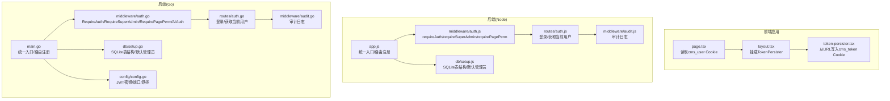
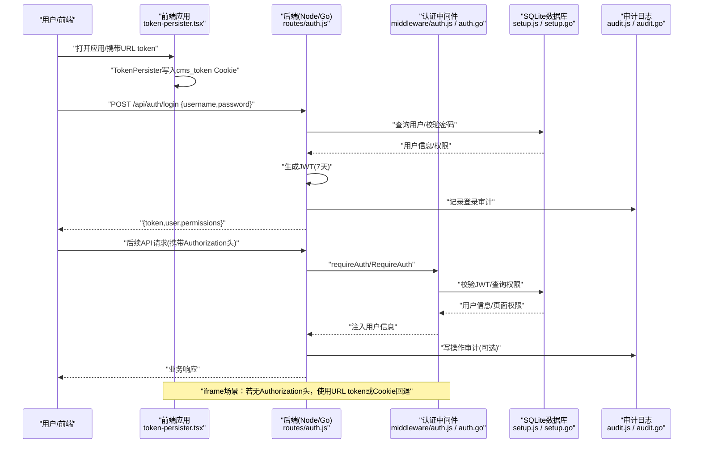
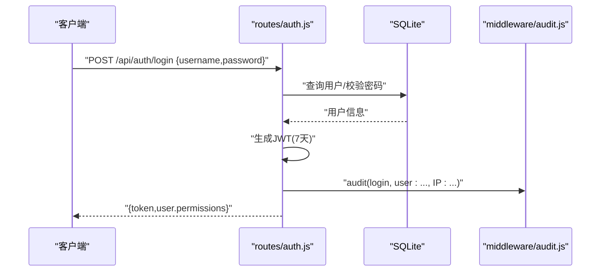
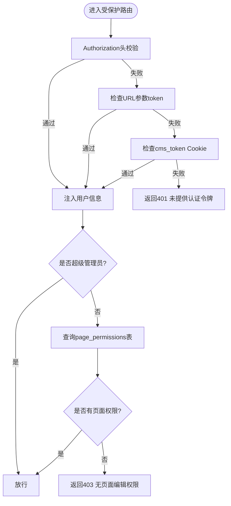
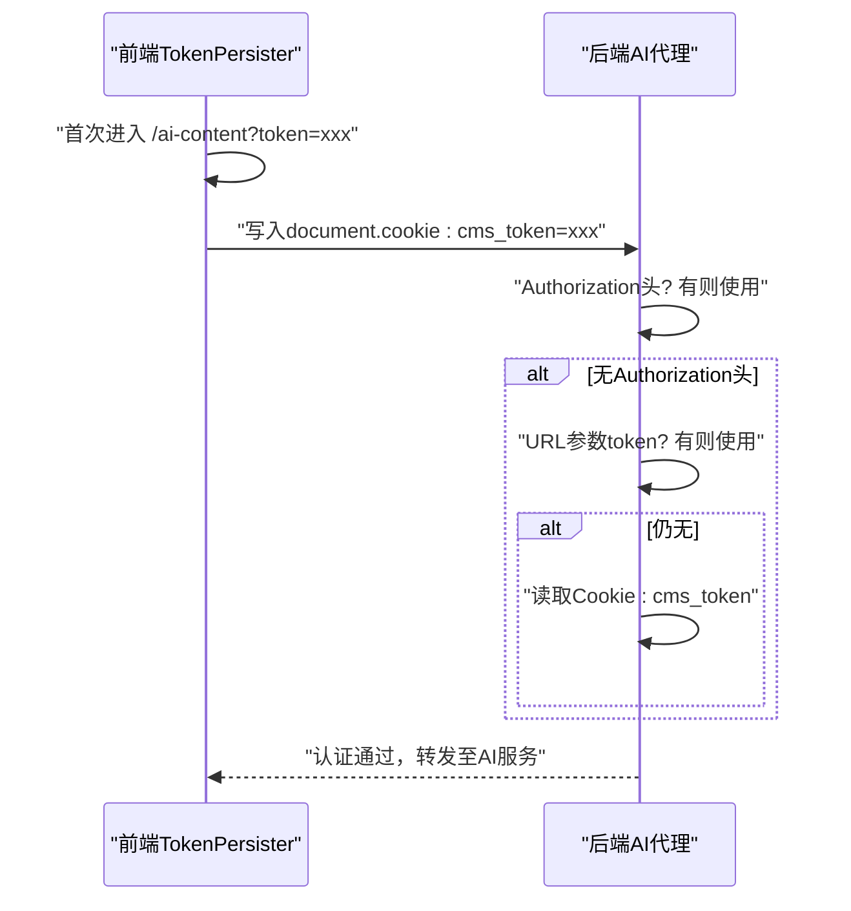
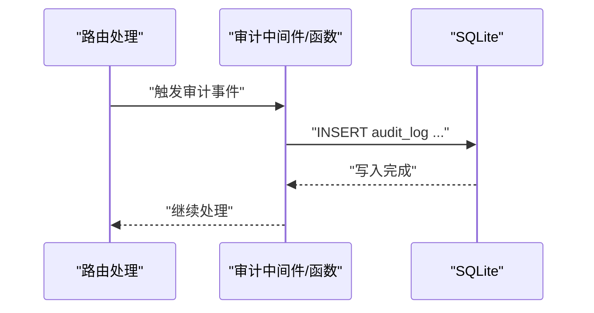
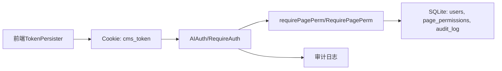

# 用户认证数据流

<cite>
**本文引用的文件**
- [business-core/cms-server/middleware/auth.js](file://business-core/cms-server/middleware/auth.js)
- [business-core/cms-server/routes/auth.js](file://business-core/cms-server/routes/auth.js)
- [business-core/cms-server/app.js](file://business-core/cms-server/app.js)
- [business-core/cms-server/middleware/audit.js](file://business-core/cms-server/middleware/audit.js)
- [business-core/cms-server/db/setup.js](file://business-core/cms-server/db/setup.js)
- [ai-content-project/src/components/token-persister.tsx](file://ai-content-project/src/components/token-persister.tsx)
- [ai-content-project/src/app/layout.tsx](file://ai-content-project/src/app/layout.tsx)
- [ai-content-project/src/app/page.tsx](file://ai-content-project/src/app/page.tsx)
- [business-core/cms-server-go/middleware/auth.go](file://business-core/cms-server-go/middleware/auth.go)
- [business-core/cms-server-go/routes/auth.go](file://business-core/cms-server-go/routes/auth.go)
- [business-core/cms-server-go/middleware/audit.go](file://business-core/cms-server-go/middleware/audit.go)
- [business-core/cms-server-go/db/setup.go](file://business-core/cms-server-go/db/setup.go)
- [business-core/cms-server-go/config/config.go](file://business-core/cms-server-go/config/config.go)
- [business-core/cms-server-go/main.go](file://business-core/cms-server-go/main.go)
</cite>

## 目录
1. [简介](#简介)
2. [项目结构](#项目结构)
3. [核心组件](#核心组件)
4. [架构总览](#架构总览)
5. [详细组件分析](#详细组件分析)
6. [依赖关系分析](#依赖关系分析)
7. [性能考量](#性能考量)
8. [故障排查指南](#故障排查指南)
9. [结论](#结论)
10. [附录](#附录)

## 简介
本文件面向ZSTS-CMS的用户认证数据流，系统性梳理JWT令牌的生成、验证与刷新全生命周期，覆盖登录请求→密码验证→JWT签发→令牌存储→API调用验证→权限检查→自动续期等环节。文档同时说明三种认证方式：Authorization头、URL令牌和Cookie回退机制；阐述用户角色权限控制、页面级权限验证与审计日志记录；并给出令牌安全策略、过期处理与异常情况处置建议，以及认证流程图与安全最佳实践。

## 项目结构
ZSTS-CMS采用前后端分离架构，后端包含两套实现：
- Node.js版本（Express）：位于business-core/cms-server，提供传统REST API与反向代理AI内容生成服务。
- Go/Gin版本：位于business-core/cms-server-go，提供高性能API与统一的AI内容生成代理。

前端位于ai-content-project，负责UI与令牌持久化（Cookie回退）。



图表来源
- [business-core/cms-server/app.js:1-315](file://business-core/cms-server/app.js#L1-L315)
- [business-core/cms-server/middleware/auth.js:1-86](file://business-core/cms-server/middleware/auth.js#L1-L86)
- [business-core/cms-server/routes/auth.js:1-99](file://business-core/cms-server/routes/auth.js#L1-L99)
- [business-core/cms-server/middleware/audit.js:1-75](file://business-core/cms-server/middleware/audit.js#L1-L75)
- [business-core/cms-server/db/setup.js:1-115](file://business-core/cms-server/db/setup.js#L1-L115)
- [ai-content-project/src/app/layout.tsx:1-34](file://ai-content-project/src/app/layout.tsx#L1-L34)
- [ai-content-project/src/components/token-persister.tsx:1-38](file://ai-content-project/src/components/token-persister.tsx#L1-L38)
- [ai-content-project/src/app/page.tsx:1-285](file://ai-content-project/src/app/page.tsx#L1-L285)
- [business-core/cms-server-go/main.go:1-317](file://business-core/cms-server-go/main.go#L1-L317)
- [business-core/cms-server-go/middleware/auth.go:1-203](file://business-core/cms-server-go/middleware/auth.go#L1-L203)
- [business-core/cms-server-go/routes/auth.go:1-174](file://business-core/cms-server-go/routes/auth.go#L1-L174)
- [business-core/cms-server-go/middleware/audit.go:1-96](file://business-core/cms-server-go/middleware/audit.go#L1-L96)
- [business-core/cms-server-go/db/setup.go:1-187](file://business-core/cms-server-go/db/setup.go#L1-L187)
- [business-core/cms-server-go/config/config.go:1-95](file://business-core/cms-server-go/config/config.go#L1-L95)

章节来源
- [business-core/cms-server/app.js:1-315](file://business-core/cms-server/app.js#L1-L315)
- [business-core/cms-server-go/main.go:1-317](file://business-core/cms-server-go/main.go#L1-L317)
- [ai-content-project/src/app/layout.tsx:1-34](file://ai-content-project/src/app/layout.tsx#L1-L34)

## 核心组件
- 认证中间件与权限控制
  - Node.js：requireAuth、requireSuperAdmin、requirePagePerm，基于Authorization头校验JWT，注入req.user；页面权限通过page_permissions表检查。
  - Go/Gin：RequireAuth、RequireSuperAdmin、RequirePagePerm、AIAuth，支持Authorization头、URL参数token与Cookie回退；AIAuth专门用于AI内容生成代理场景。
- 登录与当前用户接口
  - Node.js：POST /api/auth/login、GET /api/auth/me；登录时生成7天JWT，记录审计日志；/me接口验证JWT并返回用户信息与权限列表。
  - Go/Gin：POST /api/auth/login、GET /api/auth/me；逻辑一致，使用Gin框架与jwt-go库。
- 令牌持久化与回退
  - 前端TokenPersister在首次进入带token的URL时写入cms_token Cookie，解决iframe内客户端导航导致的401问题；页面渲染时读取cms_user Cookie显示当前用户。
- 审计日志
  - Node.js与Go均提供审计中间件/函数，记录登录、写操作等行为，包含用户ID/用户名、动作、目标与详情。
- 数据库初始化
  - users、page_permissions、audit_log等表结构初始化，默认超级管理员账号及页面权限分配。

章节来源
- [business-core/cms-server/middleware/auth.js:1-86](file://business-core/cms-server/middleware/auth.js#L1-L86)
- [business-core/cms-server/routes/auth.js:1-99](file://business-core/cms-server/routes/auth.js#L1-L99)
- [business-core/cms-server-go/middleware/auth.go:1-203](file://business-core/cms-server-go/middleware/auth.go#L1-L203)
- [business-core/cms-server-go/routes/auth.go:1-174](file://business-core/cms-server-go/routes/auth.go#L1-L174)
- [ai-content-project/src/components/token-persister.tsx:1-38](file://ai-content-project/src/components/token-persister.tsx#L1-L38)
- [ai-content-project/src/app/page.tsx:1-285](file://ai-content-project/src/app/page.tsx#L1-L285)
- [business-core/cms-server/middleware/audit.js:1-75](file://business-core/cms-server/middleware/audit.js#L1-L75)
- [business-core/cms-server-go/middleware/audit.go:1-96](file://business-core/cms-server-go/middleware/audit.go#L1-L96)
- [business-core/cms-server/db/setup.js:1-115](file://business-core/cms-server/db/setup.js#L1-L115)
- [business-core/cms-server-go/db/setup.go:1-187](file://business-core/cms-server-go/db/setup.go#L1-L187)

## 架构总览
下图展示从登录到API调用、权限检查与审计日志的关键交互：



图表来源
- [business-core/cms-server/routes/auth.js:22-66](file://business-core/cms-server/routes/auth.js#L22-L66)
- [business-core/cms-server/middleware/auth.js:20-35](file://business-core/cms-server/middleware/auth.js#L20-L35)
- [business-core/cms-server/db/setup.js:14-104](file://business-core/cms-server/db/setup.js#L14-L104)
- [business-core/cms-server/middleware/audit.js:22-40](file://business-core/cms-server/middleware/audit.js#L22-L40)
- [business-core/cms-server-go/routes/auth.go:27-104](file://business-core/cms-server-go/routes/auth.go#L27-L104)
- [business-core/cms-server-go/middleware/auth.go:17-63](file://business-core/cms-server-go/middleware/auth.go#L17-L63)
- [business-core/cms-server-go/db/setup.go:18-175](file://business-core/cms-server-go/db/setup.go#L18-L175)
- [business-core/cms-server-go/middleware/audit.go:16-46](file://business-core/cms-server-go/middleware/audit.go#L16-L46)
- [ai-content-project/src/components/token-persister.tsx:15-37](file://ai-content-project/src/components/token-persister.tsx#L15-L37)

## 详细组件分析

### 登录与JWT签发流程
- Node.js实现要点
  - 登录接口接收用户名与密码，查询用户并使用bcrypt比对哈希；成功后生成7天有效期JWT，返回token与用户权限列表，并记录审计日志。
  - /api/auth/me接口从Authorization头解析Bearer token，验证后返回用户信息与权限。
- Go/Gin实现要点
  - 登录接口逻辑一致，使用jwt-go库生成7天JWT；/api/auth/me接口同样验证Authorization头中的JWT。
- 安全与合规
  - 使用强JWT密钥（开发默认值需在生产环境替换）。
  - 密码使用bcrypt存储与校验，降低泄露风险。
  - 审计日志记录登录事件，便于追踪。



图表来源
- [business-core/cms-server/routes/auth.js:22-66](file://business-core/cms-server/routes/auth.js#L22-L66)
- [business-core/cms-server/middleware/audit.js:22-40](file://business-core/cms-server/middleware/audit.js#L22-L40)
- [business-core/cms-server/db/setup.js:72-104](file://business-core/cms-server/db/setup.js#L72-L104)

章节来源
- [business-core/cms-server/routes/auth.js:22-66](file://business-core/cms-server/routes/auth.js#L22-L66)
- [business-core/cms-server-go/routes/auth.go:27-104](file://business-core/cms-server-go/routes/auth.go#L27-L104)

### JWT验证与权限检查
- Node.js中间件
  - requireAuth：从Authorization头提取Bearer token并验证，失败返回401；成功将用户信息注入req.user。
  - requireSuperAdmin：要求用户角色为super_admin。
  - requirePagePerm(pageKey)：除super_admin外，查询page_permissions表判断是否具备页面编辑权限。
- Go中间件
  - RequireAuth/RequireSuperAdmin/RequirePagePerm：与Node实现一致，支持从Authorization头、URL参数token与Cookie回退。
  - AIAuth：专用于AI内容生成代理，按优先级尝试三种认证途径，任一成功即注入用户信息。



图表来源
- [business-core/cms-server/middleware/auth.js:20-63](file://business-core/cms-server/middleware/auth.js#L20-L63)
- [business-core/cms-server-go/middleware/auth.go:134-176](file://business-core/cms-server-go/middleware/auth.go#L134-L176)

章节来源
- [business-core/cms-server/middleware/auth.js:20-63](file://business-core/cms-server/middleware/auth.js#L20-L63)
- [business-core/cms-server-go/middleware/auth.go:17-132](file://business-core/cms-server-go/middleware/auth.go#L17-L132)

### 令牌存储与Cookie回退机制
- 前端TokenPersister
  - 首次进入带token的URL时，读取token并写入非HttpOnly的cms_token Cookie；避免iframe内客户端导航导致的401。
- 页面渲染
  - 读取cms_user Cookie显示当前用户名称，提升用户体验。
- 后端代理
  - Node与Go后端均支持Authorization头、URL token与Cookie三种认证方式，AI内容生成代理优先尝试Authorization头，其次URL token，最后Cookie回退。



图表来源
- [ai-content-project/src/components/token-persister.tsx:15-37](file://ai-content-project/src/components/token-persister.tsx#L15-L37)
- [business-core/cms-server/app.js:168-225](file://business-core/cms-server/app.js#L168-L225)
- [business-core/cms-server-go/main.go:209-290](file://business-core/cms-server-go/main.go#L209-L290)

章节来源
- [ai-content-project/src/components/token-persister.tsx:15-37](file://ai-content-project/src/components/token-persister.tsx#L15-L37)
- [ai-content-project/src/app/page.tsx:45-50](file://ai-content-project/src/app/page.tsx#L45-L50)
- [business-core/cms-server/app.js:168-225](file://business-core/cms-server/app.js#L168-L225)
- [business-core/cms-server-go/main.go:209-290](file://business-core/cms-server-go/main.go#L209-L290)

### 权限模型与页面级权限验证
- 角色
  - super_admin：超级管理员，拥有所有权限。
  - editor：编辑者，仅能访问被授权的页面。
- 页面权限
  - page_permissions表存储用户与页面键值(page_key)的映射；除super_admin外，其余用户必须具备对应页面权限才可访问。
- 数据初始化
  - 默认管理员账号创建时，批量授予多个页面权限，确保初始可用性。

```mermaid
erDiagram
USERS {
int id PK
text username UK
text password_hash
text role
text created_at
text last_login
}
PAGE_PERMISSIONS {
int user_id FK
text page_key
primary key (user_id, page_key)
}
AUDIT_LOG {
int id PK
int user_id
text username
text action
text target
text detail
text timestamp
}
USERS ||--o{ PAGE_PERMISSIONS : "拥有"
USERS ||--o{ AUDIT_LOG : "产生"
```

图表来源
- [business-core/cms-server/db/setup.js:18-53](file://business-core/cms-server/db/setup.js#L18-L53)
- [business-core/cms-server-go/db/setup.go:46-90](file://business-core/cms-server-go/db/setup.go#L46-L90)

章节来源
- [business-core/cms-server/middleware/auth.js:46-63](file://business-core/cms-server/middleware/auth.js#L46-L63)
- [business-core/cms-server-go/middleware/auth.go:86-132](file://business-core/cms-server-go/middleware/auth.go#L86-L132)
- [business-core/cms-server/db/setup.js:72-104](file://business-core/cms-server/db/setup.js#L72-L104)
- [business-core/cms-server-go/db/setup.go:110-175](file://business-core/cms-server-go/db/setup.go#L110-L175)

### 审计日志记录
- Node.js
  - 手动调用audit记录登录等关键事件；提供审计中间件拦截写操作并异步记录。
- Go/Gin
  - 提供Audit函数与AuditMiddleware，统一记录用户、动作、目标与请求体摘要。



图表来源
- [business-core/cms-server/middleware/audit.js:22-72](file://business-core/cms-server/middleware/audit.js#L22-L72)
- [business-core/cms-server-go/middleware/audit.go:16-95](file://business-core/cms-server-go/middleware/audit.go#L16-L95)

章节来源
- [business-core/cms-server/middleware/audit.js:22-72](file://business-core/cms-server/middleware/audit.js#L22-L72)
- [business-core/cms-server-go/middleware/audit.go:16-95](file://business-core/cms-server-go/middleware/audit.go#L16-L95)

## 依赖关系分析
- 认证链路
  - 前端通过TokenPersister写入Cookie，后端中间件按序尝试Authorization头、URL token与Cookie。
  - 登录成功后返回JWT，后续API请求均需携带Authorization头。
- 数据一致性
  - 用户信息与权限来源于SQLite数据库；审计日志独立记录，不影响业务主流程。
- 外部依赖
  - Node：jsonwebtoken、bcrypt、better-sqlite3、http-proxy-middleware。
  - Go：gin、jwt-go、sqlite3驱动、godotenv。



图表来源
- [ai-content-project/src/components/token-persister.tsx:15-37](file://ai-content-project/src/components/token-persister.tsx#L15-L37)
- [business-core/cms-server-go/middleware/auth.go:134-176](file://business-core/cms-server-go/middleware/auth.go#L134-L176)
- [business-core/cms-server/db/setup.js:18-53](file://business-core/cms-server/db/setup.js#L18-L53)
- [business-core/cms-server-go/db/setup.go:46-90](file://business-core/cms-server-go/db/setup.go#L46-L90)

章节来源
- [business-core/cms-server-go/middleware/auth.go:134-176](file://business-core/cms-server-go/middleware/auth.go#L134-L176)
- [business-core/cms-server/db/setup.js:18-53](file://business-core/cms-server/db/setup.js#L18-L53)
- [business-core/cms-server-go/db/setup.go:46-90](file://business-core/cms-server-go/db/setup.go#L46-L90)

## 性能考量
- JWT验证成本低：基于内存验证，避免频繁数据库查询。
- 权限检查：页面权限查询为单条记录查找，索引为主键(user_id,page_key)，性能稳定。
- 审计日志：Node采用异步写入，Go使用goroutine异步写入，避免阻塞请求。
- 代理转发：AI内容生成代理在认证通过后直接转发请求，减少额外序列化开销。

## 故障排查指南
- 401 未提供认证令牌
  - 检查Authorization头是否包含Bearer token；确认URL参数token或Cookie cms_token是否存在且未过期。
- 401 令牌已失效
  - 确认JWT未过期；核对JWT_SECRET是否一致；检查系统时间与时区。
- 403 无页面编辑权限
  - 确认用户角色与页面权限映射；必要时为用户添加page_permissions记录。
- 审计日志未记录
  - 检查审计中间件/函数是否正确注册；确认数据库连接正常。
- iframe内401
  - 确认TokenPersister已将token写入cms_token Cookie；检查SameSite/Lax设置与跨域策略。

章节来源
- [business-core/cms-server/middleware/auth.js:20-35](file://business-core/cms-server/middleware/auth.js#L20-L35)
- [business-core/cms-server-go/middleware/auth.go:17-63](file://business-core/cms-server-go/middleware/auth.go#L17-L63)
- [business-core/cms-server/routes/auth.js:68-96](file://business-core/cms-server/routes/auth.js#L68-L96)
- [business-core/cms-server-go/routes/auth.go:106-173](file://business-core/cms-server-go/routes/auth.go#L106-L173)
- [ai-content-project/src/components/token-persister.tsx:15-37](file://ai-content-project/src/components/token-persister.tsx#L15-L37)

## 结论
ZSTS-CMS的认证体系以JWT为核心，结合多途径认证（Authorization头、URL token、Cookie回退）与严格的页面级权限控制，实现了安全、灵活且易用的用户认证数据流。配合完善的审计日志与数据库初始化脚本，系统在开发与生产环境中均可快速落地。建议在生产环境强化密钥管理、启用HTTPS、定期轮换密钥并监控异常登录与写操作。

## 附录
- 令牌安全策略
  - 强制HTTPS传输；合理设置Cookie属性（HttpOnly、Secure、SameSite）；生产环境务必替换默认JWT_SECRET。
  - 令牌有效期建议根据业务场景调整；结合刷新令牌机制（当前代码未实现，可在后续迭代引入）。
- 过期处理与异常
  - 前端在401时引导用户重新登录；后端对无效令牌统一返回401。
  - 审计日志记录登录与关键操作，便于事后追溯。
- 最佳实践
  - 使用强密码策略与多因素认证（MFA）增强登录安全。
  - 对敏感接口增加速率限制与IP白名单。
  - 定期备份数据库与审计日志，确保可恢复性。