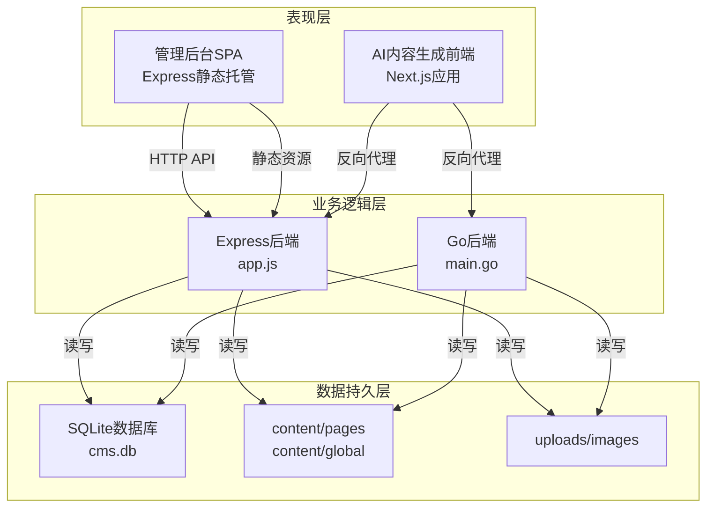
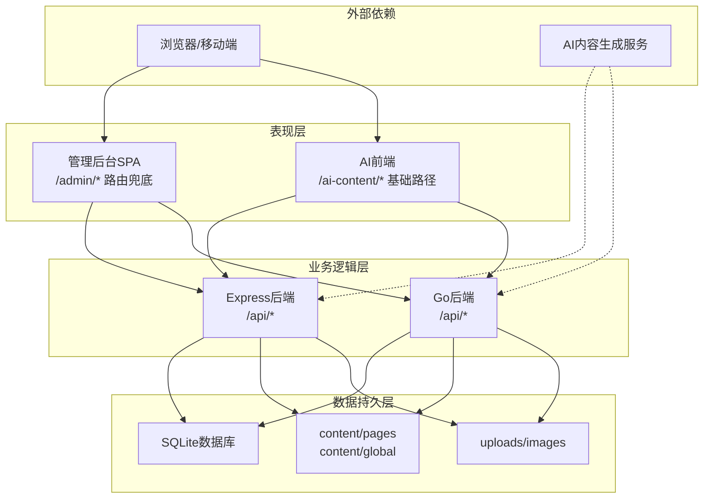
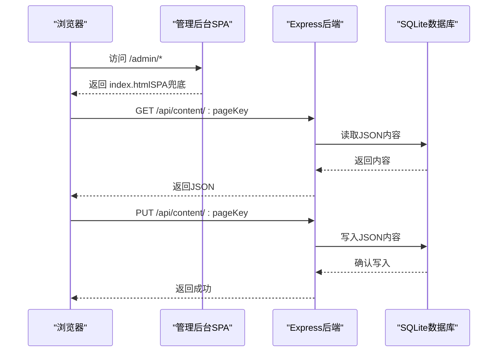
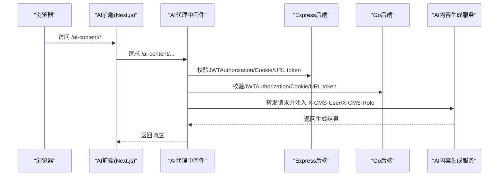
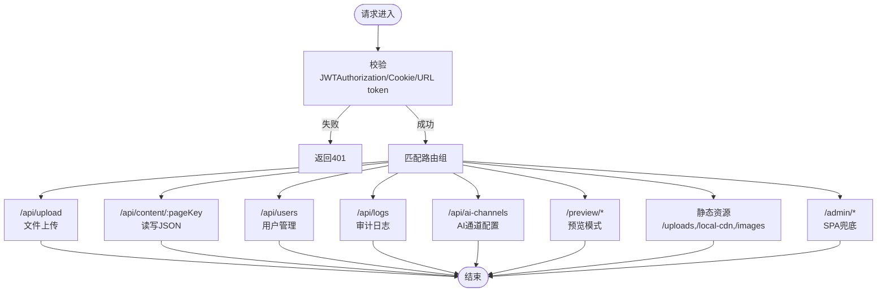
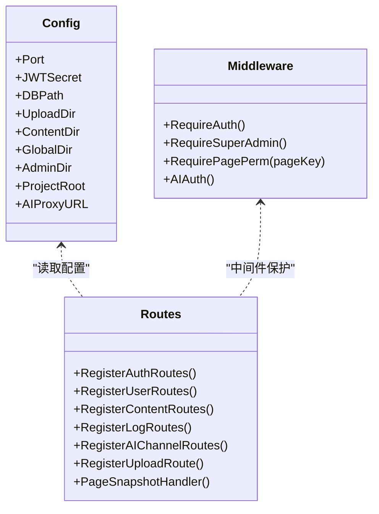
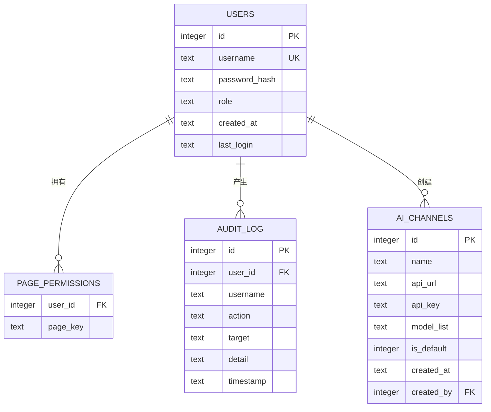
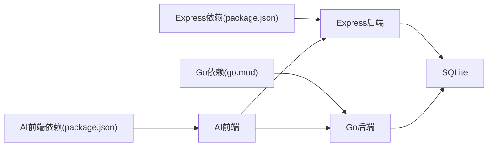

# 整体架构概览

<cite>
**本文引用的文件**
- [cms-server/package.json](file://cms-server/package.json)
- [cms-server/app.js](file://cms-server/app.js)
- [cms-server/db/setup.js](file://cms-server/db/setup.js)
- [cms-server/middleware/auth.js](file://cms-server/middleware/auth.js)
- [cms-server/routes/auth.js](file://cms-server/routes/auth.js)
- [cms-server/routes/content.js](file://cms-server/routes/content.js)
- [cms-server/routes/users.js](file://cms-server/routes/users.js)
- [cms-server-go/go.mod](file://cms-server-go/go.mod)
- [cms-server-go/main.go](file://cms-server-go/main.go)
- [cms-server-go/config/config.go](file://cms-server-go/config/config.go)
- [cms-server-go/db/db.go](file://cms-server-go/db/db.go)
- [cms-server-go/middleware/auth.go](file://cms-server-go/middleware/auth.go)
- [cms-server-go/routes/auth.go](file://cms-server-go/routes/auth.go)
- [cms-server-go/routes/content.go](file://cms-server-go/routes/content.go)
- [cms-server-go/routes/users.go](file://cms-server-go/routes/users.go)
- [ai-content-project/package.json](file://ai-content-project/package.json)
- [ai-content-project/src/server.ts](file://ai-content-project/src/server.ts)
- [ai-content-project/next.config.ts](file://ai-content-project/next.config.ts)
</cite>

## 更新摘要
**所做更改**
- 新增Go后端服务架构分析，包括Gin框架实现与MySQL数据库支持
- 新增AI内容生成前端架构说明，基于Next.js的独立部署模式
- 更新双后端协同架构设计，明确Express与Go后端的职责分工
- 扩展数据持久层分析，对比SQLite与MySQL的差异
- 完善AI代理机制的技术实现细节
- 更新系统上下文图，反映新增组件与通信关系

## 目录
1. [引言](#引言)
2. [项目结构](#项目结构)
3. [核心组件](#核心组件)
4. [架构总览](#架构总览)
5. [详细组件分析](#详细组件分析)
6. [依赖关系分析](#依赖关系分析)
7. [性能考量](#性能考量)
8. [故障排查指南](#故障排查指南)
9. [结论](#结论)
10. [附录](#附录)

## 引言
本文件面向ZSTS-CMS的整体架构，聚焦三层架构设计：表现层（管理后台SPA与AI前端）、业务逻辑层（Express.js与Go后端）、数据持久层（SQLite数据库）。文档明确三个核心子系统的职责边界、组件间通信机制与数据流向，并给出系统上下文图与技术选型说明，帮助读者快速理解系统全貌与实现细节。

**更新** 本次更新反映了应用变更：新增Go后端服务、双后端协同架构、AI内容生成前端等新组件，形成了更加完善的多后端协同架构。

## 项目结构
ZSTS-CMS采用多模块组织方式：
- ai-content-project：AI内容生成前端（Next.js应用），通过反向代理与后端进行鉴权与数据交互。
- business-core：业务核心，包含两个后端服务与共享内容存储：
  - cms-server（Express.js）：传统后端API与静态资源托管。
  - cms-server-go（Gin/Go）：现代化后端API与静态资源托管，提供更完善的中间件与路由组织。
  - content与uploads：内容与上传资源的本地持久化目录。

**图表来源**
- [cms-server/app.js:1-315](file://cms-server/app.js#L1-L315)
- [cms-server-go/main.go:1-189](file://cms-server-go/main.go#L1-L189)
- [cms-server/db/setup.js:1-115](file://cms-server/db/setup.js#L1-L115)
- [cms-server-go/db/db.go:1-155](file://cms-server-go/db/db.go#L1-L155)

**章节来源**
- [cms-server/package.json:1-22](file://cms-server/package.json#L1-L22)
- [cms-server-go/go.mod:1-41](file://cms-server-go/go.mod#L1-L41)
- [ai-content-project/package.json:1-100](file://ai-content-project/package.json#L1-L100)

## 核心组件
- 管理后台SPA（Express静态托管）：提供内容管理与用户权限管理界面，通过API与后端交互；同时作为静态资源服务器托管自身资源。
- AI内容生成前端（Next.js）：提供智能生成功能，通过反向代理与后端进行统一鉴权与用户上下文传递。
- Express后端（cms-server）：提供认证、内容管理、用户管理、日志、AI通道等API；内置静态资源与预览模式；提供AI内容生成代理。
- Go后端（cms-server-go）：提供与Express后端一致的API能力，采用Gin框架，具备更强的中间件与路由组织能力；同样提供静态资源、预览模式与AI代理。
- SQLite数据库：存储用户、页面权限、审计日志与AI通道配置；初始化脚本创建表并注入默认超级管理员。

**更新** 新增Go后端服务，采用Gin框架实现，提供与Express后端一致的API能力，增强了中间件与路由组织能力。

**章节来源**
- [cms-server/app.js:155-225](file://cms-server/app.js#L155-L225)
- [cms-server-go/main.go:72-87](file://cms-server-go/main.go#L72-L87)
- [cms-server/db/setup.js:14-108](file://cms-server/db/setup.js#L14-L108)
- [cms-server-go/db/db.go:18-175](file://cms-server-go/db/db.go#L18-L175)

## 架构总览
系统采用前后端分离与多后端协同的三层架构：
- 表现层：管理后台SPA与AI前端分别运行在不同后端之上，共享统一的鉴权与资源访问策略。
- 业务逻辑层：Express与Go后端均提供REST API，负责认证、权限校验、内容读写、用户管理与审计日志。
- 数据持久层：SQLite数据库集中存储用户与权限、审计日志、AI通道配置；内容与上传资源以文件形式存储于content与uploads目录。

**图表来源**
- [cms-server/app.js:227-230](file://cms-server/app.js#L227-L230)
- [ai-content-project/next.config.ts:4](file://ai-content-project/next.config.ts#L4)
- [cms-server-go/main.go:89-97](file://cms-server-go/main.go#L89-L97)

## 详细组件分析

### 管理后台SPA（Express静态托管）
- 职责：提供内容管理与用户权限管理界面；作为静态资源服务器托管自身资源。
- 关键点：
  - 管理后台路由兜底：所有/admin/*路径交由Express返回index.html，实现SPA路由。
  - 静态资源托管：/admin、/uploads、/local-cdn、/images等路径映射至相应目录。
  - 预览模式：/preview/*路径托管官网前端页面，注入预览客户端JS与pageKey，修复资源相对路径。
  - 页面快照：/api/page-snapshot/:pageKey抓取HTML中的data-i18n元素，用于编辑器首次回显。

**图表来源**
- [cms-server/app.js:227-230](file://cms-server/app.js#L227-L230)
- [cms-server/app.js:48-53](file://cms-server/app.js#L48-L53)
- [cms-server/routes/content.js:48-65](file://cms-server/routes/content.js#L48-L65)

**章节来源**
- [cms-server/app.js:55-62](file://cms-server/app.js#L55-L62)
- [cms-server/app.js:103-153](file://cms-server/app.js#L103-L153)
- [cms-server/app.js:232-299](file://cms-server/app.js#L232-L299)

### AI内容生成前端（Next.js）
- 职责：提供智能生成功能，通过反向代理与后端统一鉴权。
- 关键点：
  - 基础路径：/ai-content，便于与后端路由区分。
  - 服务器启动：基于Next.js HTTP服务器，处理静态与动态请求。
  - 与后端协作：通过AI代理将用户上下文（用户名、角色）注入到AI服务请求头中。

**图表来源**
- [ai-content-project/src/server.ts:13-35](file://ai-content-project/src/server.ts#L13-L35)
- [ai-content-project/next.config.ts:4](file://ai-content-project/next.config.ts#L4)
- [cms-server/app.js:163-225](file://cms-server/app.js#L163-L225)
- [cms-server-go/main.go:209-289](file://cms-server-go/main.go#L209-L289)

**章节来源**
- [ai-content-project/src/server.ts:1-36](file://ai-content-project/src/server.ts#L1-L36)
- [ai-content-project/next.config.ts:1-23](file://ai-content-project/next.config.ts#L1-L23)

### Express后端（cms-server）
- 职责：提供认证、内容管理、用户管理、日志、AI通道等API；静态资源托管与预览模式；AI内容生成代理。
- 关键点：
  - 认证中间件：requireAuth、requireSuperAdmin、requirePagePerm；支持JWT校验与页面权限检查。
  - 路由分组：/api/auth、/api/users、/api/content、/api/logs、/api/ai-channels。
  - AI代理：支持Authorization头、URL token与Cookie三种方式校验，转发时注入用户信息与Cookie。
  - 静态资源与预览：/uploads、/local-cdn、/images、/preview/*；/admin/*SPA兜底。
  - 数据库初始化：创建users、page_permissions、audit_log、ai_channels表并初始化默认超级管理员。

**图表来源**
- [cms-server/app.js:155-225](file://cms-server/app.js#L155-L225)
- [cms-server/middleware/auth.js:20-63](file://cms-server/middleware/auth.js#L20-L63)
- [cms-server/routes/content.js:48-101](file://cms-server/routes/content.js#L48-L101)
- [cms-server/routes/users.js:26-151](file://cms-server/routes/users.js#L26-L151)

**章节来源**
- [cms-server/app.js:163-225](file://cms-server/app.js#L163-L225)
- [cms-server/middleware/auth.js:1-86](file://cms-server/middleware/auth.js#L1-L86)
- [cms-server/routes/auth.js:22-96](file://cms-server/routes/auth.js#L22-L96)
- [cms-server/routes/content.js:1-104](file://cms-server/routes/content.js#L1-L104)
- [cms-server/routes/users.js:1-154](file://cms-server/routes/users.js#L1-L154)
- [cms-server/db/setup.js:14-108](file://cms-server/db/setup.js#L14-L108)

### Go后端（cms-server-go）
- 职责：提供与Express后端一致的API能力，增强中间件与路由组织；静态资源托管与预览模式；AI代理。
- 关键点：
  - 配置加载：从环境变量读取端口、JWT密钥、数据库路径、上传目录、内容目录等。
  - 中间件：CORS、日志、恢复、请求体大小限制；AI认证中间件支持三种令牌来源。
  - 路由注册：/api/auth、/api/users、/api/content、/api/logs、/api/ai-channels、/api/upload、/api/page-snapshot。
  - 静态资源与预览：/uploads、/local-cdn、/images、/preview/*；/admin/*SPA兜底。
  - 数据库初始化：创建users、page_permissions、audit_log、ai_channels表并初始化默认超级管理员。

**图表来源**
- [cms-server-go/config/config.go:10-22](file://cms-server-go/config/config.go#L10-L22)
- [cms-server-go/middleware/auth.go:17-132](file://cms-server-go/middleware/auth.go#L17-L132)
- [cms-server-go/routes/auth.go:18-25](file://cms-server-go/routes/auth.go#L18-L25)
- [cms-server-go/routes/content.go:29-36](file://cms-server-go/routes/content.go#L29-L36)

**章节来源**
- [cms-server-go/main.go:22-114](file://cms-server-go/main.go#L22-L114)
- [cms-server-go/config/config.go:26-57](file://cms-server-go/config/config.go#L26-L57)
- [cms-server-go/middleware/auth.go:134-203](file://cms-server-go/middleware/auth.go#L134-L203)
- [cms-server-go/routes/auth.go:27-173](file://cms-server-go/routes/auth.go#L27-L173)
- [cms-server-go/routes/content.go:80-157](file://cms-server-go/routes/content.go#L80-L157)
- [cms-server-go/routes/users.go:18-248](file://cms-server-go/routes/users.go#L18-L248)
- [cms-server-go/db/db.go:18-175](file://cms-server-go/db/db.go#L18-L175)

### 数据持久层（SQLite）
- 职责：存储用户、页面权限、审计日志、AI通道配置；内容与上传资源以文件形式存储。
- 关键点：
  - 表结构：users（用户）、page_permissions（页面权限）、audit_log（审计日志）、ai_channels（AI通道）。
  - 初始化：创建表并插入默认超级管理员账号，分配所有页面权限，记录审计日志。
  - 文件存储：content/pages与content/global存放页面JSON；uploads/images存放上传图片。

**更新** 新增Go后端使用MySQL数据库的实现，提供更好的性能和扩展性。两个后端共享同一套数据库schema与文件存储约定，确保内容一致性。

**图表来源**
- [cms-server/db/setup.js:18-53](file://cms-server/db/setup.js#L18-L53)
- [cms-server-go/db/db.go:46-90](file://cms-server-go/db/db.go#L46-L90)

**章节来源**
- [cms-server/db/setup.js:14-108](file://cms-server/db/setup.js#L14-L108)
- [cms-server-go/db/db.go:18-175](file://cms-server-go/db/db.go#L18-L175)

## 依赖关系分析
- 外部依赖：
  - Express后端依赖better-sqlite3、bcrypt、jsonwebtoken、cors、multer等。
  - Go后端依赖gin、jwt、godotenv、mysql驱动等。
  - AI前端依赖Next.js、TailwindCSS、Radix UI等生态组件。
- 内部依赖：
  - 两个后端共享同一套数据库schema与文件存储约定，确保内容一致性。
  - AI代理统一校验JWT，保证跨后端的一致性鉴权体验。

**图表来源**
- [cms-server/package.json:10-21](file://cms-server/package.json#L10-L21)
- [cms-server-go/go.mod:5-11](file://cms-server-go/go.mod#L5-L11)
- [ai-content-project/package.json:15-76](file://ai-content-project/package.json#L15-L76)

**章节来源**
- [cms-server/package.json:1-22](file://cms-server/package.json#L1-L22)
- [cms-server-go/go.mod:1-41](file://cms-server-go/go.mod#L1-L41)
- [ai-content-project/package.json:1-100](file://ai-content-project/package.json#L1-L100)

## 性能考量
- 请求体大小限制：Express与Go后端均限制multipart内存大小，避免大文件导致内存压力。
- 缓存策略：预览模式禁用缓存，确保编辑实时生效；静态资源提供明确的缓存头。
- 数据库外键：Go后端显式启用外键约束，保障数据一致性。
- 文件I/O：内容与上传资源采用文件系统存储，简单可靠；建议在高并发场景引入CDN与对象存储。

**更新** 新增Go后端的MySQL数据库优化，包括连接池配置、外键约束启用等性能优化措施。

## 故障排查指南
- 认证失败：
  - 检查Authorization头、Cookie或URL token是否有效；确认JWT密钥一致。
  - Express后端：中间件requireAuth会返回具体错误信息。
  - Go后端：中间件RequireAuth/RequireSuperAdmin/RequirePagePerm提供统一错误码。
- 权限不足：
  - 确认用户角色与页面权限；超级管理员可绕过页面权限检查。
  - 检查page_permissions表中是否存在对应page_key。
- 数据库问题：
  - 确认DB_PATH与目录权限；初始化脚本会在缺失时自动创建表与默认管理员。
- 静态资源与预览：
  - 检查/static映射与/preview/*路径；确认资源相对路径被正确修复。
- AI代理：
  - 确认AI_PROXY_URL配置；检查代理中间件是否正确注入X-CMS-User与X-CMS-Role。

**更新** 新增Go后端数据库连接问题排查，包括MySQL连接参数验证、连接池配置检查等。

**章节来源**
- [cms-server/middleware/auth.js:20-63](file://cms-server/middleware/auth.js#L20-L63)
- [cms-server-go/middleware/auth.go:17-132](file://cms-server-go/middleware/auth.go#L17-L132)
- [cms-server/db/setup.js:72-104](file://cms-server/db/setup.js#L72-L104)
- [cms-server-go/db/db.go:110-172](file://cms-server-go/db/db.go#L110-L172)

## 结论
ZSTS-CMS通过"表现层-业务逻辑层-数据持久层"的清晰分层，结合Express与Go双后端协同，实现了内容管理、用户权限、审计日志与AI内容生成的统一平台。SQLite与文件系统提供了简洁可靠的持久化方案；JWT与多源认证机制确保了安全与可用性。未来可在高并发场景引入CDN与对象存储优化静态资源与上传性能，并持续完善监控与可观测性体系。

**更新** 新架构通过双后端协同实现了更好的性能与可维护性，Go后端提供现代化的API实现，Express后端保持向后兼容，AI前端独立部署提升了系统的模块化程度。

## 附录
- 技术选型说明：
  - Express与Go：兼顾开发效率与性能，双栈并行降低迁移风险。
  - SQLite与MySQL：根据场景选择合适的数据库，SQLite适合开发测试，MySQL适合生产环境。
  - Next.js：SSR/ISR与静态导出能力，满足AI前端的快速迭代需求。
  - JWT：无状态认证，便于跨服务与跨端使用。
- 架构决策权衡：
  - 双后端并行：提升开发灵活性与演进速度，需注意API一致性与运维复杂度。
  - 文件系统存储：部署简单，扩展性有限；建议结合对象存储与CDN。
  - 预览模式：提升编辑体验，需关注资源路径修复与缓存策略。
  - AI代理：统一鉴权与用户上下文传递，简化AI服务集成。

**更新** 新增Go后端技术选型说明，包括Gin框架的优势、MySQL数据库的选择理由，以及AI代理机制的技术实现细节。