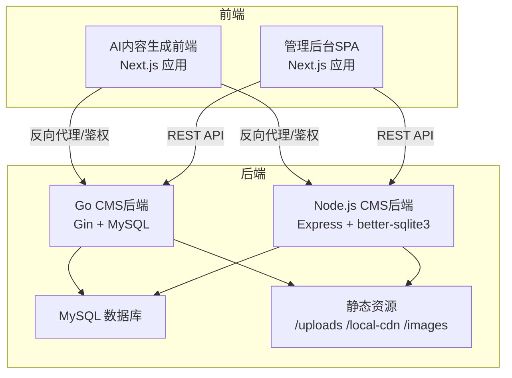
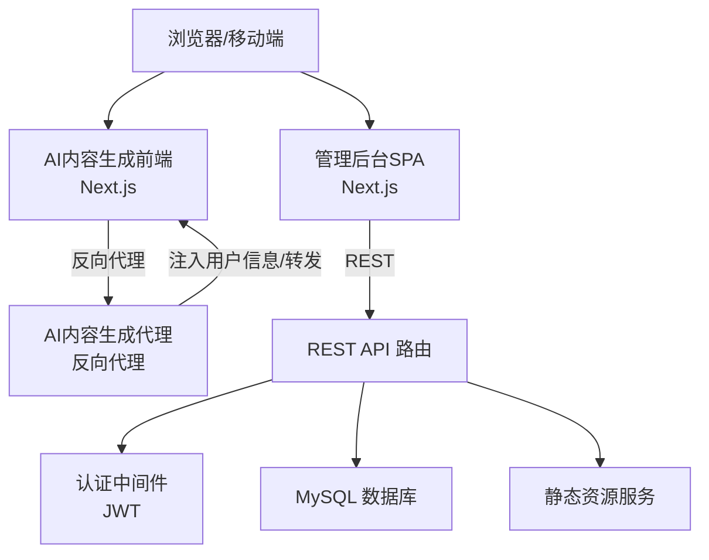
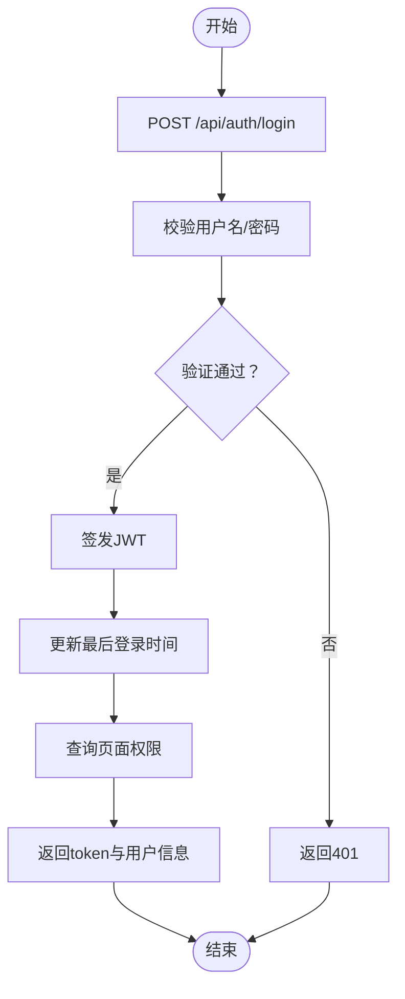
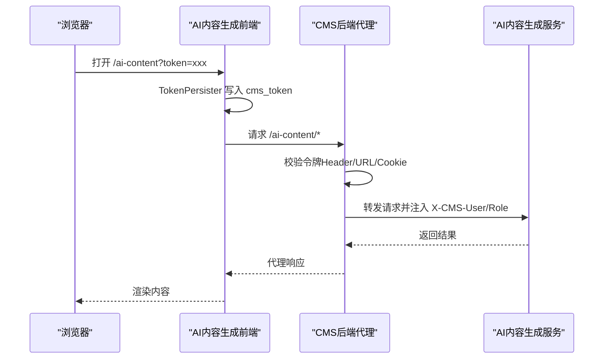
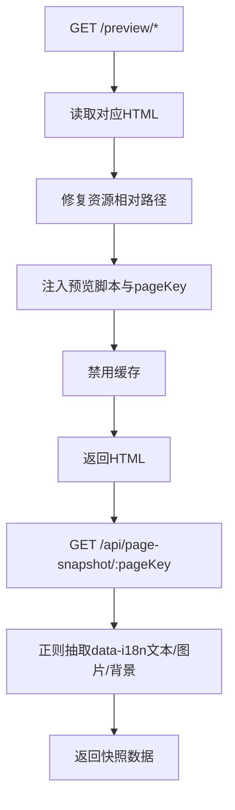
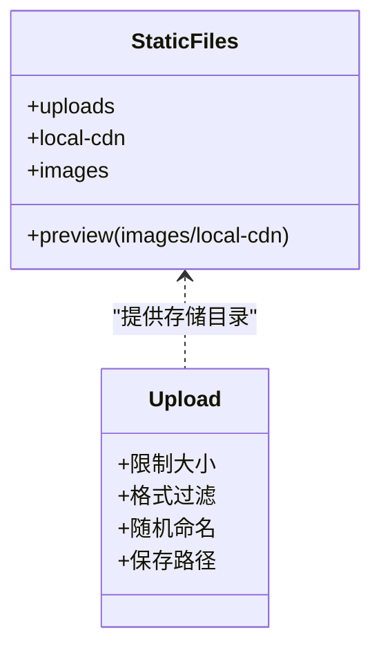
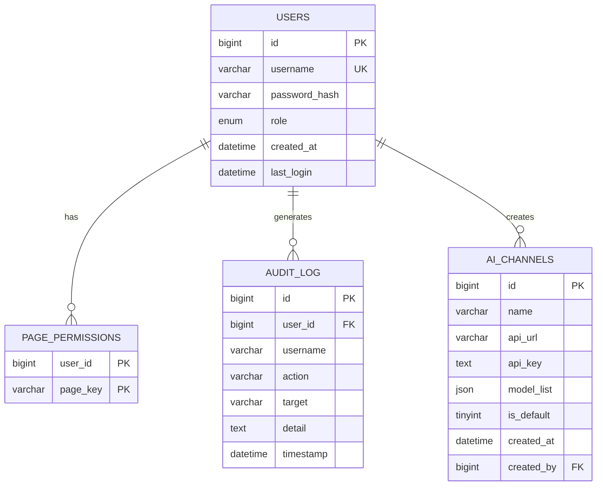
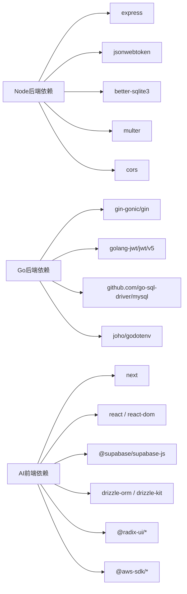

# 系统架构设计

<cite>
**本文档引用的文件**
- [cms-server-go/main.go](file://cms-server-go/main.go)
- [cms-server/app.js](file://cms-server/app.js)
- [cms-server-go/models/models.go](file://cms-server-go/models/models.go)
- [cms-server/db/setup.js](file://cms-server/db/setup.js)
- [cms-server-go/db/db.go](file://cms-server-go/db/db.go)
- [ai-content-project/package.json](file://ai-content-project/package.json)
- [cms-server-go/go.mod](file://cms-server-go/go.mod)
- [cms-server/package.json](file://cms-server/package.json)
- [cms-server-go/routes/auth.go](file://cms-server-go/routes/auth.go)
- [cms-server/routes/auth.js](file://cms-server/routes/auth.js)
- [cms-server-go/config/config.go](file://cms-server-go/config/config.go)
- [ai-content-project/next.config.ts](file://ai-content-project/next.config.ts)
- [ai-content-project/src/app/layout.tsx](file://ai-content-project/src/app/layout.tsx)
- [ai-content-project/src/components/token-persister.tsx](file://ai-content-project/src/components/token-persister.tsx)
</cite>

## 更新摘要
**所做更改**
- 更新架构概述以反映Node.js+Go双后端架构迁移
- 新增完整的数据库设计文档和API接口规范
- 更新技术栈和依赖关系分析
- 增强安全性和性能考量章节
- 完善部署拓扑和运维指南

## 目录
1. [引言](#引言)
2. [项目结构](#项目结构)
3. [核心组件](#核心组件)
4. [架构总览](#架构总览)
5. [详细组件分析](#详细组件分析)
6. [数据库设计](#数据库设计)
7. [API接口文档](#api接口文档)
8. [依赖关系分析](#依赖关系分析)
9. [性能考量](#性能考量)
10. [故障排查指南](#故障排查指南)
11. [结论](#结论)
12. [附录](#附录)

## 引言
本架构文档面向ZSTS-CMS系统，聚焦于三个子系统的协同工作：CMS后端API服务器（Node.js/Go双栈）、管理后台SPA（Next.js）与AI内容生成前端（Next.js）。系统已完成从单一架构到Node.js+Go双后端架构的重大迁移，新增了完整的数据库设计和API接口文档。文档阐述高层设计、架构模式与系统边界，详细说明三者之间的组件交互、数据流向与集成模式；解释技术决策、权衡与约束；给出基础设施需求、可扩展性考虑与部署拓扑；覆盖安全、监控与灾备等横切关注点；并记录技术栈、第三方依赖与版本兼容性。

## 项目结构
ZSTS-CMS采用多模块组织方式：
- ai-content-project：AI内容生成前端应用，基于Next.js，提供内容创作、海报生成、日志查看等功能页面，通过反向代理与CMS后端进行认证与鉴权协作。
- business-core/cms-server：Node.js版CMS后端API服务器，提供认证、内容管理、日志、AI通道配置、静态资源托管与预览模式等能力。
- business-core/cms-server-go：Go/Gin版CMS后端API服务器，功能与Node版本一致，具备更强的并发与性能优势，作为生产主选。
- business-core/content：静态页面内容源文件（HTML/CSS/JS），由CMS后端在预览模式下注入客户端脚本并托管。
- business-core/uploads/images：图片上传存储目录，由后端统一管理。



**图表来源**
- [cms-server-go/main.go:21-116](file://cms-server-go/main.go#L21-L116)
- [cms-server/app.js:16-315](file://cms-server/app.js#L16-L315)
- [ai-content-project/next.config.ts:1-23](file://ai-content-project/next.config.ts#L1-L23)

**章节来源**
- [ai-content-project/package.json:1-100](file://ai-content-project/package.json#L1-L100)
- [cms-server/package.json:1-22](file://cms-server/package.json#L1-L22)
- [cms-server-go/go.mod:1-41](file://cms-server-go/go.mod#L1-L41)

## 核心组件
- CMS后端API服务器（Node.js/Go双栈）
  - 认证与授权：JWT令牌签发与校验，角色与页面权限控制。
  - 内容管理：页面内容读写、页面快照抓取、预览模式托管。
  - 文件上传：图片上传与存储，支持多格式与大小限制。
  - 审计日志：登录与关键操作记录。
  - AI内容生成代理：统一鉴权入口，支持Header、URL token与Cookie三种方式。
- 管理后台SPA（Next.js）
  - 单页应用路由，基于REST API与后端交互。
  - 集成鉴权状态与权限菜单渲染。
- AI内容生成前端（Next.js）
  - 通过反向代理访问AI服务，内置Token持久化组件解决iframe客户端导航丢失令牌的问题。
  - 支持基础路径前缀"/ai-content"。

**章节来源**
- [cms-server/routes/auth.js:1-99](file://cms-server/routes/auth.js#L1-L99)
- [cms-server-go/routes/auth.go:1-131](file://cms-server-go/routes/auth.go#L1-L131)
- [cms-server/middleware/auth.js:1-86](file://cms-server/middleware/auth.js#L1-L86)
- [cms-server-go/middleware/auth.go:1-203](file://cms-server-go/middleware/auth.go#L1-L203)
- [ai-content-project/src/components/token-persister.tsx:1-38](file://ai-content-project/src/components/token-persister.tsx#L1-L38)

## 架构总览
系统采用"前后端分离 + 反向代理 + 多后端实例"的混合架构：
- 前端侧：管理后台SPA与AI内容生成前端均基于Next.js，分别通过REST API与反向代理与后端交互。
- 后端侧：Node.js与Go双栈并存，Go版本作为主力，Node版本用于兼容与过渡。
- 鉴权与代理：后端统一提供JWT认证与AI内容生成代理，支持多种令牌传递方式（Header、URL token、Cookie）。
- 静态资源：后端统一托管上传图片、本地CDN与预览资源，支持预览模式下的HTML注入与资源路径修复。



**图表来源**
- [cms-server-go/main.go:135-189](file://cms-server-go/main.go#L135-L189)
- [cms-server/app.js:163-225](file://cms-server/app.js#L163-L225)
- [cms-server-go/middleware/auth.go:134-176](file://cms-server-go/middleware/auth.go#L134-L176)
- [cms-server/middleware/auth.js:20-63](file://cms-server/middleware/auth.js#L20-L63)

## 详细组件分析

### 组件A：认证与授权（JWT）
- 设计要点
  - 登录成功后签发包含用户ID、用户名与角色的JWT，有效期7天。
  - 角色分为"超级管理员"和"编辑"，超级管理员拥有全部页面权限。
  - 页面权限表用于细粒度控制各页面编辑权限。
- 流程图



**图表来源**
- [cms-server/routes/auth.js:22-66](file://cms-server/routes/auth.js#L22-L66)
- [cms-server-go/routes/auth.go:27-104](file://cms-server-go/routes/auth.go#L27-L104)

**章节来源**
- [cms-server/routes/auth.js:1-99](file://cms-server/routes/auth.js#L1-L99)
- [cms-server-go/routes/auth.go:1-131](file://cms-server-go/routes/auth.go#L1-L131)
- [cms-server/db/setup.js:18-53](file://cms-server/db/setup.js#L18-L53)
- [cms-server-go/db/db.go:63-105](file://cms-server-go/db/db.go#L63-L105)

### 组件B：AI内容生成代理（多令牌通道）
- 设计要点
  - 支持三种令牌传递方式：Authorization头、URL查询参数、Cookie回传。
  - 代理将用户身份注入到上游请求头（X-CMS-User/X-CMS-Role），并设置cms_user Cookie。
  - 适用于iframe嵌入场景，解决客户端导航导致的令牌丢失问题。
- 时序图



**图表来源**
- [cms-server/app.js:163-225](file://cms-server/app.js#L163-L225)
- [cms-server-go/main.go:135-189](file://cms-server-go/main.go#L135-L189)
- [ai-content-project/src/components/token-persister.tsx:1-38](file://ai-content-project/src/components/token-persister.tsx#L1-L38)

**章节来源**
- [cms-server/app.js:163-225](file://cms-server/app.js#L163-L225)
- [cms-server-go/main.go:135-189](file://cms-server-go/main.go#L135-L189)
- [ai-content-project/src/components/token-persister.tsx:1-38](file://ai-content-project/src/components/token-persister.tsx#L1-L38)

### 组件C：预览模式与页面快照
- 设计要点
  - 后端托管官网HTML，在预览模式下注入预览客户端脚本与pageKey，修复资源相对路径。
  - 提供页面快照接口，从前端HTML中抽取data-i18n元素的当前值，用于编辑器回显。
- 流程图



**图表来源**
- [cms-server/app.js:104-153](file://cms-server/app.js#L104-L153)
- [cms-server/app.js:233-299](file://cms-server/app.js#L233-L299)
- [cms-server-go/main.go:146-207](file://cms-server-go/main.go#L146-L207)

**章节来源**
- [cms-server/app.js:104-153](file://cms-server/app.js#L104-L153)
- [cms-server/app.js:233-299](file://cms-server/app.js#L233-L299)
- [cms-server-go/main.go:146-207](file://cms-server-go/main.go#L146-L207)

### 组件D：静态资源与上传
- 设计要点
  - 后端统一暴露/uploads、/local-cdn、/images等静态目录，支持预览模式下的资源访问。
  - 图片上传限制5MB以内，支持常见图片格式，文件名随机化避免冲突。
- 类图



**图表来源**
- [cms-server/app.js:55-62](file://cms-server/app.js#L55-L62)
- [cms-server/app.js:28-53](file://cms-server/app.js#L28-L53)
- [cms-server-go/main.go:51-58](file://cms-server-go/main.go#L51-L58)

**章节来源**
- [cms-server/app.js:28-53](file://cms-server/app.js#L28-L53)
- [cms-server-go/main.go:51-58](file://cms-server-go/main.go#L51-L58)

## 数据库设计

### 数据库架构概览
系统采用MySQL作为主要数据库存储，支持用户认证、权限管理、审计日志和AI通道配置等核心功能。



**图表来源**
- [cms-server-go/db/db.go:63-105](file://cms-server-go/db/db.go#L63-L105)
- [cms-server/db/setup.js:18-68](file://cms-server/db/setup.js#L18-L68)

### 核心表结构

#### 用户表 (users)
| 字段名 | 类型 | 约束 | 描述 |
|--------|------|------|------|
| id | BIGINT UNSIGNED | 主键, 自增 | 用户唯一标识 |
| username | VARCHAR(100) | 唯一, 非空 | 用户名 |
| password_hash | VARCHAR(255) | 非空 | 密码哈希值 |
| role | ENUM('super_admin', 'editor') | 非空, 默认'editor' | 用户角色 |
| created_at | DATETIME | 非空, 默认当前时间 | 创建时间 |
| last_login | DATETIME | 可空 | 最后登录时间 |

#### 页面权限表 (page_permissions)
| 字段名 | 类型 | 约束 | 描述 |
|--------|------|------|------|
| user_id | BIGINT UNSIGNED | 复合主键, 外键(users.id) | 用户ID |
| page_key | VARCHAR(100) | 复合主键 | 页面标识符 |

#### 审计日志表 (audit_log)
| 字段名 | 类型 | 约束 | 描述 |
|--------|------|------|------|
| id | BIGINT UNSIGNED | 主键, 自增 | 日志ID |
| user_id | BIGINT UNSIGNED | 外键(users.id), 可空 | 操作用户ID |
| username | VARCHAR(100) | 非空, 默认'system' | 用户名 |
| action | VARCHAR(100) | 非空 | 操作类型 |
| target | VARCHAR(255) | 非空, 默认'' | 操作目标 |
| detail | TEXT | 可空 | 详细信息 |
| timestamp | DATETIME | 非空, 默认当前时间 | 操作时间 |

#### AI通道表 (ai_channels)
| 字段名 | 类型 | 约束 | 描述 |
|--------|------|------|------|
| id | BIGINT UNSIGNED | 主键, 自增 | 通道ID |
| name | VARCHAR(255) | 非空 | 通道名称 |
| api_url | VARCHAR(500) | 非空 | API地址 |
| api_key | TEXT | 可空 | API密钥 |
| model_list | JSON | 非空 | 模型列表 |
| is_default | TINYINT | 非空, 默认0 | 是否默认通道 |
| created_at | DATETIME | 非空, 默认当前时间 | 创建时间 |
| created_by | BIGINT UNSIGNED | 外键(users.id), 可空 | 创建人ID |

**章节来源**
- [cms-server-go/db/db.go:63-105](file://cms-server-go/db/db.go#L63-L105)
- [cms-server/db/setup.js:18-68](file://cms-server/db/setup.js#L18-L68)

## API接口文档

### 认证接口

#### 登录
- 方法：POST
- 路径：`/api/auth/login`
- 请求体：
```json
{
  "username": "string",
  "password": "string"
}
```
- 响应体：
```json
{
  "token": "string",
  "user": {
    "id": 1,
    "username": "string",
    "role": "string",
    "permissions": ["string"]
  }
}
```

#### 获取当前用户信息
- 方法：GET
- 路径：`/api/auth/me`
- 请求头：Authorization: Bearer {token}
- 响应体：
```json
{
  "id": 1,
  "username": "string",
  "role": "string",
  "created_at": "datetime",
  "last_login": "datetime",
  "permissions": ["string"]
}
```

### 用户管理接口

#### 创建用户
- 方法：POST
- 路径：`/api/users`
- 请求头：Authorization: Bearer {token}
- 请求体：
```json
{
  "username": "string",
  "password": "string",
  "role": "string",
  "permissions": ["string"]
}
```

#### 更新用户权限
- 方法：PUT
- 路径：`/api/users/{id}/permissions`
- 请求头：Authorization: Bearer {token}
- 请求体：
```json
{
  "permissions": ["string"]
}
```

### 内容管理接口

#### 获取页面内容
- 方法：GET
- 路径：`/api/content/{pageKey}`
- 响应体：
```json
{
  "pageKey": "string",
  "content": "object",
  "updatedAt": "datetime"
}
```

#### 更新页面内容
- 方法：PUT
- 路径：`/api/content/{pageKey}`
- 请求头：Authorization: Bearer {token}
- 请求体：
```json
{
  "content": "object"
}
```

### 日志接口

#### 查询审计日志
- 方法：GET
- 路径：`/api/logs`
- 查询参数：
  - page: number (默认1)
  - limit: number (默认50)
  - action: string
  - username: string
  - start_date: string
  - end_date: string
- 响应体：
```json
{
  "total": 1,
  "page": 1,
  "limit": 50,
  "rows": [
    {
      "id": 1,
      "user_id": 1,
      "username": "string",
      "action": "string",
      "target": "string",
      "detail": "string",
      "timestamp": "datetime"
    }
  ]
}
```

### AI通道接口

#### 获取AI通道列表
- 方法：GET
- 路径：`/api/ai-channels`
- 响应体：
```json
[
  {
    "id": 1,
    "name": "string",
    "api_url": "string",
    "api_key": "string",
    "model_list": ["string"],
    "is_default": true,
    "created_at": "datetime",
    "created_by": 1
  }
]
```

#### 创建AI通道
- 方法：POST
- 路径：`/api/ai-channels`
- 请求头：Authorization: Bearer {token}
- 请求体：
```json
{
  "name": "string",
  "api_url": "string",
  "api_key": "string",
  "model_list": ["string"]
}
```

**章节来源**
- [cms-server/routes/auth.js:22-99](file://cms-server/routes/auth.js#L22-L99)
- [cms-server-go/routes/auth.go:22-131](file://cms-server-go/routes/auth.go#L22-L131)

## 依赖关系分析
- 技术栈与版本
  - Node.js后端：Express、better-sqlite3、JWT、Multer、CORS、Cookie Parser、http-proxy-middleware。
  - Go后端：Gin、JWT、MySQL驱动、godotenv、bcrypt。
  - 前端（AI内容生成）：Next.js 16.1.1、React 19、Supabase、Drizzle ORM、Radix UI、AWS SDK等。
- 关键依赖关系



**图表来源**
- [cms-server/package.json:10-20](file://cms-server/package.json#L10-L20)
- [cms-server-go/go.mod:5-11](file://cms-server-go/go.mod#L5-L11)
- [ai-content-project/package.json:15-75](file://ai-content-project/package.json#L15-L75)

**章节来源**
- [cms-server/package.json:1-22](file://cms-server/package.json#L1-L22)
- [cms-server-go/go.mod:1-41](file://cms-server-go/go.mod#L1-L41)
- [ai-content-project/package.json:1-100](file://ai-content-project/package.json#L1-L100)

## 性能考量
- 并发与吞吐
  - Go/Gin版本具备更好的并发性能与内存占用，建议生产环境优先使用。
  - MySQL相比SQLite具有更好的并发处理能力和事务支持。
- 上传与存储
  - 上传大小限制与格式过滤降低异常请求风险；文件名随机化避免路径冲突。
- 缓存策略
  - 预览模式禁用缓存确保实时性；静态资源按需缓存，结合版本化与CDN可进一步优化。
- 数据库优化
  - MySQL适合中大规模数据与生产环境；建议配置合适的连接池参数和索引策略。
  - 定期清理审计日志和优化查询性能。

## 故障排查指南
- 认证失败
  - 检查Authorization头格式是否为Bearer token；确认JWT密钥一致且未过期。
  - 若通过URL token或Cookie回传，确认TokenPersister是否正确写入cms_token。
- 代理访问被拒绝
  - 确认AI代理目标地址与端口配置正确；检查后端JWT密钥与令牌签名算法一致。
- 预览页面空白或资源404
  - 检查预览模式下资源路径修复逻辑；确认/static目录映射与文件存在。
- 数据库初始化
  - 首次运行后端会初始化默认超级管理员账户；若未生效，检查DB配置与权限。
- 双后端同步
  - 确保Node.js和Go后端使用相同的数据库配置；检查JWT密钥一致性。

**章节来源**
- [cms-server/middleware/auth.js:20-63](file://cms-server/middleware/auth.js#L20-L63)
- [cms-server-go/middleware/auth.go:17-63](file://cms-server-go/middleware/auth.go#L17-L63)
- [ai-content-project/src/components/token-persister.tsx:15-37](file://ai-content-project/src/components/token-persister.tsx#L15-L37)
- [cms-server/db/setup.js:72-104](file://cms-server/db/setup.js#L72-L104)
- [cms-server-go/db/db.go:107-155](file://cms-server-go/db/db.go#L107-L155)

## 结论
ZSTS-CMS通过"前端SPA + 双后端 + 反向代理 + 统一鉴权"的架构实现了内容生产的高效率与可维护性。系统已完成从单一架构到Node.js+Go双后端架构的迁移，Go后端在性能与稳定性上更具优势，Node后端用于兼容与过渡。AI内容生成前端通过Token持久化与代理鉴权无缝对接后端，满足iframe场景需求。新增的完整数据库设计和API接口文档为系统的稳定运行提供了坚实基础。建议在生产环境中优先采用Go后端与MySQL数据库，并引入CDN与日志/监控体系以提升可用性与可观测性。

## 附录
- 基础设施与部署拓扑
  - 前端：Next.js应用可通过静态部署或SSR部署，需配置基础路径与远程图片白名单。
  - 后端：Go/Node均可独立部署，建议在同一主机或容器内，共享静态资源目录与数据库文件。
  - 代理：AI内容生成代理需与前端同域或跨域配置CORS，确保令牌传递与Cookie设置。
  - 数据库：推荐使用MySQL作为生产数据库，配置主从复制和备份策略。
- 安全加固建议
  - 强制HTTPS与安全Cookie属性；限制JWT密钥长度与轮换周期；启用审计日志。
  - 对上传文件进行二次校验与病毒扫描；对敏感接口增加速率限制。
  - 实施数据库连接池安全配置和SQL注入防护。
- 监控与灾备
  - 建议接入APM与日志聚合；定期备份数据库与静态资源；制定故障切换与回滚流程。
  - 监控关键指标：请求延迟、错误率、数据库连接数、磁盘空间。
  - 实施自动化的健康检查和告警机制。