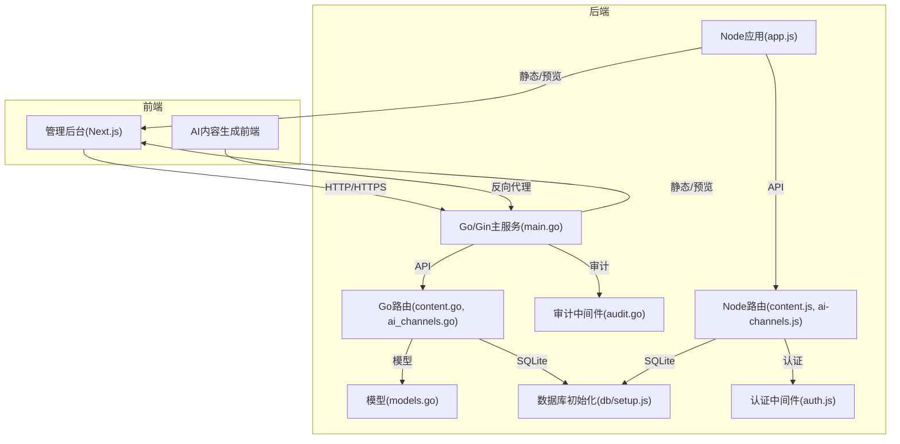
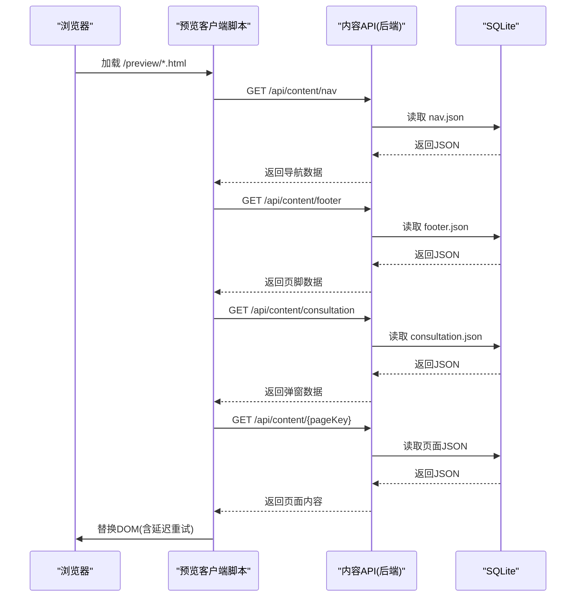
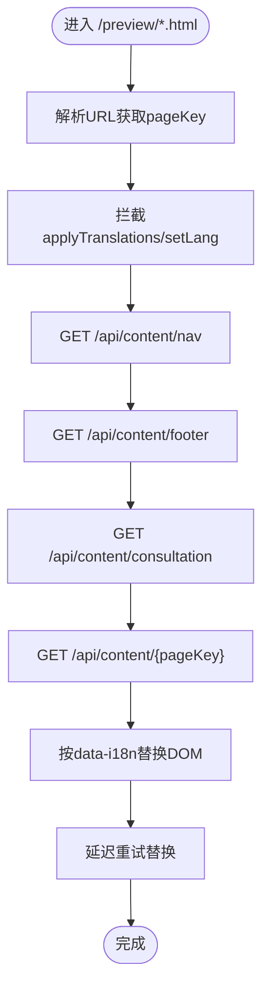
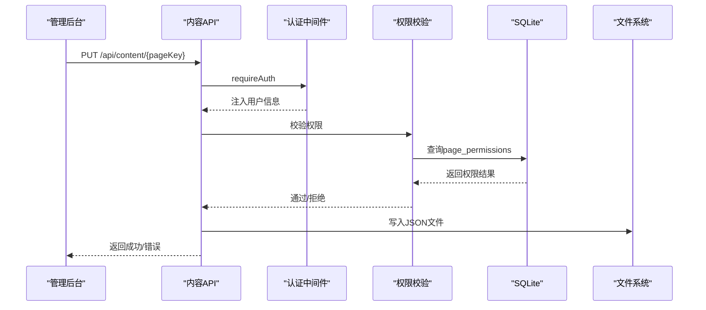
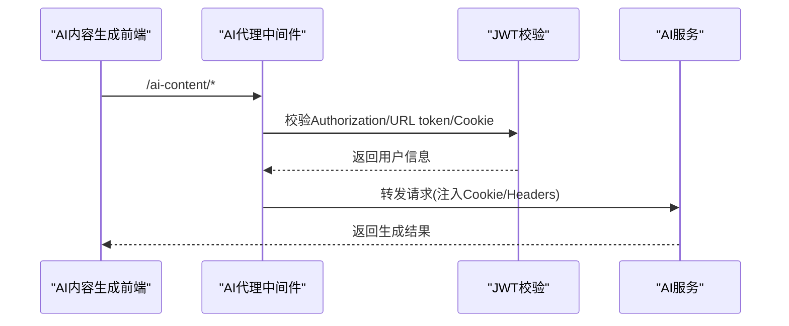
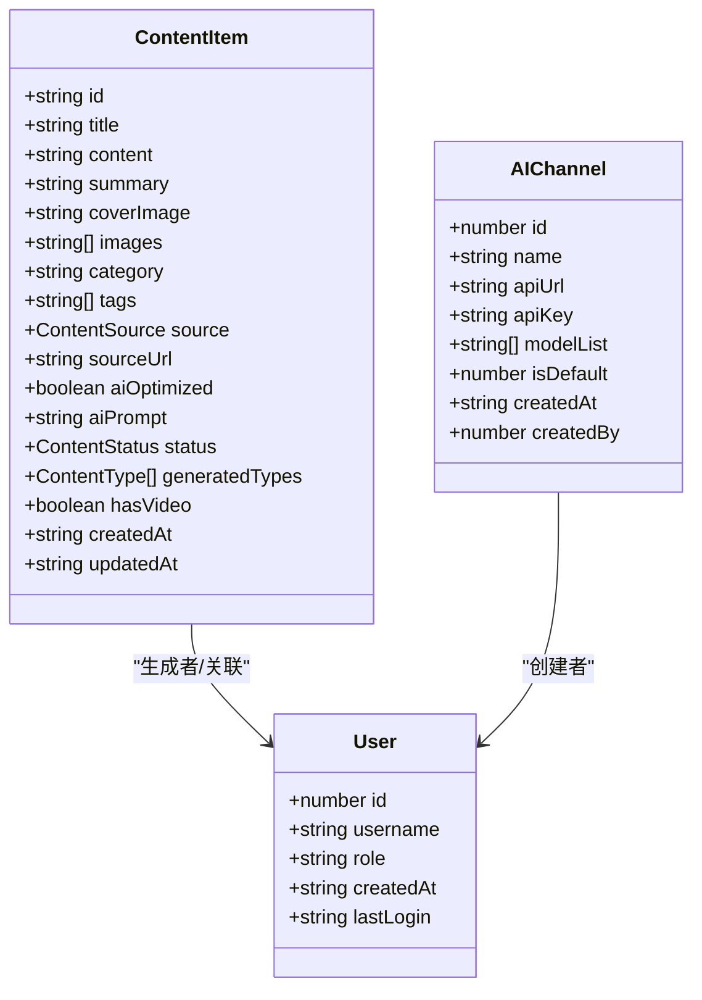
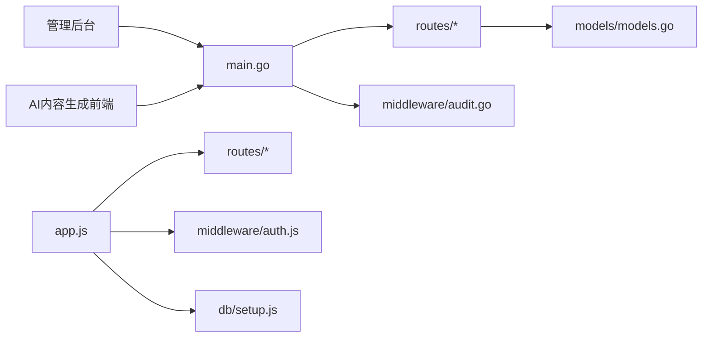

# 数据同步与状态管理

<cite>
**本文引用的文件**
- [business-core/cms-server/app.js](file://business-core/cms-server/app.js)
- [business-core/cms-server/routes/content.js](file://business-core/cms-server/routes/content.js)
- [business-core/cms-server/preview-client.js](file://business-core/cms-server/preview-client.js)
- [business-core/cms-server/db/setup.js](file://business-core/cms-server/db/setup.js)
- [business-core/cms-server/middleware/auth.js](file://business-core/cms-server/middleware/auth.js)
- [business-core/cms-server/routes/ai-channels.js](file://business-core/cms-server/routes/ai-channels.js)
- [business-core/cms-server-go/main.go](file://business-core/cms-server-go/main.go)
- [business-core/cms-server-go/routes/content.go](file://business-core/cms-server-go/routes/content.go)
- [business-core/cms-server-go/routes/ai_channels.go](file://business-core/cms-server-go/routes/ai_channels.go)
- [business-core/cms-server-go/middleware/audit.go](file://business-core/cms-server-go/middleware/audit.go)
- [business-core/cms-server-go/models/models.go](file://business-core/cms-server-go/models/models.go)
- [ai-content-project/src/lib/data.ts](file://ai-content-project/src/lib/data.ts)
- [ai-content-project/src/app/page.tsx](file://ai-content-project/src/app/page.tsx)
</cite>

## 目录
1. [引言](#引言)
2. [项目结构](#项目结构)
3. [核心组件](#核心组件)
4. [架构总览](#架构总览)
5. [组件详细分析](#组件详细分析)
6. [依赖关系分析](#依赖关系分析)
7. [性能考量](#性能考量)
8. [故障排查指南](#故障排查指南)
9. [结论](#结论)
10. [附录](#附录)

## 引言
本文件面向ZSTS-CMS的数据同步与状态管理，系统性梳理以下方面：
- 预览客户端与后端的实时数据同步机制：包括预览模式下的静态HTML托管、预览客户端脚本注入、DOM替换策略与延迟重试。
- 管理后台与后端API的状态同步模式：基于REST的CRUD操作、鉴权与权限校验、审计日志与冲突缓解思路。
- AI内容生成前后端异步数据交换：通过反向代理转发、JWT认证、Cookie注入与用户上下文传递。
- 组件间数据流、状态变更通知与错误恢复策略。
- 性能优化、网络异常处理与断线重连建议。
- 状态管理模式、数据结构设计与时间戳处理。

## 项目结构
ZSTS-CMS采用多语言分层架构：
- Go/Gin后端：提供API网关、静态资源托管、预览模式注入、AI内容生成代理、审计日志与权限控制。
- Node/Express后端：补充部分路由与预览客户端兼容，维持历史版本兼容。
- 前端管理后台：Next.js应用，负责内容池展示、筛选与操作入口。
- AI内容生成前端：独立前端应用，提供内容创建、结果查看与状态池管理。

图表来源
- [business-core/cms-server-go/main.go:1-114](file://business-core/cms-server-go/main.go#L1-L114)
- [business-core/cms-server-go/routes/content.go:29-36](file://business-core/cms-server-go/routes/content.go#L29-L36)
- [business-core/cms-server-go/middleware/audit.go:16-46](file://business-core/cms-server-go/middleware/audit.go#L16-L46)
- [business-core/cms-server-go/models/models.go:1-145](file://business-core/cms-server-go/models/models.go#L1-L145)
- [business-core/cms-server/app.js:1-114](file://business-core/cms-server/app.js#L1-L114)
- [business-core/cms-server/routes/content.js:1-104](file://business-core/cms-server/routes/content.js#L1-L104)
- [business-core/cms-server/db/setup.js:1-115](file://business-core/cms-server/db/setup.js#L1-L115)
- [business-core/cms-server/middleware/auth.js:1-86](file://business-core/cms-server/middleware/auth.js#L1-L86)
- [business-core/cms-server/routes/ai-channels.js:1-113](file://business-core/cms-server/routes/ai-channels.js#L1-L113)

章节来源
- [business-core/cms-server-go/main.go:1-114](file://business-core/cms-server-go/main.go#L1-L114)
- [business-core/cms-server/app.js:1-114](file://business-core/cms-server/app.js#L1-L114)

## 核心组件
- 预览客户端脚本：在预览模式下注入页面，按data-i18n键从后端API拉取JSON并替换DOM，支持导航、页脚、咨询弹窗与页面内容四类数据源。
- 内容API：提供GET/PUT两类端点，分别用于读取与更新页面/全局JSON内容；支持权限校验与审计日志。
- 认证与权限：基于JWT的认证中间件，区分超级管理员与普通编辑，页面级权限表控制细粒度访问。
- 审计日志：记录写操作行为，便于追踪与冲突缓解。
- AI内容生成代理：统一鉴权入口，支持Header、URL Token与Cookie三种方式，注入用户上下文并转发至AI服务。
- 数据模型：定义用户、AI渠道、上传响应、页面快照等模型，支撑API契约与状态存储。

章节来源
- [business-core/cms-server/preview-client.js:1-308](file://business-core/cms-server/preview-client.js#L1-L308)
- [business-core/cms-server-go/routes/content.go:80-157](file://business-core/cms-server-go/routes/content.go#L80-L157)
- [business-core/cms-server/middleware/auth.js:20-63](file://business-core/cms-server/middleware/auth.js#L20-L63)
- [business-core/cms-server-go/middleware/audit.go:16-46](file://business-core/cms-server-go/middleware/audit.go#L16-L46)
- [business-core/cms-server-go/main.go:209-290](file://business-core/cms-server-go/main.go#L209-L290)
- [business-core/cms-server-go/models/models.go:72-144](file://business-core/cms-server-go/models/models.go#L72-L144)

## 架构总览
ZSTS-CMS围绕“预览模式 + 管理后台 + AI内容生成”三条主线构建数据同步与状态管理：

图表来源
- [business-core/cms-server/preview-client.js:69-290](file://business-core/cms-server/preview-client.js#L69-L290)
- [business-core/cms-server-go/routes/content.go:80-108](file://business-core/cms-server-go/routes/content.go#L80-L108)

章节来源
- [business-core/cms-server/preview-client.js:1-308](file://business-core/cms-server/preview-client.js#L1-L308)
- [business-core/cms-server-go/routes/content.go:1-298](file://business-core/cms-server-go/routes/content.go#L1-L298)

## 组件详细分析

### 预览客户端与后端实时同步
- 预览模式注入：后端在托管HTML时注入预览标志与pageKey，并注入预览客户端JS，确保每次加载最新脚本。
- 数据拉取与DOM替换：脚本按导航、页脚、咨询弹窗、页面内容四个阶段依次拉取JSON并替换对应元素；对图片URL进行有效性校验与绝对路径修正。
- 延迟重试：在初次渲染后延时再次应用页面内容，避免其他脚本覆盖。
- 缓存策略：预览客户端JS与预览HTML均禁用缓存，保证开发期一致性。

图表来源
- [business-core/cms-server/preview-client.js:12-290](file://business-core/cms-server/preview-client.js#L12-L290)

章节来源
- [business-core/cms-server/app.js:104-153](file://business-core/cms-server/app.js#L104-L153)
- [business-core/cms-server/preview-client.js:1-308](file://business-core/cms-server/preview-client.js#L1-L308)

### 管理后台与后端API状态同步
- CRUD流程：
  - 读取：GET /api/content/:pageKey，支持全局配置(nav/footer/consultation)与页面内容(home/about/visa/...)。
  - 更新：PUT /api/content/:pageKey，需认证与权限校验；全局配置仅超级管理员可写。
- 权限控制：
  - 超级管理员：拥有所有页面权限。
  - 普通编辑：通过page_permissions表授予特定页面权限。
- 审计日志：写操作自动记录，便于追踪与冲突缓解。
- 数据持久化：JSON文件落盘于content/global与content/pages目录，配合SQLite记录权限与审计。

图表来源
- [business-core/cms-server/routes/content.js:67-101](file://business-core/cms-server/routes/content.js#L67-L101)
- [business-core/cms-server/middleware/auth.js:20-63](file://business-core/cms-server/middleware/auth.js#L20-L63)
- [business-core/cms-server/db/setup.js:31-53](file://business-core/cms-server/db/setup.js#L31-L53)

章节来源
- [business-core/cms-server/routes/content.js:1-104](file://business-core/cms-server/routes/content.js#L1-L104)
- [business-core/cms-server/middleware/auth.js:1-86](file://business-core/cms-server/middleware/auth.js#L1-L86)
- [business-core/cms-server/db/setup.js:1-115](file://business-core/cms-server/db/setup.js#L1-L115)

### AI内容生成前端与后端异步交换
- 认证入口：统一通过后端中间件处理，支持三类认证方式（Authorization、URL token、Cookie），校验JWT并注入用户上下文。
- 代理转发：将请求转发至AI服务，同时注入X-CMS-User/X-CMS-Role与cms_user Cookie，确保AI侧具备用户身份信息。
- 前端状态池：AI内容生成前端维护本地内容池状态，结合后端API进行长轮询/事件推送与缓存一致性策略（由前端实现，后端提供数据源）。

图表来源
- [business-core/cms-server-go/main.go:209-290](file://business-core/cms-server-go/main.go#L209-L290)
- [business-core/cms-server/app.js:163-225](file://business-core/cms-server/app.js#L163-L225)

章节来源
- [business-core/cms-server-go/main.go:209-290](file://business-core/cms-server-go/main.go#L209-L290)
- [business-core/cms-server/app.js:163-225](file://business-core/cms-server/app.js#L163-L225)
- [ai-content-project/src/lib/data.ts:1-218](file://ai-content-project/src/lib/data.ts#L1-L218)
- [ai-content-project/src/app/page.tsx:1-285](file://ai-content-project/src/app/page.tsx#L1-L285)

### 状态管理模式与数据结构
- 管理后台状态池：AI内容生成前端以本地状态池管理内容项，包含标题、摘要、封面图、分类、标签、来源、状态、生成类型、视频标记、创建/更新时间等字段。
- 后端数据模型：Go模型定义了用户、AI渠道、上传响应、页面快照等，支撑API契约与审计日志。
- 时间戳处理：后端审计日志与用户表均包含时间戳字段，前端展示使用字符串格式。

图表来源
- [ai-content-project/src/lib/data.ts:5-23](file://ai-content-project/src/lib/data.ts#L5-L23)
- [business-core/cms-server-go/models/models.go:72-110](file://business-core/cms-server-go/models/models.go#L72-L110)
- [business-core/cms-server-go/models/models.go:3-21](file://business-core/cms-server-go/models/models.go#L3-L21)

章节来源
- [ai-content-project/src/lib/data.ts:1-218](file://ai-content-project/src/lib/data.ts#L1-L218)
- [business-core/cms-server-go/models/models.go:1-145](file://business-core/cms-server-go/models/models.go#L1-L145)

### 冲突解决与一致性策略
- 权限冲突：通过page_permissions表与requirePagePerm中间件在写入前强制校验，避免越权写入。
- 审计日志：写操作自动记录，便于事后追溯与冲突定位。
- 预览一致性：预览HTML与JS禁用缓存，确保预览客户端始终获取最新数据。
- 前端一致性：AI内容生成前端通过状态池与后端API交互，结合延迟重试与URL校验保障DOM更新一致性。

章节来源
- [business-core/cms-server/routes/content.js:37-46](file://business-core/cms-server/routes/content.js#L37-L46)
- [business-core/cms-server-go/middleware/audit.go:16-46](file://business-core/cms-server-go/middleware/audit.go#L16-L46)
- [business-core/cms-server/preview-client.js:235-265](file://business-core/cms-server/preview-client.js#L235-L265)

## 依赖关系分析
- Go后端依赖Gin框架、JWT库、SQLite驱动，提供路由注册、中间件与模型定义。
- Node后端依赖Express、JWT、Multer、CORS与http-proxy-middleware，提供静态资源、预览模式与AI代理。
- 前端管理后台依赖UI组件库与状态管理，负责内容池展示与操作。
- 数据库初始化脚本创建用户、权限与审计表，插入默认超级管理员并分配页面权限。

图表来源
- [business-core/cms-server-go/main.go:1-114](file://business-core/cms-server-go/main.go#L1-L114)
- [business-core/cms-server/app.js:1-114](file://business-core/cms-server/app.js#L1-L114)
- [business-core/cms-server/db/setup.js:1-115](file://business-core/cms-server/db/setup.js#L1-L115)
- [business-core/cms-server/middleware/auth.js:1-86](file://business-core/cms-server/middleware/auth.js#L1-L86)

章节来源
- [business-core/cms-server-go/main.go:1-114](file://business-core/cms-server-go/main.go#L1-L114)
- [business-core/cms-server/app.js:1-114](file://business-core/cms-server/app.js#L1-L114)
- [business-core/cms-server/db/setup.js:1-115](file://business-core/cms-server/db/setup.js#L1-L115)

## 性能考量
- 预览模式禁用缓存：预览HTML与JS均设置no-cache，确保开发期一致性，但可能增加带宽与CPU消耗。
- 请求体限制：后端限制multipart内存与文件大小，避免大文件导致内存压力。
- 审计日志异步化：Go审计中间件采用goroutine异步写入，避免阻塞主请求链路。
- 前端渲染优化：预览客户端对图片URL进行校验与绝对路径修正，减少无效请求与重绘成本。
- 建议：
  - 对频繁读取的JSON内容引入CDN与缓存头（生产环境谨慎启用）。
  - 对大体积图片采用懒加载与尺寸裁剪。
  - 对写操作增加幂等性校验与乐观锁策略（基于时间戳或版本号）。

## 故障排查指南
- 预览页面空白或内容未更新：
  - 检查预览HTML是否注入预览客户端JS与pageKey。
  - 确认后端预览路由与静态资源路径配置。
  - 查看浏览器控制台日志，确认各API返回状态码。
- 权限不足：
  - 确认用户角色与page_permissions表中的页面权限。
  - 检查PUT请求是否携带有效JWT。
- 审计日志缺失：
  - 确认写操作是否触发审计中间件（GET与错误状态不会记录）。
  - 检查数据库连接与表结构。
- AI代理认证失败：
  - 检查Authorization头、URL token与Cookie是否正确传递。
  - 确认JWT密钥一致与签名有效。

章节来源
- [business-core/cms-server/preview-client.js:1-308](file://business-core/cms-server/preview-client.js#L1-L308)
- [business-core/cms-server/routes/content.js:67-101](file://business-core/cms-server/routes/content.js#L67-L101)
- [business-core/cms-server-go/middleware/audit.go:48-95](file://business-core/cms-server-go/middleware/audit.go#L48-L95)
- [business-core/cms-server-go/main.go:209-290](file://business-core/cms-server-go/main.go#L209-L290)

## 结论
ZSTS-CMS通过预览客户端脚本、内容API与认证/权限体系，实现了预览模式下的高效数据同步；通过审计日志与权限控制，提供了冲突缓解与可追溯性；通过AI代理中间件，统一了AI内容生成的认证与上下文传递。建议在生产环境中进一步完善缓存策略、写操作幂等性与断线重试机制，以提升整体稳定性与用户体验。

## 附录
- 关键端点与职责
  - GET /api/content/:pageKey：读取页面/全局JSON内容。
  - PUT /api/content/:pageKey：更新页面/全局JSON内容（需认证与权限）。
  - GET /api/page-snapshot/:pageKey：抓取页面快照（用于编辑器回显）。
  - GET/POST/PUT/DELETE /api/ai-channels：管理AI渠道配置（超级管理员）。
  - GET /preview/*：托管前端HTML并注入预览客户端JS。
  - /ai-content/*：AI内容生成代理（统一认证与用户上下文注入）。

章节来源
- [business-core/cms-server-go/routes/content.go:29-36](file://business-core/cms-server-go/routes/content.go#L29-L36)
- [business-core/cms-server/routes/content.js:4-10](file://business-core/cms-server/routes/content.js#L4-L10)
- [business-core/cms-server-go/routes/content.go:213-274](file://business-core/cms-server-go/routes/content.go#L213-L274)
- [business-core/cms-server-go/routes/ai_channels.go:17-28](file://business-core/cms-server-go/routes/ai_channels.go#L17-L28)
- [business-core/cms-server/app.js:103-153](file://business-core/cms-server/app.js#L103-L153)
- [business-core/cms-server-go/main.go:209-290](file://business-core/cms-server-go/main.go#L209-L290)