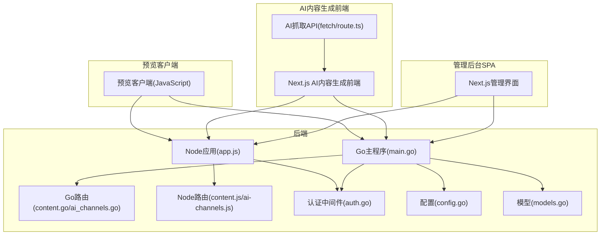
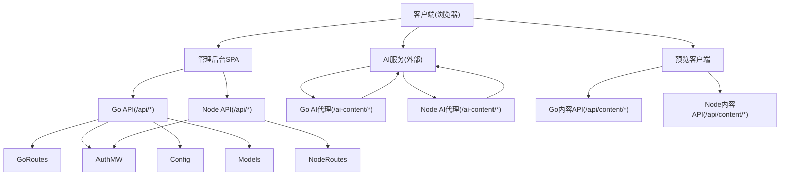
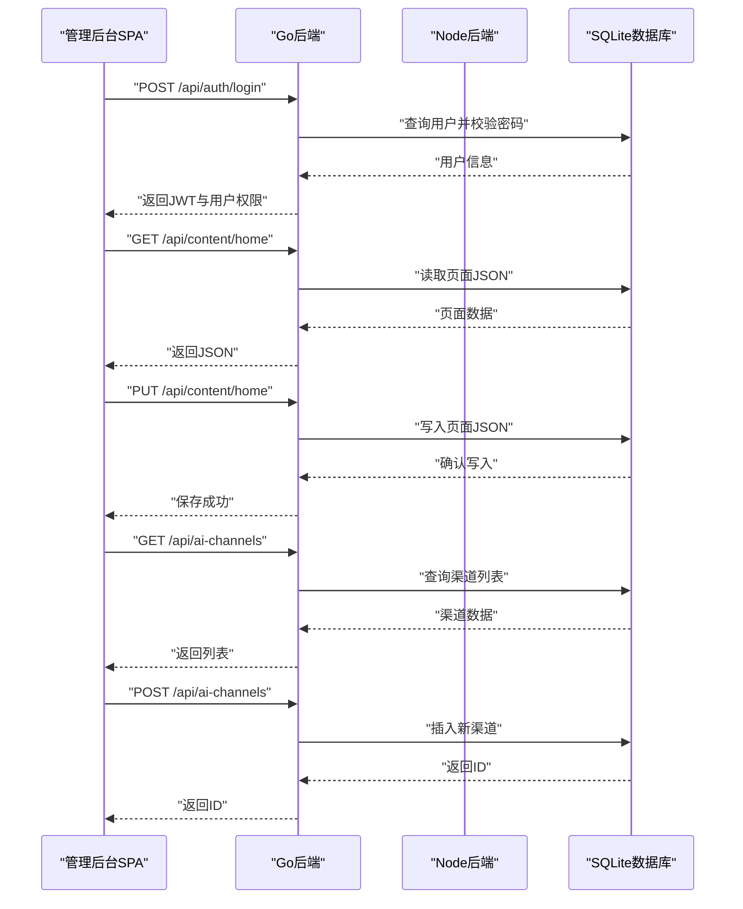
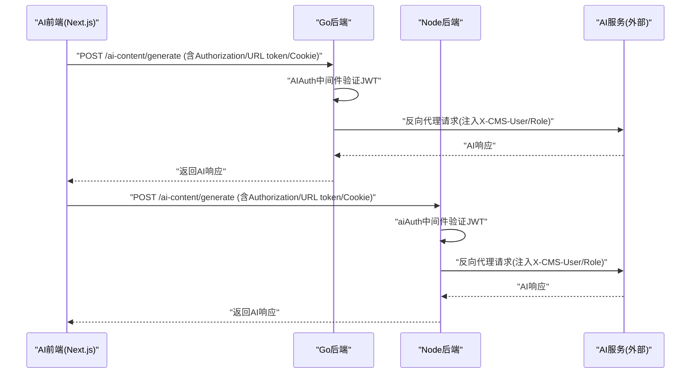
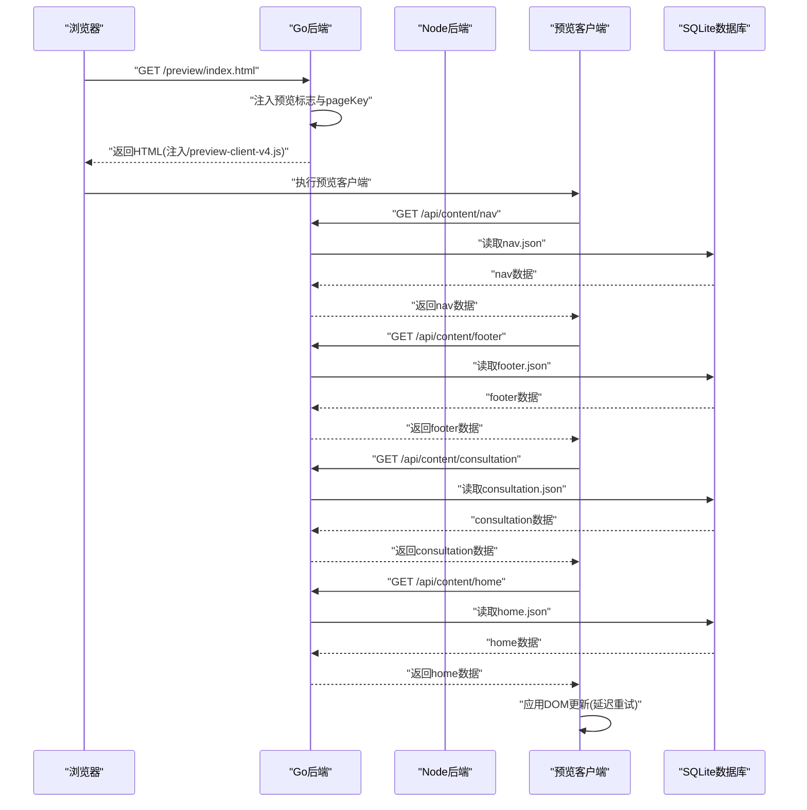
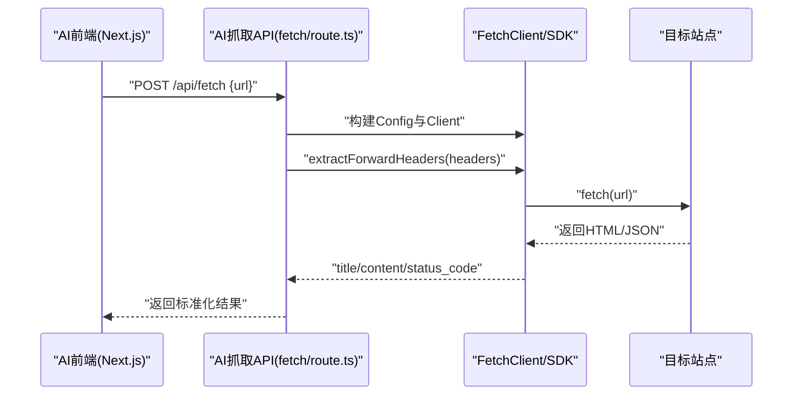
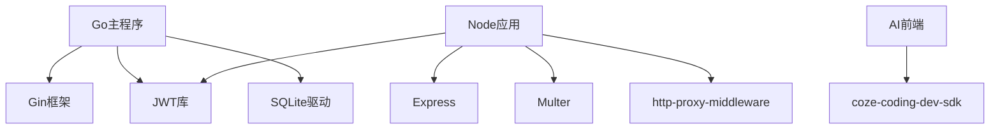

# 组件交互关系

<cite>
**本文引用的文件**
- [ai-content-project/src/app/api/fetch/route.ts](file://ai-content-project/src/app/api/fetch/route.ts)
- [business-core/cms-server/routes/content.js](file://business-core/cms-server/routes/content.js)
- [business-core/cms-server/routes/ai-channels.js](file://business-core/cms-server/routes/ai-channels.js)
- [business-core/cms-server/preview-client.js](file://business-core/cms-server/preview-client.js)
- [business-core/cms-server/app.js](file://business-core/cms-server/app.js)
- [business-core/cms-server-go/main.go](file://business-core/cms-server-go/main.go)
- [business-core/cms-server-go/routes/content.go](file://business-core/cms-server-go/routes/content.go)
- [business-core/cms-server-go/routes/ai_channels.go](file://business-core/cms-server-go/routes/ai_channels.go)
- [business-core/cms-server-go/middleware/auth.go](file://business-core/cms-server-go/middleware/auth.go)
- [business-core/cms-server-go/config/config.go](file://business-core/cms-server-go/config/config.go)
- [business-core/cms-server-go/models/models.go](file://business-core/cms-server-go/models/models.go)
- [ai-content-project/src/app/layout.tsx](file://ai-content-project/src/app/layout.tsx)
- [ai-content-project/package.json](file://ai-content-project/package.json)
</cite>

## 目录
1. [引言](#引言)
2. [项目结构](#项目结构)
3. [核心组件](#核心组件)
4. [架构总览](#架构总览)
5. [详细组件分析](#详细组件分析)
6. [依赖关系分析](#依赖关系分析)
7. [性能考量](#性能考量)
8. [故障排查指南](#故障排查指南)
9. [结论](#结论)
10. [附录](#附录)

## 引言
本文件面向ZSTS-CMS的组件交互关系，聚焦三大核心组件及其交互模式：
- CMS后端API服务器（Node/Go双栈）与管理后台SPA的双向通信机制
- CMS后端与AI内容生成前端的代理访问模式
- 预览客户端与后端的数据同步机制

文档将从系统架构、组件职责、消息传递协议、状态同步策略、错误处理与异常恢复等方面进行深入分析，并通过序列图展示典型业务场景下的数据流，帮助读者全面理解各组件如何协同工作。

## 项目结构
ZSTS-CMS采用多组件协作的分层架构：
- 后端服务：Node.js与Go双栈并行，分别提供REST API、静态资源、预览模式与AI代理能力
- 管理后台SPA：基于Next.js，通过JWT认证与后端交互，实现内容编辑与AI渠道管理
- AI内容生成前端：Next.js应用，通过后端代理访问AI服务，支持多种认证方式
- 预览客户端：注入到静态HTML中，按data-i18n键从后端拉取JSON并同步DOM

图表来源
- [business-core/cms-server-go/main.go:22-114](file://business-core/cms-server-go/main.go#L22-L114)
- [business-core/cms-server/app.js:103-153](file://business-core/cms-server/app.js#L103-L153)
- [ai-content-project/src/app/api/fetch/route.ts:1-25](file://ai-content-project/src/app/api/fetch/route.ts#L1-L25)
- [business-core/cms-server/preview-client.js:1-308](file://business-core/cms-server/preview-client.js#L1-L308)

章节来源
- [business-core/cms-server-go/main.go:22-114](file://business-core/cms-server-go/main.go#L22-L114)
- [business-core/cms-server/app.js:103-153](file://business-core/cms-server/app.js#L103-L153)

## 核心组件
- 后端API服务器（Go/Gin）
  - 提供统一REST API、静态资源、预览模式、AI代理、CORS与中间件
  - 负责内容读写、AI渠道配置、鉴权与审计
- 后端API服务器（Node/Express）
  - 提供历史兼容API、上传、预览模式、AI代理
  - 与Go后端共享部分功能，保证前后端一致性
- 管理后台SPA（Next.js）
  - 登录认证、内容编辑、AI渠道管理、页面快照
  - 通过JWT与后端交互，遵循统一的接口契约
- AI内容生成前端（Next.js）
  - 通过后端代理访问AI服务，支持多种认证方式
  - 提供内容抓取API，将外部URL内容转换为结构化数据
- 预览客户端（JavaScript）
  - 注入到静态HTML，按data-i18n键从后端拉取JSON并同步DOM
  - 支持导航、页脚、咨询弹窗与页面内容的增量更新

章节来源
- [business-core/cms-server-go/main.go:22-114](file://business-core/cms-server-go/main.go#L22-L114)
- [business-core/cms-server/app.js:103-153](file://business-core/cms-server/app.js#L103-L153)
- [ai-content-project/src/app/layout.tsx:15-33](file://ai-content-project/src/app/layout.tsx#L15-L33)
- [business-core/cms-server/preview-client.js:1-308](file://business-core/cms-server/preview-client.js#L1-L308)

## 架构总览
后端采用“Go主程序 + Node兼容层”的双栈架构，统一对外提供REST API与静态资源服务。管理后台与AI前端均通过JWT认证与后端交互；预览客户端通过后端提供的预览模式与内容API实现数据同步。

图表来源
- [business-core/cms-server-go/main.go:72-84](file://business-core/cms-server-go/main.go#L72-L84)
- [business-core/cms-server/app.js:163-225](file://business-core/cms-server/app.js#L163-L225)
- [business-core/cms-server/preview-client.js:69-105](file://business-core/cms-server/preview-client.js#L69-L105)

## 详细组件分析

### 组件A：CMS后端API服务器与管理后台SPA的双向通信机制
- 认证与会话
  - 管理后台通过登录接口获取JWT，后续请求携带Authorization头
  - 后端中间件验证JWT并注入用户上下文，支持超级管理员与页面权限校验
- 内容读写
  - GET /api/content/:pageKey：读取页面或全局配置JSON（无需认证，预览模式需要）
  - PUT /api/content/:pageKey：更新页面或全局配置JSON（需认证与权限）
- AI渠道管理
  - GET/POST/PUT/DELETE /api/ai-channels：超级管理员可管理渠道
  - 支持设为默认渠道与模型列表配置
- 页面快照
  - /api/page-snapshot/:pageKey：从HTML中抽取data-i18n键的初始值，用于编辑器回显

图表来源
- [business-core/cms-server-go/routes/content.go:80-157](file://business-core/cms-server-go/routes/content.go#L80-L157)
- [business-core/cms-server-go/routes/ai_channels.go:30-117](file://business-core/cms-server-go/routes/ai_channels.go#L30-L117)
- [business-core/cms-server-go/middleware/auth.go:17-83](file://business-core/cms-server-go/middleware/auth.go#L17-L83)

章节来源
- [business-core/cms-server-go/routes/content.go:80-157](file://business-core/cms-server-go/routes/content.go#L80-L157)
- [business-core/cms-server-go/routes/ai_channels.go:30-117](file://business-core/cms-server-go/routes/ai_channels.go#L30-L117)
- [business-core/cms-server-go/middleware/auth.go:17-83](file://business-core/cms-server-go/middleware/auth.go#L17-L83)

### 组件B：CMS后端与AI内容生成前端的代理访问模式
- 认证方式
  - 支持Authorization头、URL参数token、Cookie三种方式
  - 代理过程中将用户信息注入到上游请求头（X-CMS-User/X-CMS-Role）
- 代理路径
  - /ai-content/*：转发至AI服务（默认本地3000端口）
  - Node版本：使用http-proxy-middleware
  - Go版本：使用httputil.NewSingleHostReverseProxy
- SDK集成
  - AI前端通过coze-coding-dev-sdk发起请求，后端代理透传

图表来源
- [business-core/cms-server-go/main.go:209-289](file://business-core/cms-server-go/main.go#L209-L289)
- [business-core/cms-server/app.js:163-225](file://business-core/cms-server/app.js#L163-L225)
- [ai-content-project/src/app/api/fetch/route.ts:4-24](file://ai-content-project/src/app/api/fetch/route.ts#L4-L24)

章节来源
- [business-core/cms-server-go/main.go:209-289](file://business-core/cms-server-go/main.go#L209-L289)
- [business-core/cms-server/app.js:163-225](file://business-core/cms-server/app.js#L163-L225)
- [ai-content-project/src/app/api/fetch/route.ts:4-24](file://ai-content-project/src/app/api/fetch/route.ts#L4-L24)

### 组件C：预览客户端与后端的数据同步机制
- 预览模式
  - 后端托管静态HTML，注入预览标志与pageKey，注入预览客户端JS
  - 预览客户端按data-i18n键从后端拉取JSON并同步DOM
- 数据同步流程
  - 导航、页脚、咨询弹窗：分别从nav/footer/consultation.json读取
  - 页面内容：从对应pageKey.json读取，支持延迟重试与结构化数组暴露
- 安全与拦截
  - 预览模式下拦截applyTranslations/setLang，避免覆盖CMS注入内容

图表来源
- [business-core/cms-server-go/main.go:146-207](file://business-core/cms-server-go/main.go#L146-L207)
- [business-core/cms-server/preview-client.js:69-290](file://business-core/cms-server/preview-client.js#L69-L290)
- [business-core/cms-server-go/routes/content.go:80-108](file://business-core/cms-server-go/routes/content.go#L80-L108)

章节来源
- [business-core/cms-server-go/main.go:146-207](file://business-core/cms-server-go/main.go#L146-L207)
- [business-core/cms-server/preview-client.js:69-290](file://business-core/cms-server/preview-client.js#L69-L290)
- [business-core/cms-server-go/routes/content.go:80-108](file://business-core/cms-server-go/routes/content.go#L80-L108)

### 组件D：AI内容生成前端的抓取API
- 功能概述
  - 接收URL，提取标题、内容、状态码等，返回标准化JSON
  - 通过coze-coding-dev-sdk的FetchClient与HeaderUtils实现
- 使用场景
  - AI前端在生成内容前，先抓取目标URL的结构化数据，提升生成质量

图表来源
- [ai-content-project/src/app/api/fetch/route.ts:4-24](file://ai-content-project/src/app/api/fetch/route.ts#L4-L24)

章节来源
- [ai-content-project/src/app/api/fetch/route.ts:4-24](file://ai-content-project/src/app/api/fetch/route.ts#L4-L24)
- [ai-content-project/package.json:51-51](file://ai-content-project/package.json#L51-L51)

## 依赖关系分析
- 组件耦合
  - Go与Node后端共享同一套API契约，降低客户端适配成本
  - 管理后台与AI前端均依赖JWT认证与统一的API路径
- 外部依赖
  - Go后端依赖Gin框架、JWT库、SQLite驱动
  - Node后端依赖Express、JWT、http-proxy-middleware、multer
  - AI前端依赖coze-coding-dev-sdk
- 配置与模型
  - 配置集中于config.go，包含端口、JWT密钥、路径等
  - 模型定义于models.go，涵盖用户、AI渠道、响应等

图表来源
- [business-core/cms-server-go/main.go:3-20](file://business-core/cms-server-go/main.go#L3-L20)
- [business-core/cms-server/app.js:24-44](file://business-core/cms-server/app.js#L24-L44)
- [ai-content-project/package.json:51-51](file://ai-content-project/package.json#L51-L51)

章节来源
- [business-core/cms-server-go/config/config.go:10-22](file://business-core/cms-server-go/config/config.go#L10-L22)
- [business-core/cms-server-go/models/models.go:1-145](file://business-core/cms-server-go/models/models.go#L1-L145)

## 性能考量
- 请求体大小限制
  - Go后端限制multipart内存为10MB，避免大文件导致内存压力
- 缓存策略
  - 预览客户端JS与预览HTML禁用缓存，确保开发期实时更新
- 代理性能
  - 反向代理直接透传请求头与Cookie，减少额外开销
- 数据库访问
  - 内容读写与AI渠道查询均走SQLite，注意并发与事务控制

章节来源
- [business-core/cms-server-go/main.go:48-49](file://business-core/cms-server-go/main.go#L48-L49)
- [business-core/cms-server-go/main.go:131-144](file://business-core/cms-server-go/main.go#L131-L144)
- [business-core/cms-server/app.js:86-101](file://business-core/cms-server/app.js#L86-L101)

## 故障排查指南
- 认证失败
  - 检查Authorization头格式与JWT有效期
  - 确认Cookie中cms_token是否存在且有效
- 权限不足
  - 超级管理员才能更新全局配置与管理AI渠道
  - 普通编辑需具备对应页面权限
- 代理失败
  - 确认AI服务可达与端口正确
  - 检查后端代理配置与AIProxyURL
- 预览模式异常
  - 确认预览客户端JS注入与缓存禁用
  - 检查/data-i18n键与JSON文件路径

章节来源
- [business-core/cms-server-go/middleware/auth.go:17-83](file://business-core/cms-server-go/middleware/auth.go#L17-L83)
- [business-core/cms-server-go/routes/content.go:122-147](file://business-core/cms-server-go/routes/content.go#L122-L147)
- [business-core/cms-server-go/main.go:209-289](file://business-core/cms-server-go/main.go#L209-L289)
- [business-core/cms-server/preview-client.js:292-307](file://business-core/cms-server/preview-client.js#L292-L307)

## 结论
ZSTS-CMS通过Go与Node双栈后端统一提供API与静态资源，配合JWT认证与反向代理，实现了管理后台、AI前端与预览客户端的高效协同。组件间通过清晰的接口契约与状态同步策略，确保了内容的一致性与可维护性。建议在生产环境中强化安全配置（如HTTPS、CORS白名单）、优化数据库并发与代理超时策略，并完善监控与日志审计。

## 附录
- 组件生命周期管理
  - 启动：加载配置、初始化数据库、注册路由与中间件
  - 运行：处理请求、鉴权、代理、静态资源与预览模式
  - 关闭：优雅退出，释放资源
- 异常恢复策略
  - 中间件统一捕获错误并返回标准JSON
  - 代理失败时返回明确错误信息，便于前端提示
  - 预览客户端对图片加载失败进行告警，不影响整体渲染