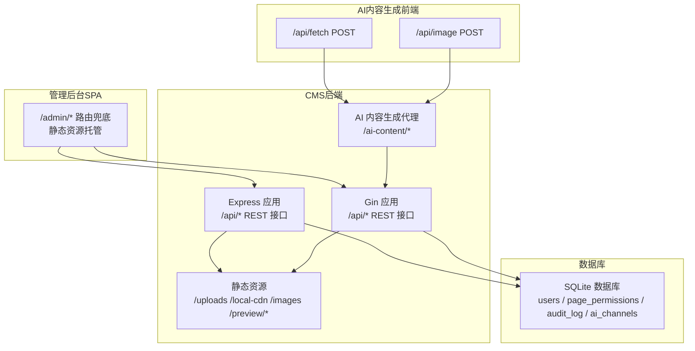
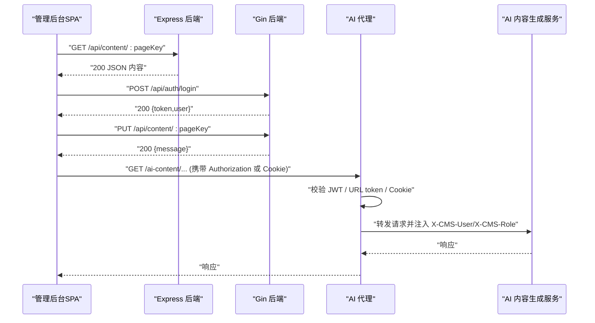
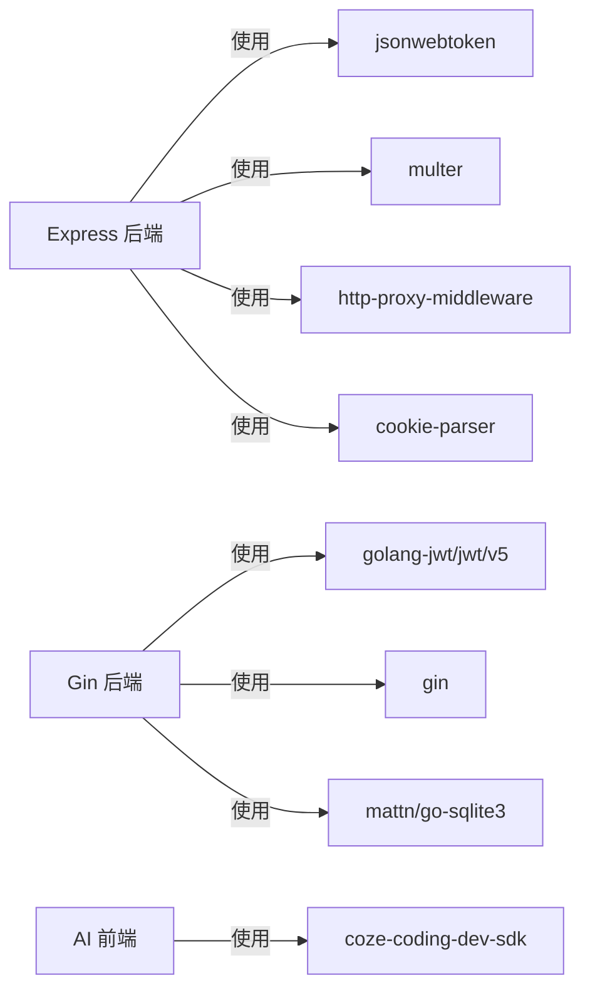

# 通信协议与接口契约

<cite>
**本文引用的文件**
- [business-core/cms-server/app.js](file://business-core/cms-server/app.js)
- [business-core/cms-server/routes/auth.js](file://business-core/cms-server/routes/auth.js)
- [business-core/cms-server/routes/content.js](file://business-core/cms-server/routes/content.js)
- [business-core/cms-server/middleware/auth.js](file://business-core/cms-server/middleware/auth.js)
- [business-core/cms-server/db/setup.js](file://business-core/cms-server/db/setup.js)
- [business-core/cms-server-go/main.go](file://business-core/cms-server-go/main.go)
- [business-core/cms-server-go/config/config.go](file://business-core/cms-server-go/config/config.go)
- [business-core/cms-server-go/models/models.go](file://business-core/cms-server-go/models/models.go)
- [business-core/cms-server-go/routes/content.go](file://business-core/cms-server-go/routes/content.go)
- [business-core/cms-server-go/middleware/auth.go](file://business-core/cms-server-go/middleware/auth.go)
- [business-core/cms-server-go/db/setup.go](file://business-core/cms-server-go/db/setup.go)
- [ai-content-project/src/app/api/fetch/route.ts](file://ai-content-project/src/app/api/fetch/route.ts)
- [ai-content-project/src/app/api/image/route.ts](file://ai-content-project/src/app/api/image/route.ts)
- [ai-content-project/package.json](file://ai-content-project/package.json)
</cite>

## 目录
1. [引言](#引言)
2. [项目结构](#项目结构)
3. [核心组件](#核心组件)
4. [架构总览](#架构总览)
5. [详细组件分析](#详细组件分析)
6. [依赖分析](#依赖分析)
7. [性能考虑](#性能考虑)
8. [故障排查指南](#故障排查指南)
9. [结论](#结论)
10. [附录](#附录)

## 引言
本文件面向ZSTS-CMS系统的通信协议与接口契约，系统包含两套后端实现（Node.js与Go/Gin）以及一个AI内容生成前端应用。本文档覆盖以下方面：
- 管理后台SPA与CMS后端的RESTful API通信协议（HTTP方法、请求/响应格式、状态码、错误处理）
- CMS后端与AI内容生成前端的代理通信协议（JWT令牌传递、Cookie认证、WebSocket支持、跨域资源共享策略）
- 组件间消息格式、数据序列化方式与版本兼容性处理
- 具体API调用示例、请求头配置与响应数据结构
- 认证令牌的生成、验证与刷新机制，以及接口契约约束与数据校验规则

## 项目结构
系统采用多模块组织：
- business-core/cms-server：基于Express的Node.js后端
- business-core/cms-server-go：基于Gin的Go后端
- ai-content-project：Next.js前端，提供AI内容抓取与图像生成功能
- 数据库：SQLite，统一存储用户、权限、审计日志与AI渠道配置

图表来源
- [business-core/cms-server/app.js:155-230](file://business-core/cms-server/app.js#L155-L230)
- [business-core/cms-server-go/main.go:72-97](file://business-core/cms-server-go/main.go#L72-L97)
- [ai-content-project/src/app/api/fetch/route.ts:1-25](file://ai-content-project/src/app/api/fetch/route.ts#L1-L25)
- [ai-content-project/src/app/api/image/route.ts:1-36](file://ai-content-project/src/app/api/image/route.ts#L1-L36)

章节来源
- [business-core/cms-server/app.js:155-230](file://business-core/cms-server/app.js#L155-L230)
- [business-core/cms-server-go/main.go:72-97](file://business-core/cms-server-go/main.go#L72-L97)

## 核心组件
- 认证与授权中间件：负责JWT校验、超级管理员与页面权限校验
- REST API路由：登录、用户信息、内容读写、日志、AI通道等
- AI内容生成代理：支持Authorization头、URL token与Cookie三种认证方式，转发至AI服务并注入用户信息
- 静态资源与预览：托管上传资源、本地CDN与图片，提供预览模式HTML注入与客户端脚本
- 数据模型与配置：统一的JWT密钥、端口、目录路径与AI代理地址配置

章节来源
- [business-core/cms-server/middleware/auth.js:20-63](file://business-core/cms-server/middleware/auth.js#L20-L63)
- [business-core/cms-server-go/middleware/auth.go:17-132](file://business-core/cms-server-go/middleware/auth.go#L17-L132)
- [business-core/cms-server-go/config/config.go:26-57](file://business-core/cms-server-go/config/config.go#L26-L57)

## 架构总览
CMS后端通过CORS允许跨域访问；管理后台SPA通过REST API与后端交互；AI内容生成前端通过代理访问AI服务，代理层进行JWT认证与Cookie注入。

图表来源
- [business-core/cms-server/app.js:163-225](file://business-core/cms-server/app.js#L163-L225)
- [business-core/cms-server-go/main.go:209-290](file://business-core/cms-server-go/main.go#L209-L290)

## 详细组件分析

### 管理后台SPA与CMS后端REST API通信协议
- 基础URL：后端提供两个实现，均以 /api 作为前缀
- 认证方式：所有受保护接口要求在请求头携带 Authorization: Bearer <token>
- CORS策略：允许GET/POST/PUT/DELETE/OPTIONS，允许的头部包含Origin、Content-Type、Authorization，允许携带凭据
- 请求体与响应体：均为JSON；错误响应包含统一的error字段
- 状态码约定：
  - 200 成功
  - 400 参数错误/请求体格式错误
  - 401 未认证/令牌无效
  - 403 无权限
  - 500 服务器内部错误

接口定义与行为要点
- 登录
  - 方法：POST /api/auth/login
  - 请求体：{ username, password }
  - 响应体：{ token, user: { id, username, role, permissions } }
  - 失败：400/401
- 获取当前用户
  - 方法：GET /api/auth/me
  - 响应体：{ id, username, role, created_at, last_login, permissions }
  - 失败：401
- 内容读取
  - 方法：GET /api/content/:pageKey
  - 无需认证（预览需要）
  - 响应体：页面JSON或空对象
  - 失败：400（非法pageKey）
- 内容更新
  - 方法：PUT /api/content/:pageKey
  - 要求认证；全局配置仅超级管理员可写；普通页面需对应页面权限
  - 响应体：{ message }
  - 失败：400/401/403/500

章节来源
- [business-core/cms-server/routes/auth.js:22-96](file://business-core/cms-server/routes/auth.js#L22-L96)
- [business-core/cms-server/routes/content.js:48-101](file://business-core/cms-server/routes/content.js#L48-L101)
- [business-core/cms-server/app.js:198-225](file://business-core/cms-server/app.js#L198-L225)

### CMS后端与AI内容生成前端代理通信协议
- 代理路径：/ai-content/*
- 认证方式（优先级）：
  1) Authorization: Bearer <token>
  2) URL参数 token=<token>
  3) Cookie: cms_token=<token>
- 代理行为：
  - 校验JWT并通过后，向AI服务转发请求
  - 注入自定义头部：X-CMS-User、X-CMS-Role
  - 注入Cookie：cms_user=<username>
- WebSocket支持：代理开启ws: true，支持WebSocket
- 跨域策略：代理目标changeOrigin=true，配合后端CORS

章节来源
- [business-core/cms-server/app.js:163-225](file://business-core/cms-server/app.js#L163-L225)
- [business-core/cms-server-go/main.go:209-290](file://business-core/cms-server-go/main.go#L209-L290)

### AI内容生成前端API（Next.js）
- 抓取网页摘要
  - 方法：POST /api/fetch
  - 请求体：{ url }
  - 响应体：{ title, content, url, status_code }
  - 失败：500
- 图像生成
  - 方法：POST /api/image
  - 请求体：{ prompt }（必填）
  - 响应体：{ imageUrl } 或 { error }
  - 失败：400（prompt缺失）/500

章节来源
- [ai-content-project/src/app/api/fetch/route.ts:1-25](file://ai-content-project/src/app/api/fetch/route.ts#L1-L25)
- [ai-content-project/src/app/api/image/route.ts:1-36](file://ai-content-project/src/app/api/image/route.ts#L1-L36)

### 认证与授权机制
- JWT生成
  - 登录成功后签发JWT，包含id、username、role，有效期7天
- JWT验证
  - Express与Gin两端均通过中间件校验Authorization头中的Bearer Token
  - 校验失败返回401
- 角色与页面权限
  - 超级管理员拥有所有页面权限
  - 普通用户需在page_permissions表中具备对应page_key权限
- 令牌刷新
  - 代码未实现自动刷新逻辑；建议前端在即将过期时重新登录获取新token

章节来源
- [business-core/cms-server/routes/auth.js:44-65](file://business-core/cms-server/routes/auth.js#L44-L65)
- [business-core/cms-server/middleware/auth.js:20-63](file://business-core/cms-server/middleware/auth.js#L20-L63)
- [business-core/cms-server-go/middleware/auth.go:17-132](file://business-core/cms-server-go/middleware/auth.go#L17-L132)

### 数据模型与序列化
- 用户模型：含id、username、role、创建与登录时间
- 登录响应：包含token与用户信息（不含密码哈希）
- 内容读写：以JSON文件形式存储，接口返回标准消息或错误
- 通用响应：统一包含message或error字段

章节来源
- [business-core/cms-server-go/models/models.go:3-41](file://business-core/cms-server-go/models/models.go#L3-L41)
- [business-core/cms-server-go/routes/content.go:159-187](file://business-core/cms-server-go/routes/content.go#L159-L187)

### CORS与跨域资源共享策略
- 允许的方法：GET, POST, PUT, DELETE, OPTIONS
- 允许的头部：Origin, Content-Type, Authorization
- 允许携带凭据：true
- 预检请求：返回204

章节来源
- [business-core/cms-server/app.js:20](file://business-core/cms-server/app.js#L20)
- [business-core/cms-server-go/main.go:117-129](file://business-core/cms-server-go/main.go#L117-L129)

### 静态资源与预览模式
- 静态资源：/uploads、/local-cdn、/images、/preview/images、/preview/local-cdn
- 预览模式：/preview/* 返回前端HTML，注入预览客户端脚本与pageKey，并修复资源相对路径
- 禁用缓存：预览HTML与客户端脚本设置no-cache

章节来源
- [business-core/cms-server/app.js:55-153](file://business-core/cms-server/app.js#L55-L153)
- [business-core/cms-server-go/main.go:51-70](file://business-core/cms-server-go/main.go#L51-L70)

## 依赖分析
- Express后端依赖：cors、express、multer、jsonwebtoken、bcrypt、better-sqlite3、http-proxy-middleware、cookie-parser
- Gin后端依赖：gin、jwt（go-jwt）、sqlite3驱动、godotenv
- AI前端依赖：coze-coding-dev-sdk（FetchClient/ImageGenerationClient）

图表来源
- [business-core/cms-server/app.js:6-44](file://business-core/cms-server/app.js#L6-L44)
- [business-core/cms-server-go/main.go:3-20](file://business-core/cms-server-go/main.go#L3-L20)
- [ai-content-project/package.json:51](file://ai-content-project/package.json#L51)

章节来源
- [business-core/cms-server/app.js:6-44](file://business-core/cms-server/app.js#L6-L44)
- [business-core/cms-server-go/main.go:3-20](file://business-core/cms-server-go/main.go#L3-L20)
- [ai-content-project/package.json:51](file://ai-content-project/package.json#L51)

## 性能考虑
- 请求体大小限制：Express为10MB，Gin为10MB
- 上传文件大小限制：Express为5MB，可通过环境变量调整
- 缓存策略：预览HTML与客户端脚本禁用缓存，确保开发体验
- 代理：WebSocket支持，适合实时场景

## 故障排查指南
- 401 未认证/令牌无效
  - 检查Authorization头格式是否为Bearer <token>
  - 确认JWT密钥一致且未被篡改
- 403 无权限
  - 确认用户角色为super_admin或已在page_permissions中授予page_key权限
- 404 页面不存在
  - 检查pageKey是否在允许列表中
- 500 服务器内部错误
  - 查看后端日志，确认数据库连接与文件写入权限
- CORS问题
  - 确认前端请求方法与头部符合后端CORS配置

章节来源
- [business-core/cms-server/routes/content.js:88-91](file://business-core/cms-server/routes/content.js#L88-L91)
- [business-core/cms-server-go/routes/content.go:144-147](file://business-core/cms-server-go/routes/content.go#L144-L147)

## 结论
本协议文档明确了管理后台与CMS后端的REST API契约、AI内容生成代理的认证与转发机制、跨域策略与数据模型。建议在生产环境中：
- 使用强JWT密钥并定期轮换
- 实施令牌刷新策略
- 对敏感接口增加速率限制与审计日志
- 在前端统一处理401/403错误并引导用户重新登录

## 附录

### API调用示例与请求头配置
- 管理后台登录
  - 方法：POST /api/auth/login
  - 请求头：Content-Type: application/json
  - 请求体：{ username, password }
  - 成功响应：{ token, user }
- 更新页面内容
  - 方法：PUT /api/content/:pageKey
  - 请求头：Authorization: Bearer <token>, Content-Type: application/json
  - 请求体：页面JSON
  - 成功响应：{ message }
- 抓取网页摘要
  - 方法：POST /ai-content/api/fetch
  - 请求头：Authorization: Bearer <token> 或携带Cookie cms_token
  - 请求体：{ url }
  - 成功响应：{ title, content, url, status_code }

章节来源
- [business-core/cms-server/routes/auth.js:22-65](file://business-core/cms-server/routes/auth.js#L22-L65)
- [business-core/cms-server/routes/content.js:67-101](file://business-core/cms-server/routes/content.js#L67-L101)
- [ai-content-project/src/app/api/fetch/route.ts:4-24](file://ai-content-project/src/app/api/fetch/route.ts#L4-L24)