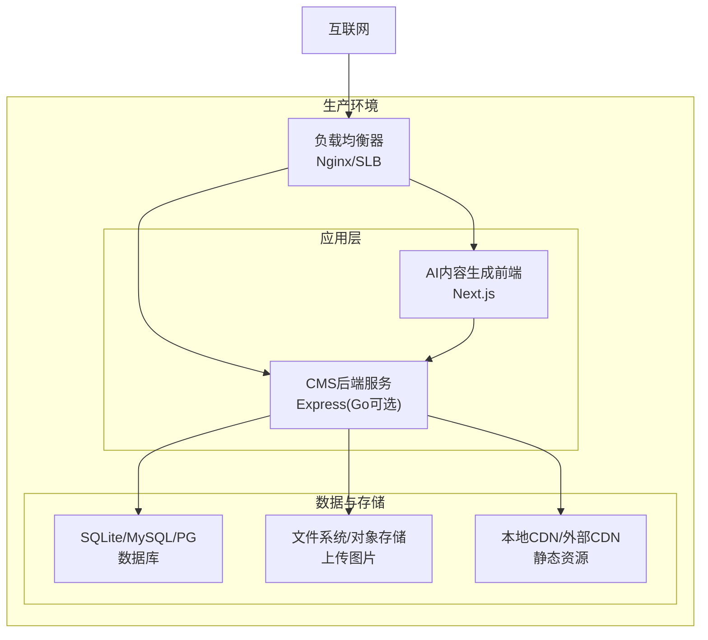
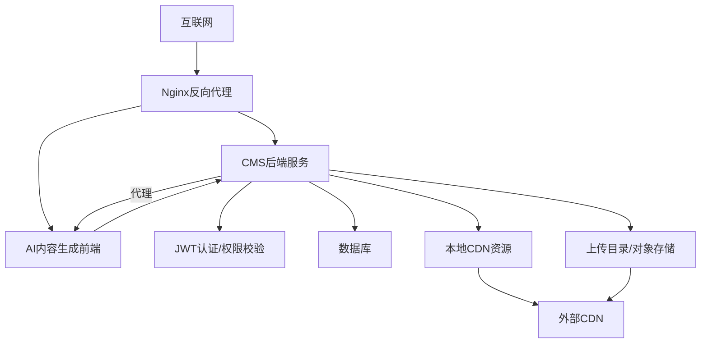
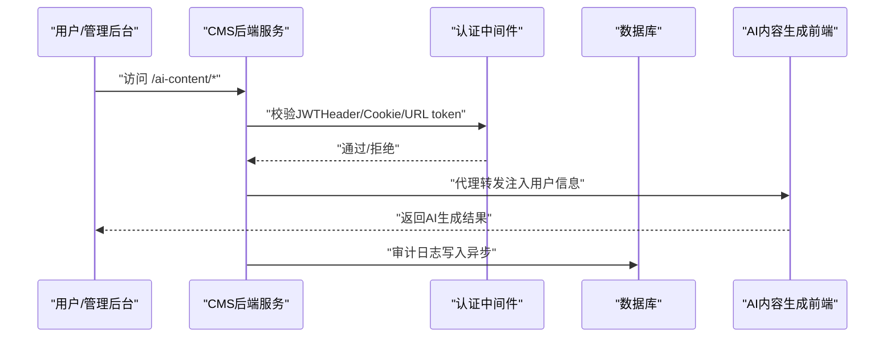
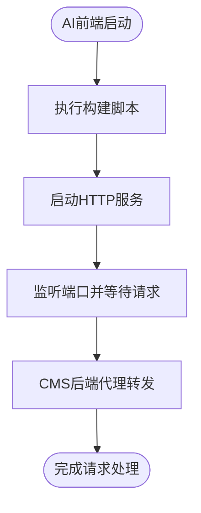
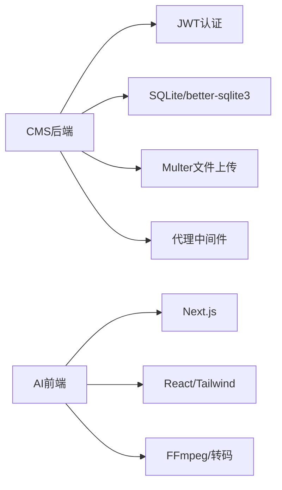
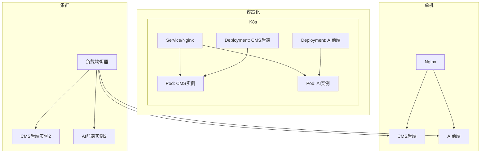

# 部署拓扑

<cite>
**本文引用的文件**
- [ZSTS-CMS-后端移交说明书.md](file://ZSTS-CMS-后端移交说明书.md)
- [business-core/cms-server/app.js](file://business-core/cms-server/app.js)
- [business-core/cms-server/db/setup.js](file://business-core/cms-server/db/setup.js)
- [business-core/cms-server/.env](file://business-core/cms-server/.env)
- [business-core/cms-server-go/main.go](file://business-core/cms-server-go/main.go)
- [business-core/cms-server-go/config/config.go](file://business-core/cms-server-go/config/config.go)
- [business-core/cms-server-go/middleware/auth.go](file://business-core/cms-server-go/middleware/auth.go)
- [business-core/cms-server-go/middleware/audit.go](file://business-core/cms-server-go/middleware/audit.go)
- [business-core/cms-server-go/routes/auth.go](file://business-core/cms-server-go/routes/auth.go)
- [business-core/cms-server-go/routes/content.go](file://business-core/cms-server-go/routes/content.go)
- [ai-content-project/package.json](file://ai-content-project/package.json)
- [ai-content-project/scripts/build.sh](file://ai-content-project/scripts/build.sh)
- [ai-content-project/scripts/start.sh](file://ai-content-project/scripts/start.sh)
- [ai-content-project/next.config.ts](file://ai-content-project/next.config.ts)
- [ai-content-project/.env.local](file://ai-content-project/.env.local)
</cite>

## 目录
1. [引言](#引言)
2. [项目结构](#项目结构)
3. [核心组件](#核心组件)
4. [架构总览](#架构总览)
5. [详细组件分析](#详细组件分析)
6. [依赖分析](#依赖分析)
7. [性能考虑](#性能考虑)
8. [故障排查指南](#故障排查指南)
9. [结论](#结论)
10. [附录](#附录)

## 引言
本文件面向ZSTS-CMS生产部署，提供完整的部署拓扑与实施方案，覆盖单机部署、容器化部署与集群部署三种模式；明确各组件部署位置（CMS后端服务、AI内容生成服务、静态资源CDN）、负载均衡与高可用策略、故障转移机制、环境配置差异、安全加固与监控告警建议，以及部署清单、配置模板与自动化脚本指引。

## 项目结构
ZSTS-CMS由三大子系统构成：
- CMS后端服务：提供认证、内容管理、日志、AI通道配置等API，同时内置AI内容生成前端的反向代理与静态资源托管。
- AI内容生成前端：基于Next.js的独立前端应用，提供文章/海报/视频生成能力，通过CMS后端进行统一认证与代理转发。
- 静态官网页面：面向终端用户的静态HTML页面，配合data-i18n标记实现内容可编辑；静态资源通过本地CDN路径对外提供。

图表来源
- [business-core/cms-server/app.js:163-225](file://business-core/cms-server/app.js#L163-L225)
- [business-core/cms-server-go/main.go:86-88](file://business-core/cms-server-go/main.go#L86-L88)
- [ai-content-project/next.config.ts:3-4](file://ai-content-project/next.config.ts#L3-L4)

章节来源
- [ZSTS-CMS-后端移交说明书.md:26-94](file://ZSTS-CMS-后端移交说明书.md#L26-L94)

## 核心组件
- CMS后端服务（Express/Gin二选一）
  - Express版本：负责认证、内容读写、日志、AI通道、文件上传、静态资源托管、AI内容生成前端代理。
  - Go版本：采用Gin框架，提供与Express相同的API能力，内置CORS、JWT认证、审计日志、静态文件与AI代理。
- AI内容生成前端（Next.js）
  - 通过basePath前缀“/ai-content”对外提供服务，由CMS后端统一认证并通过反向代理转发至Next.js服务。
- 静态资源与CDN
  - 上传图片与本地CDN资源通过CMS后端静态路由暴露，生产环境建议接入外部CDN以提升访问性能与稳定性。

章节来源
- [business-core/cms-server/app.js:155-225](file://business-core/cms-server/app.js#L155-L225)
- [business-core/cms-server-go/main.go:72-114](file://business-core/cms-server-go/main.go#L72-L114)
- [ai-content-project/next.config.ts:3-4](file://ai-content-project/next.config.ts#L3-L4)

## 架构总览
生产环境推荐采用“反向代理 + 应用服务 + 数据存储 + CDN”的分层架构。CMS后端作为统一入口，负责认证、鉴权、内容管理与AI代理；AI前端独立部署并通过CMS进行统一认证；静态资源与上传文件通过CDN加速。

图表来源
- [business-core/cms-server/app.js:163-225](file://business-core/cms-server/app.js#L163-L225)
- [business-core/cms-server-go/main.go:210-290](file://business-core/cms-server-go/main.go#L210-L290)
- [ai-content-project/next.config.ts:3-4](file://ai-content-project/next.config.ts#L3-L4)

## 详细组件分析

### 组件A：CMS后端服务（Express/Gin）
- Express版本
  - 路由与中间件：认证中间件、审计日志中间件、静态资源托管、AI内容生成代理。
  - 数据库：SQLite初始化脚本，包含用户、权限、审计日志、AI通道等表。
  - 环境变量：端口、JWT密钥、节点环境等。
- Go版本
  - 路由与中间件：CORS、日志、恢复、JWT认证、审计日志。
  - 静态资源：上传目录、本地CDN、图片、预览客户端JS、管理后台SPA兜底。
  - AI代理：统一认证后将请求转发至AI前端服务。

图表来源
- [business-core/cms-server/app.js:163-225](file://business-core/cms-server/app.js#L163-L225)
- [business-core/cms-server-go/main.go:210-290](file://business-core/cms-server-go/main.go#L210-L290)
- [business-core/cms-server-go/middleware/audit.go:48-95](file://business-core/cms-server-go/middleware/audit.go#L48-L95)

章节来源
- [business-core/cms-server/app.js:155-225](file://business-core/cms-server/app.js#L155-L225)
- [business-core/cms-server/db/setup.js:14-108](file://business-core/cms-server/db/setup.js#L14-L108)
- [business-core/cms-server-go/main.go:72-114](file://business-core/cms-server-go/main.go#L72-L114)
- [business-core/cms-server-go/middleware/auth.go:17-63](file://business-core/cms-server-go/middleware/auth.go#L17-L63)
- [business-core/cms-server-go/middleware/audit.go:16-46](file://business-core/cms-server-go/middleware/audit.go#L16-L46)

### 组件B：AI内容生成前端（Next.js）
- 配置要点：basePath为“/ai-content”，支持代理转发与统一认证。
- 启动与构建：提供构建与启动脚本，便于容器化与CI/CD集成。
- 认证方式：支持Authorization Header、URL token、Cookie三种方式，与CMS后端保持一致。

图表来源
- [ai-content-project/scripts/build.sh:1-18](file://ai-content-project/scripts/build.sh#L1-L18)
- [ai-content-project/scripts/start.sh:1-18](file://ai-content-project/scripts/start.sh#L1-L18)
- [ai-content-project/next.config.ts:3-4](file://ai-content-project/next.config.ts#L3-L4)

章节来源
- [ai-content-project/package.json:1-100](file://ai-content-project/package.json#L1-L100)
- [ai-content-project/scripts/build.sh:1-18](file://ai-content-project/scripts/build.sh#L1-L18)
- [ai-content-project/scripts/start.sh:1-18](file://ai-content-project/scripts/start.sh#L1-L18)
- [ai-content-project/next.config.ts:3-4](file://ai-content-project/next.config.ts#L3-L4)

### 组件C：静态资源与CDN
- 上传图片与本地CDN资源通过CMS后端静态路由对外提供。
- 生产环境建议将静态资源接入外部CDN，以提升访问速度与可靠性。

章节来源
- [business-core/cms-server/app.js:55-62](file://business-core/cms-server/app.js#L55-L62)
- [business-core/cms-server-go/main.go:51-58](file://business-core/cms-server-go/main.go#L51-L58)

## 依赖分析
- CMS后端依赖
  - Express/Gin：HTTP服务与路由。
  - JWT：认证与权限校验。
  - Multer：文件上传。
  - SQLite/better-sqlite3：文件型数据库。
  - http-proxy-middleware：AI前端代理。
- AI前端依赖
  - Next.js、React、TailwindCSS、FFmpeg等，用于内容生成与视频转码。

图表来源
- [business-core/cms-server/app.js:16-24](file://business-core/cms-server/app.js#L16-L24)
- [business-core/cms-server-go/main.go:39-49](file://business-core/cms-server-go/main.go#L39-L49)
- [ai-content-project/package.json:15-76](file://ai-content-project/package.json#L15-L76)

章节来源
- [business-core/cms-server/package.json:10-20](file://business-core/cms-server/package.json#L10-L20)
- [business-core/cms-server-go/main.go:39-49](file://business-core/cms-server-go/main.go#L39-L49)
- [ai-content-project/package.json:15-76](file://ai-content-project/package.json#L15-L76)

## 性能考虑
- 静态资源优化
  - 将上传图片与本地CDN资源接入外部CDN，减少应用服务器带宽压力。
- 代理与缓存
  - AI前端静态资源与JS可在CDN层面设置缓存策略；预览客户端JS在CMS侧已禁用缓存，确保编辑体验。
- 数据库与文件存储
  - 生产环境建议从SQLite迁移到MySQL/PostgreSQL，结合连接池与索引优化；上传目录建议使用对象存储或分布式文件系统。
- 并发与伸缩
  - 应用层可横向扩展多个实例，结合负载均衡器实现高可用。

## 故障排查指南
- 认证失败
  - 检查JWT密钥配置与令牌有效期；确认CMS后端与AI前端的认证方式一致。
- 文件上传异常
  - 检查上传目录权限与磁盘空间；确认文件类型与大小限制。
- AI代理不通
  - 检查AI前端服务端口与basePath配置；确认CMS后端代理规则与目标地址。
- 审计日志缺失
  - 确认审计中间件启用与数据库写入权限；注意异步写入可能的延迟。

章节来源
- [business-core/cms-server-go/middleware/auth.go:134-176](file://business-core/cms-server-go/middleware/auth.go#L134-L176)
- [business-core/cms-server/app.js:163-225](file://business-core/cms-server/app.js#L163-L225)
- [business-core/cms-server-go/middleware/audit.go:48-95](file://business-core/cms-server-go/middleware/audit.go#L48-L95)

## 结论
ZSTS-CMS生产部署应遵循“反向代理 + 应用服务 + 数据存储 + CDN”的分层架构。CMS后端提供统一认证与API能力，AI前端独立部署并通过CMS进行统一认证与代理；静态资源与上传文件通过CDN加速。建议在生产环境中替换默认凭据、启用HTTPS、迁移数据库与接入CDN，以满足高可用与高性能需求。

## 附录

### 部署模式与拓扑

- 单机部署
  - CMS后端与AI前端在同一主机上运行，通过Nginx反向代理对外提供服务。
  - 适合开发测试与小规模生产环境。
- 容器化部署
  - 使用Docker将CMS后端与AI前端分别打包为镜像，通过编排工具（如Kubernetes）部署。
  - 建议将数据库与文件存储持久化。
- 集群部署
  - 多实例CMS后端与AI前端，结合负载均衡器实现高可用与故障转移。
  - 数据库建议使用高可用MySQL/PG集群，文件存储使用对象存储或共享存储。

图表来源
- [ai-content-project/scripts/build.sh:1-18](file://ai-content-project/scripts/build.sh#L1-L18)
- [ai-content-project/scripts/start.sh:1-18](file://ai-content-project/scripts/start.sh#L1-L18)

### 组件部署位置
- CMS后端服务：应用服务器（单机/容器/集群）。
- AI内容生成服务：独立应用服务器或容器，通过CMS后端统一认证。
- 静态资源：本地CDN与外部CDN，由CMS后端提供静态路由。

章节来源
- [business-core/cms-server/app.js:55-62](file://business-core/cms-server/app.js#L55-L62)
- [business-core/cms-server-go/main.go:51-58](file://business-core/cms-server-go/main.go#L51-L58)

### 负载均衡策略与高可用
- 负载均衡
  - 使用Nginx或云厂商SLB，按权重与健康检查分发流量。
- 高可用
  - 多实例部署CMS与AI前端，结合健康检查与自动重启。
- 故障转移
  - 当某个实例不可用时，LB自动切换至其他实例；数据库与存储采用高可用方案。

### 环境配置差异
- 开发环境
  - 默认端口与JWT密钥，SQLite文件数据库，本地静态资源。
- 生产环境
  - 替换JWT密钥与数据库配置，启用HTTPS，接入CDN与对象存储，开启审计日志与监控。

章节来源
- [business-core/cms-server/.env:1-4](file://business-core/cms-server/.env#L1-L4)
- [business-core/cms-server-go/config/config.go:26-57](file://business-core/cms-server-go/config/config.go#L26-L57)
- [ai-content-project/.env.local:1-4](file://ai-content-project/.env.local#L1-L4)

### 安全加固措施
- 认证与授权
  - 更换默认JWT密钥；严格校验令牌与权限；审计所有写操作。
- 传输安全
  - 启用HTTPS，强制重定向至HTTPS。
- 文件与资源
  - 限制上传文件类型与大小；对静态资源设置合适的缓存与安全头。
- 网络隔离
  - 将数据库与文件存储置于内网或专用子网，限制访问来源。

章节来源
- [business-core/cms-server/db/setup.js:72-104](file://business-core/cms-server/db/setup.js#L72-L104)
- [business-core/cms-server-go/middleware/auth.go:17-63](file://business-core/cms-server-go/middleware/auth.go#L17-L63)
- [business-core/cms-server-go/middleware/audit.go:16-46](file://business-core/cms-server-go/middleware/audit.go#L16-L46)

### 监控告警设置
- 应用监控
  - 监控CPU、内存、QPS、错误率、响应时间。
- 数据库监控
  - 监控连接数、慢查询、锁等待、磁盘空间。
- 存储监控
  - 监控上传目录与CDN带宽使用情况。
- 告警策略
  - 基于阈值触发告警，结合日志与审计记录进行问题定位。

### 部署清单与配置模板

- 环境变量模板（示例）
  - CMS后端
    - PORT、JWT_SECRET、NODE_ENV、DB_PATH、UPLOAD_DIR、CONTENT_DIR、GLOBAL_DIR、ADMIN_DIR、PROJECT_ROOT、AI_PROXY_URL
  - AI前端
    - HOSTNAME、PORT、COZE_PROJECT_ENV
- 配置文件模板
  - Nginx反向代理配置（包含CMS与AI前端路由、证书、缓存策略）
  - Dockerfile（分别构建CMS与AI前端镜像）
  - docker-compose.yml（编排CMS与AI前端服务）
  - Kubernetes YAML（Service/Deployment/PVC/ConfigMap）

章节来源
- [business-core/cms-server-go/config/config.go:26-57](file://business-core/cms-server-go/config/config.go#L26-L57)
- [ai-content-project/next.config.ts:3-4](file://ai-content-project/next.config.ts#L3-L4)

### 自动化部署脚本
- 构建脚本
  - AI前端：安装依赖、Next.js构建、打包服务端代码。
  - 启动脚本：指定端口启动HTTP服务。
- CI/CD建议
  - 使用流水线自动拉取代码、构建镜像、推送仓库、发布部署。
  - 在部署前执行健康检查与灰度发布。

章节来源
- [ai-content-project/scripts/build.sh:1-18](file://ai-content-project/scripts/build.sh#L1-L18)
- [ai-content-project/scripts/start.sh:1-18](file://ai-content-project/scripts/start.sh#L1-L18)