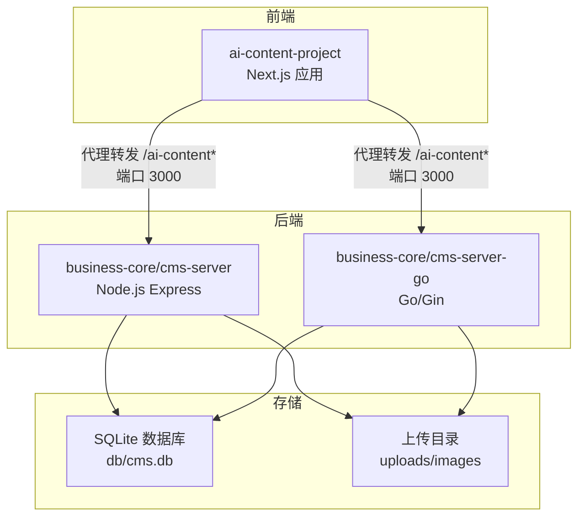
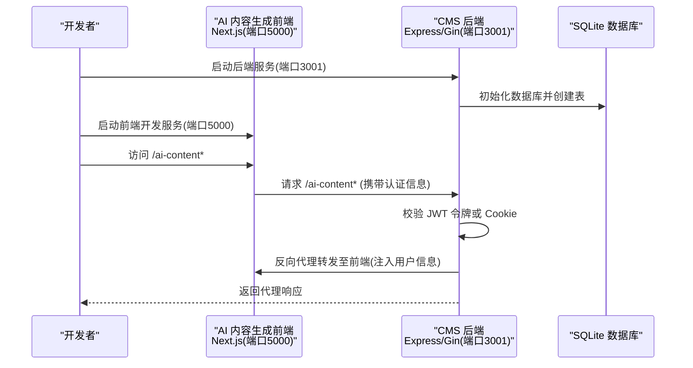
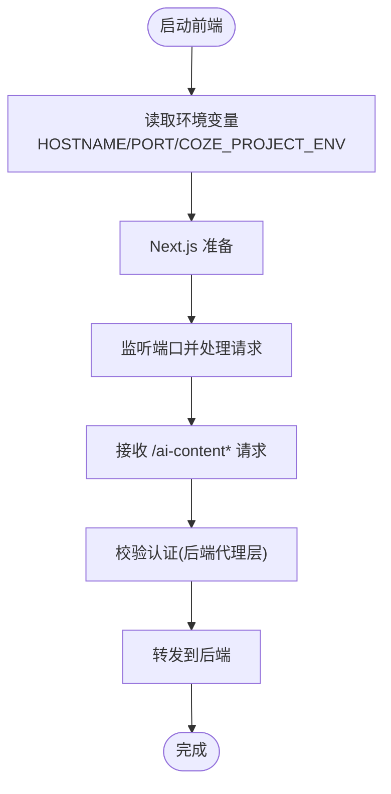
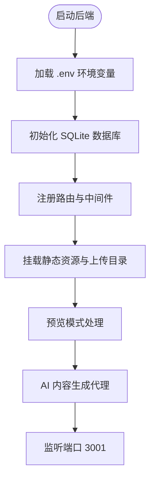
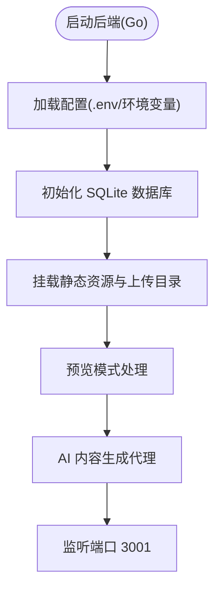
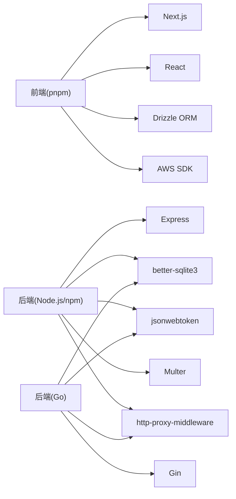

# 开发环境搭建

<cite>
**本文引用的文件**
- [ai-content-project/package.json](file://ai-content-project/package.json)
- [ai-content-project/scripts/dev.sh](file://ai-content-project/scripts/dev.sh)
- [ai-content-project/scripts/start.sh](file://ai-content-project/scripts/start.sh)
- [ai-content-project/src/server.ts](file://ai-content-project/src/server.ts)
- [business-core/cms-server/package.json](file://business-core/cms-server/package.json)
- [business-core/cms-server/app.js](file://business-core/cms-server/app.js)
- [business-core/cms-server/db/setup.js](file://business-core/cms-server/db/setup.js)
- [business-core/cms-server-go/main.go](file://business-core/cms-server-go/main.go)
- [business-core/cms-server-go/config/config.go](file://business-core/cms-server-go/config/config.go)
- [business-core/cms-server-go/db/setup.go](file://business-core/cms-server-go/db/setup.go)
- [ai-content-project/DESIGN.md](file://ai-content-project/DESIGN.md)
</cite>

## 目录
1. [简介](#简介)
2. [项目结构](#项目结构)
3. [核心组件](#核心组件)
4. [架构总览](#架构总览)
5. [详细组件分析](#详细组件分析)
6. [依赖关系分析](#依赖关系分析)
7. [性能注意事项](#性能注意事项)
8. [故障排查指南](#故障排查指南)
9. [结论](#结论)
10. [附录](#附录)

## 简介
本指南面向开发者，帮助你在本地快速搭建 ZSTS-CMS 项目开发环境，涵盖以下要点：
- Node.js 版本要求与包管理工具选择（推荐 pnpm）
- 依赖安装与环境准备
- 子系统启动流程：CMS 后端服务（端口 3001）与 AI 内容生成前端（端口 5000）
- 环境变量配置说明（.env 文件）
- 数据库初始化步骤
- 开发调试最佳实践与常见问题解决

## 项目结构
ZSTS-CMS 采用多模块组织方式：
- ai-content-project：基于 Next.js 的 AI 内容生成前端应用
- business-core：后端相关代码，包含 Node.js Express 版本与 Go/Gin 版本两套实现
- uploads/images：后端上传目录（Express 版本）

图表来源
- [business-core/cms-server/app.js:1-315](file://business-core/cms-server/app.js#L1-L315)
- [business-core/cms-server-go/main.go:1-317](file://business-core/cms-server-go/main.go#L1-L317)
- [business-core/cms-server/db/setup.js:1-115](file://business-core/cms-server/db/setup.js#L1-L115)
- [business-core/cms-server-go/db/setup.go:1-187](file://business-core/cms-server-go/db/setup.go#L1-L187)

章节来源
- [ai-content-project/package.json:1-100](file://ai-content-project/package.json#L1-L100)
- [business-core/cms-server/package.json:1-22](file://business-core/cms-server/package.json#L1-L22)
- [business-core/cms-server-go/main.go:1-114](file://business-core/cms-server-go/main.go#L1-L114)

## 核心组件
- AI 内容生成前端（Next.js）
  - 使用 pnpm 作为包管理器，开发时通过脚本自动监听端口 5000 并热更新
  - 通过环境变量控制主机名、端口与运行模式
- CMS 后端（Node.js Express）
  - 默认监听端口 3001，提供静态资源、上传接口、预览模式与 AI 内容生成代理
  - 通过 dotenv 加载环境变量，初始化 SQLite 数据库
- CMS 后端（Go/Gin）
  - 默认监听端口 3001，功能与 Express 版本一致，配置通过 .env 与环境变量控制
  - 初始化 SQLite 数据库，创建默认超级管理员账号

章节来源
- [ai-content-project/package.json:5-14](file://ai-content-project/package.json#L5-L14)
- [ai-content-project/src/server.ts:5-35](file://ai-content-project/src/server.ts#L5-L35)
- [business-core/cms-server/package.json:6-9](file://business-core/cms-server/package.json#L6-L9)
- [business-core/cms-server/app.js:6-17](file://business-core/cms-server/app.js#L6-L17)
- [business-core/cms-server-go/config/config.go:26-56](file://business-core/cms-server-go/config/config.go#L26-L56)

## 架构总览
AI 内容生成前端与后端之间通过反向代理进行鉴权与用户上下文传递，后端统一管理静态资源与上传目录。

图表来源
- [business-core/cms-server/app.js:164-225](file://business-core/cms-server/app.js#L164-L225)
- [business-core/cms-server-go/main.go:209-290](file://business-core/cms-server-go/main.go#L209-L290)
- [business-core/cms-server/db/setup.js:14-108](file://business-core/cms-server/db/setup.js#L14-L108)
- [business-core/cms-server-go/db/setup.go:18-175](file://business-core/cms-server-go/db/setup.go#L18-L175)

## 详细组件分析

### AI 内容生成前端（Next.js）
- 启动方式
  - 开发模式：通过脚本设置端口并使用 tsx 监听热更新
  - 生产模式：构建后通过 dist/server.js 在指定端口启动
- 关键行为
  - 通过环境变量控制主机名、端口与运行模式
  - 与后端通过 /ai-content* 接口进行代理通信
- 端口
  - 默认端口 5000；可通过环境变量覆盖

图表来源
- [ai-content-project/scripts/dev.sh:10-34](file://ai-content-project/scripts/dev.sh#L10-L34)
- [ai-content-project/scripts/start.sh:10-17](file://ai-content-project/scripts/start.sh#L10-L17)
- [ai-content-project/src/server.ts:5-35](file://ai-content-project/src/server.ts#L5-L35)

章节来源
- [ai-content-project/package.json:5-14](file://ai-content-project/package.json#L5-L14)
- [ai-content-project/scripts/dev.sh:1-35](file://ai-content-project/scripts/dev.sh#L1-L35)
- [ai-content-project/scripts/start.sh:1-18](file://ai-content-project/scripts/start.sh#L1-L18)
- [ai-content-project/src/server.ts:1-36](file://ai-content-project/src/server.ts#L1-L36)

### CMS 后端（Node.js Express）
- 启动方式
  - 通过 npm 脚本启动，默认监听端口 3001
- 关键行为
  - 初始化数据库（SQLite），创建用户、权限与审计日志等表
  - 提供静态资源、上传接口、预览模式与 AI 内容生成代理
  - 通过 http-proxy-middleware 将 /ai-content* 请求代理到前端（端口 3000）
- 端口
  - 默认端口 3001；可通过环境变量覆盖

图表来源
- [business-core/cms-server/app.js:6-17](file://business-core/cms-server/app.js#L6-L17)
- [business-core/cms-server/db/setup.js:14-108](file://business-core/cms-server/db/setup.js#L14-L108)
- [business-core/cms-server/app.js:155-225](file://business-core/cms-server/app.js#L155-L225)

章节来源
- [business-core/cms-server/package.json:6-9](file://business-core/cms-server/package.json#L6-L9)
- [business-core/cms-server/app.js:1-315](file://business-core/cms-server/app.js#L1-L315)
- [business-core/cms-server/db/setup.js:1-115](file://business-core/cms-server/db/setup.js#L1-L115)

### CMS 后端（Go/Gin）
- 启动方式
  - 通过 Go 运行 main.go，默认监听端口 3001
- 关键行为
  - 通过配置模块加载 .env 与环境变量，初始化数据库与目录
  - 提供静态资源、上传接口、预览模式与 AI 内容生成代理
  - 通过反向代理将 /ai-content* 请求转发到前端（端口 3000）
- 端口
  - 默认端口 3001；可通过环境变量覆盖

图表来源
- [business-core/cms-server-go/main.go:22-114](file://business-core/cms-server-go/main.go#L22-L114)
- [business-core/cms-server-go/config/config.go:26-56](file://business-core/cms-server-go/config/config.go#L26-L56)
- [business-core/cms-server-go/db/setup.go:18-175](file://business-core/cms-server-go/db/setup.go#L18-L175)

章节来源
- [business-core/cms-server-go/main.go:1-317](file://business-core/cms-server-go/main.go#L1-L317)
- [business-core/cms-server-go/config/config.go:1-95](file://business-core/cms-server-go/config/config.go#L1-L95)
- [business-core/cms-server-go/db/setup.go:1-187](file://business-core/cms-server-go/db/setup.go#L1-L187)

## 依赖关系分析
- 包管理器
  - AI 内容生成前端使用 pnpm（在 package.json 中声明）
  - 后端 Node.js Express 使用 npm（在 package.json 中声明）
- 外部依赖
  - 前端依赖 Next.js、React、TailwindCSS、AWS SDK、Drizzle ORM 等
  - 后端依赖 Express、better-sqlite3、JWT、Multer、http-proxy-middleware 等
- 环境变量
  - 后端通过 dotenv 与环境变量控制端口、JWT 密钥、上传目录、内容目录、AI 代理地址等

图表来源
- [ai-content-project/package.json:15-98](file://ai-content-project/package.json#L15-L98)
- [business-core/cms-server/package.json:10-20](file://business-core/cms-server/package.json#L10-L20)
- [business-core/cms-server-go/main.go:13-20](file://business-core/cms-server-go/main.go#L13-L20)

章节来源
- [ai-content-project/package.json:1-100](file://ai-content-project/package.json#L1-L100)
- [business-core/cms-server/package.json:1-22](file://business-core/cms-server/package.json#L1-L22)

## 性能注意事项
- 上传文件大小限制
  - Express 版本：单文件大小限制约 5MB
  - Go 版本：通过配置项控制上传大小（默认 5MB）
- 预览模式禁用缓存
  - 预览客户端 JS 与预览页面均禁用缓存，确保开发时看到最新内容
- 日志与错误处理
  - Go 版本使用 Gin Logger 与 Recovery 中间件，便于定位问题
  - Express 版本提供统一错误处理中间件

章节来源
- [business-core/cms-server/app.js:36-44](file://business-core/cms-server/app.js#L36-L44)
- [business-core/cms-server-go/main.go:42-49](file://business-core/cms-server-go/main.go#L42-L49)
- [business-core/cms-server/app.js:304-308](file://business-core/cms-server/app.js#L304-L308)
- [business-core/cms-server-go/main.go:42-46](file://business-core/cms-server-go/main.go#L42-L46)

## 故障排查指南
- 端口占用
  - 前端启动脚本会在启动前清理目标端口（默认 5000），若仍被占用可手动释放或调整端口
- 代理鉴权失败
  - 确认后端 JWT_SECRET 与前端传递的认证信息一致
  - 检查后端是否正确注入 X-CMS-User、X-CMS-Role 与 Cookie
- 数据库初始化异常
  - 确认数据库目录可写，且无权限问题
  - 若数据库已存在，初始化逻辑会跳过创建表
- 上传失败
  - 检查上传目录是否存在且可写
  - 确认文件类型与大小符合限制

章节来源
- [ai-content-project/scripts/dev.sh:12-31](file://ai-content-project/scripts/dev.sh#L12-L31)
- [business-core/cms-server/app.js:168-196](file://business-core/cms-server/app.js#L168-L196)
- [business-core/cms-server-go/main.go:227-289](file://business-core/cms-server-go/main.go#L227-L289)
- [business-core/cms-server/db/setup.js:14-108](file://business-core/cms-server/db/setup.js#L14-L108)
- [business-core/cms-server-go/db/setup.go:18-175](file://business-core/cms-server-go/db/setup.go#L18-L175)

## 结论
通过本指南，你可以完成 ZSTS-CMS 的开发环境搭建与双子系统启动。建议优先使用 pnpm 安装前端依赖，按顺序启动后端（3001）与前端（5000），并在开发过程中关注代理鉴权、数据库初始化与上传目录权限等关键点。

## 附录

### 环境变量与配置
- 后端通用配置（.env 或环境变量）
  - PORT：后端监听端口（默认 3001）
  - JWT_SECRET：JWT 密钥（默认值见配置）
  - NODE_ENV：运行环境（development/production）
  - DB_PATH：SQLite 数据库路径（默认 db/cms.db）
  - UPLOAD_DIR：上传目录（默认 ../uploads/images）
  - CONTENT_DIR：页面内容目录（默认 ../content/pages）
  - GLOBAL_DIR：全局内容目录（默认 ../content/global）
  - ADMIN_DIR：管理后台目录（默认 ../admin）
  - PROJECT_ROOT：项目根目录（默认 ../..）
  - AI_PROXY_URL：AI 内容生成前端代理地址（默认 http://localhost:3000）
- 前端配置（.env 或环境变量）
  - HOSTNAME：主机名（默认 localhost）
  - PORT：前端监听端口（默认 5000）
  - COZE_PROJECT_ENV：运行模式（非 PROD 时为开发模式）

章节来源
- [business-core/cms-server-go/config/config.go:26-56](file://business-core/cms-server-go/config/config.go#L26-L56)
- [business-core/cms-server-go/config/config.go:59-94](file://business-core/cms-server-go/config/config.go#L59-L94)
- [ai-content-project/src/server.ts:5-7](file://ai-content-project/src/server.ts#L5-L7)

### 数据库初始化步骤
- Node.js Express 版本
  - 启动后端服务时自动初始化数据库与默认管理员账号
- Go/Gin 版本
  - 启动后端服务时自动初始化数据库与默认管理员账号

章节来源
- [business-core/cms-server/db/setup.js:14-108](file://business-core/cms-server/db/setup.js#L14-L108)
- [business-core/cms-server-go/db/setup.go:18-175](file://business-core/cms-server-go/db/setup.go#L18-L175)

### 启动命令参考
- 安装依赖
  - 前端（推荐 pnpm）：在 ai-content-project 目录执行安装命令
  - 后端（Node.js）：在 business-core/cms-server 目录执行安装命令
- 启动后端（端口 3001）
  - Node.js Express：在 business-core/cms-server 目录执行启动脚本
  - Go/Gin：在 business-core/cms-server-go 目录执行运行命令
- 启动前端（端口 5000）
  - 在 ai-content-project 目录执行开发脚本
  - 如需生产启动，先构建再启动

章节来源
- [ai-content-project/package.json:5-14](file://ai-content-project/package.json#L5-L14)
- [business-core/cms-server/package.json:6-9](file://business-core/cms-server/package.json#L6-L9)
- [ai-content-project/scripts/dev.sh:34](file://ai-content-project/scripts/dev.sh#L34)
- [ai-content-project/scripts/start.sh:13](file://ai-content-project/scripts/start.sh#L13)

### 设计与配色参考
- 设计气质与配色方案、字体排版与交互动效可参考设计文档，便于前端开发与视觉一致性。

章节来源
- [ai-content-project/DESIGN.md:1-53](file://ai-content-project/DESIGN.md#L1-L53)