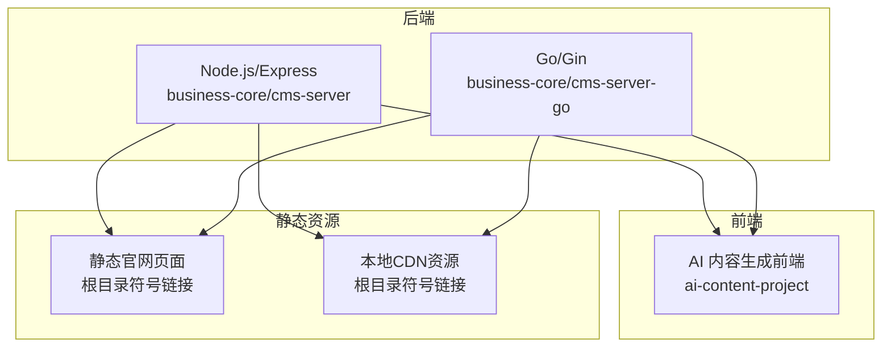
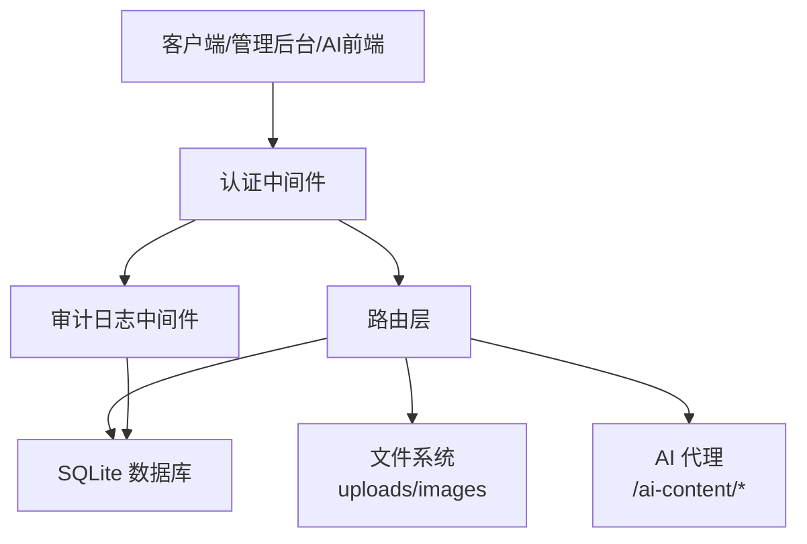
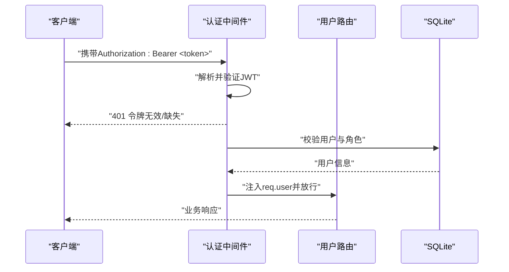
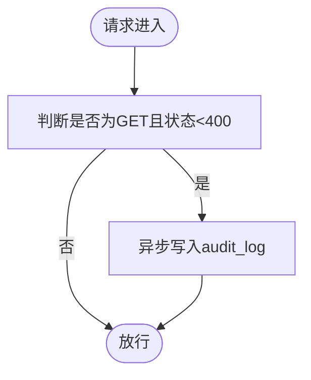
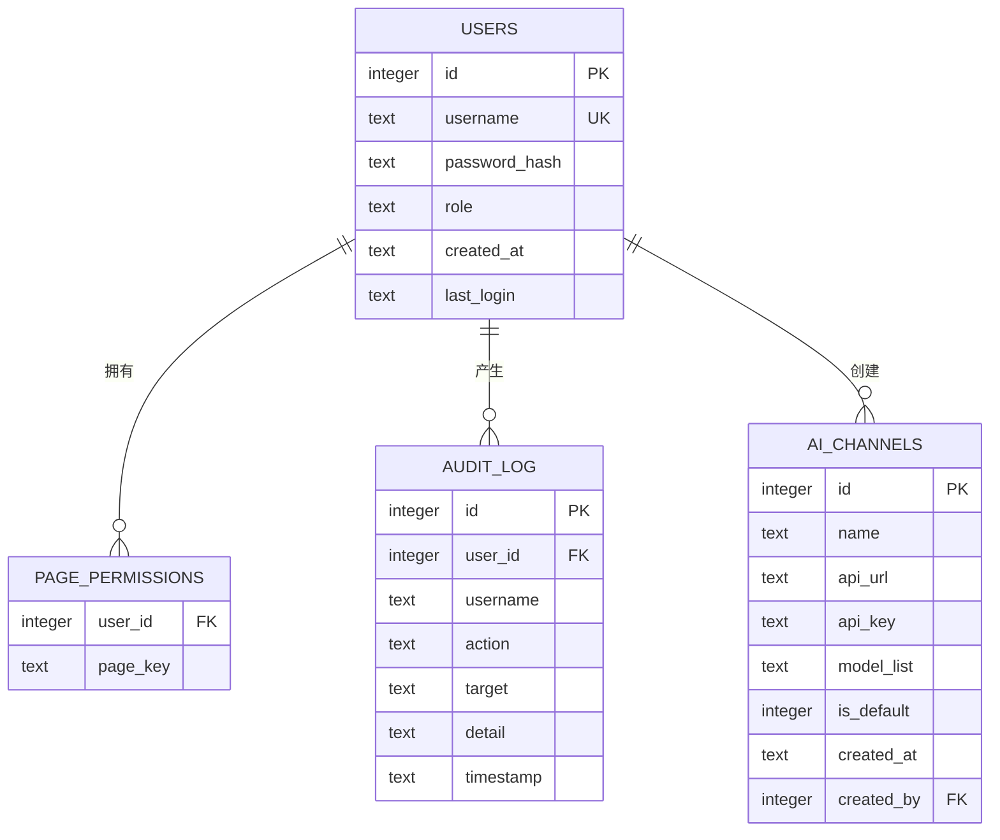
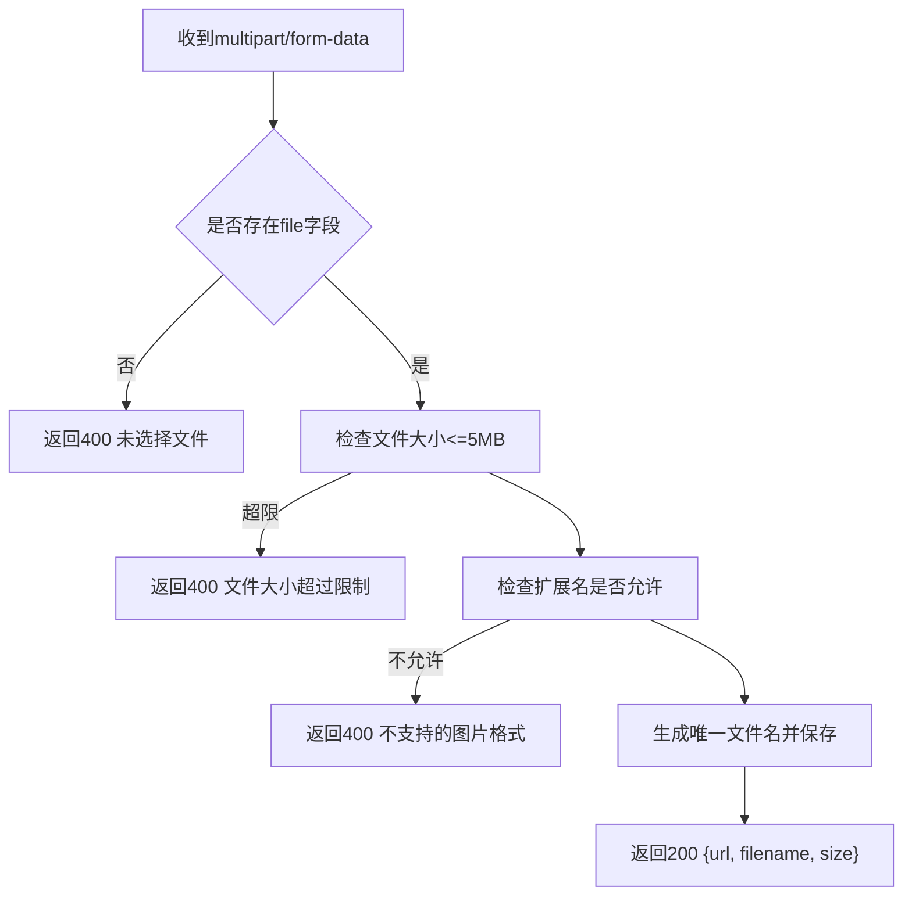
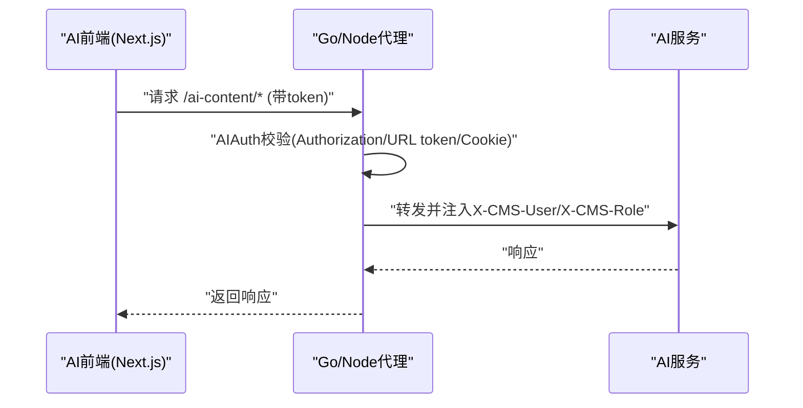
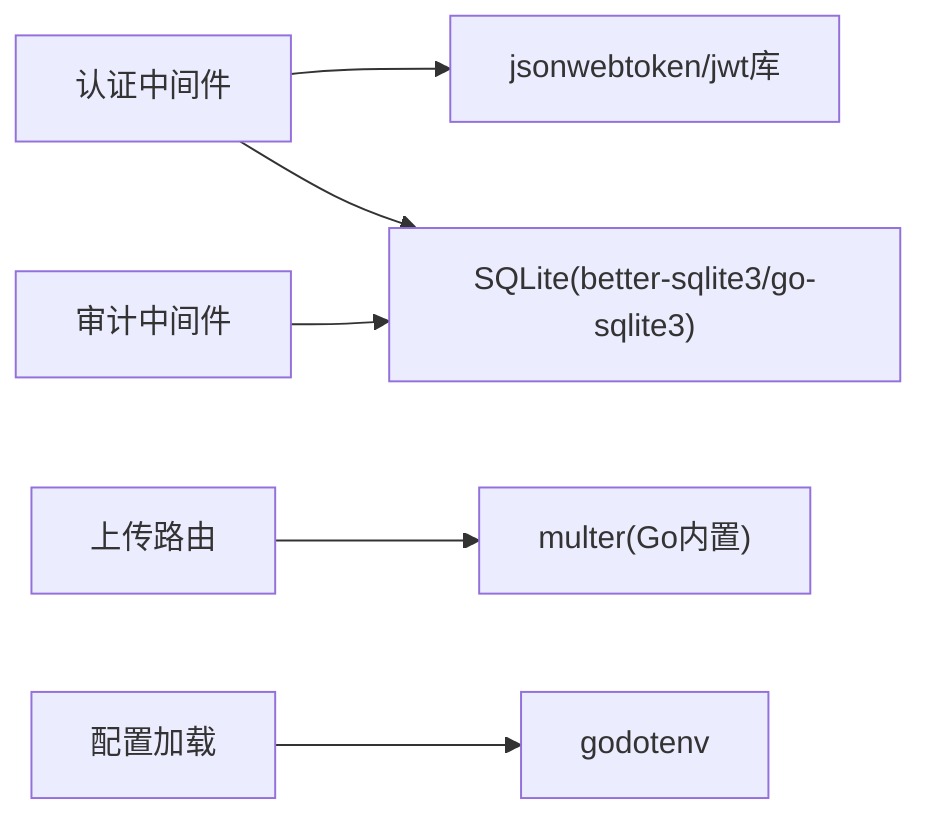

# 故障排除与维护

<cite>
**本文引用的文件**   
- [business-core/cms-server/app.js](file://business-core/cms-server/app.js)
- [business-core/cms-server/db/setup.js](file://business-core/cms-server/db/setup.js)
- [business-core/cms-server/middleware/auth.js](file://business-core/cms-server/middleware/auth.js)
- [business-core/cms-server/middleware/audit.js](file://business-core/cms-server/middleware/audit.js)
- [business-core/cms-server/routes/auth.js](file://business-core/cms-server/routes/auth.js)
- [business-core/cms-server/routes/content.js](file://business-core/cms-server/routes/content.js)
- [business-core/cms-server/routes/logs.js](file://business-core/cms-server/routes/logs.js)
- [business-core/cms-server-go/main.go](file://business-core/cms-server-go/main.go)
- [business-core/cms-server-go/db/setup.go](file://business-core/cms-server-go/db/setup.go)
- [business-core/cms-server-go/config/config.go](file://business-core/cms-server-go/config/config.go)
- [business-core/cms-server-go/middleware/auth.go](file://business-core/cms-server-go/middleware/auth.go)
- [business-core/cms-server-go/middleware/audit.go](file://business-core/cms-server-go/middleware/audit.go)
- [business-core/cms-server-go/routes/upload.go](file://business-core/cms-server-go/routes/upload.go)
- [ZSTS-CMS-后端移交说明书.md](file://ZSTS-CMS-后端移交说明书.md)
</cite>

## 目录
1. [简介](#简介)
2. [项目结构](#项目结构)
3. [核心组件](#核心组件)
4. [架构总览](#架构总览)
5. [详细组件分析](#详细组件分析)
6. [依赖分析](#依赖分析)
7. [性能考虑](#性能考虑)
8. [故障排除指南](#故障排除指南)
9. [结论](#结论)
10. [附录](#附录)

## 简介
本指南面向ZSTS-CMS项目的运维与开发人员，聚焦于常见问题诊断、日志分析、系统监控与健康检查、数据备份与恢复、灾难恢复流程以及维护最佳实践。文档基于仓库中的Node.js与Go双栈后端实现，覆盖认证失败、权限问题、数据库连接异常、文件上传错误等典型场景，并提供可操作的排查步骤与预防性维护建议。

## 项目结构
- 后端采用双栈设计：
  - Node.js/Express版本：位于 business-core/cms-server，负责认证、内容管理、日志、上传、预览注入与AI代理。
  - Go/Gin版本：位于 business-core/cms-server-go，提供与Node版本等价的功能，具备更强的并发与稳定性潜力。
- 前端AI内容生成模块位于 ai-content-project，通过反向代理与后端集成。
- 静态官网页面与资源通过符号链接指向根目录，部署时需确认实际路径。

**章节来源**
- [ZSTS-CMS-后端移交说明书.md: 26-91:26-91](file://ZSTS-CMS-后端移交说明书.md#L26-L91)

## 核心组件
- 认证与权限
  - Node版本：JWT校验中间件、超级管理员与页面权限校验。
  - Go版本：RequireAuth/RequireSuperAdmin/RequirePagePerm中间件，AI认证中间件。
- 审计日志
  - Node版本：手动写入与自动记录中间件。
  - Go版本：手动写入与自动记录中间件。
- 数据库
  - Node版本：SQLite(better-sqlite3)，初始化users/page_permissions/audit_log/ai_channels表。
  - Go版本：SQLite(go-sqlite3)，初始化逻辑与Node版本一致。
- 文件上传
  - Node版本：Multer限制5MB与扩展名校验，保存至uploads/images。
  - Go版本：基于multipart表单，限制5MB与扩展名校验，保存至配置目录。
- 静态资源与预览
  - Node/Go均提供静态目录映射与预览模式注入脚本。
- AI内容生成代理
  - Node/Go均支持Authorization/URL token/Cookie三种认证方式，转发至Next.js开发服务器。

**章节来源**
- [business-core/cms-server/middleware/auth.js: 20-63:20-63](file://business-core/cms-server/middleware/auth.js#L20-L63)
- [business-core/cms-server-go/middleware/auth.go: 17-132:17-132](file://business-core/cms-server-go/middleware/auth.go#L17-L132)
- [business-core/cms-server/middleware/audit.js: 22-72:22-72](file://business-core/cms-server/middleware/audit.js#L22-L72)
- [business-core/cms-server-go/middleware/audit.go: 16-95:16-95](file://business-core/cms-server-go/middleware/audit.go#L16-L95)
- [business-core/cms-server/db/setup.js: 14-108:14-108](file://business-core/cms-server/db/setup.js#L14-L108)
- [business-core/cms-server-go/db/setup.go: 18-175:18-175](file://business-core/cms-server-go/db/setup.go#L18-L175)
- [business-core/cms-server/app.js: 24-53:24-53](file://business-core/cms-server/app.js#L24-L53)
- [business-core/cms-server-go/routes/upload.go: 22-75:22-75](file://business-core/cms-server-go/routes/upload.go#L22-L75)
- [business-core/cms-server/app.js: 55-153:55-153](file://business-core/cms-server/app.js#L55-L153)
- [business-core/cms-server-go/main.go: 51-70:51-70](file://business-core/cms-server-go/main.go#L51-L70)

## 架构总览
后端通过中间件进行认证与审计，路由层提供认证、用户、内容、日志、AI通道等接口；静态资源与预览模式由中间件注入；AI内容生成通过反向代理接入Next.js前端。

**图表来源**
- [business-core/cms-server/app.js: 155-225:155-225](file://business-core/cms-server/app.js#L155-L225)
- [business-core/cms-server-go/main.go: 72-87:72-87](file://business-core/cms-server-go/main.go#L72-L87)

**章节来源**
- [business-core/cms-server/app.js: 155-225:155-225](file://business-core/cms-server/app.js#L155-L225)
- [business-core/cms-server-go/main.go: 72-87:72-87](file://business-core/cms-server-go/main.go#L72-L87)

## 详细组件分析

### 认证与权限组件
- Node.js认证中间件
  - requireAuth：从Authorization头解析Bearer Token，校验失败返回401。
  - requireSuperAdmin：要求角色为super_admin。
  - requirePagePerm：按用户与page_key查询page_permissions表。
- Go认证中间件
  - RequireAuth/RequireSuperAdmin/RequirePagePerm：与Node版本等价。
  - AIAuth：支持Authorization/URL token/Cookie三种方式。

**图表来源**
- [business-core/cms-server/middleware/auth.js: 20-63:20-63](file://business-core/cms-server/middleware/auth.js#L20-L63)
- [business-core/cms-server/routes/auth.js: 22-66:22-66](file://business-core/cms-server/routes/auth.js#L22-L66)

**章节来源**
- [business-core/cms-server/middleware/auth.js: 20-63:20-63](file://business-core/cms-server/middleware/auth.js#L20-L63)
- [business-core/cms-server/routes/auth.js: 22-66:22-66](file://business-core/cms-server/routes/auth.js#L22-L66)
- [business-core/cms-server-go/middleware/auth.go: 17-132:17-132](file://business-core/cms-server-go/middleware/auth.go#L17-L132)

### 审计日志组件
- Node.js审计
  - audit(req, action, target, detail)：写入audit_log。
  - auditMiddleware：拦截非GET且成功响应，异步写入。
- Go审计
  - Audit：写入audit_log。
  - AuditMiddleware：拦截非GET且成功响应，异步写入。

**图表来源**
- [business-core/cms-server/middleware/audit.js: 46-72:46-72](file://business-core/cms-server/middleware/audit.js#L46-L72)
- [business-core/cms-server-go/middleware/audit.go: 48-95:48-95](file://business-core/cms-server-go/middleware/audit.go#L48-L95)

**章节来源**
- [business-core/cms-server/middleware/audit.js: 22-72:22-72](file://business-core/cms-server/middleware/audit.js#L22-L72)
- [business-core/cms-server-go/middleware/audit.go: 16-95:16-95](file://business-core/cms-server-go/middleware/audit.go#L16-L95)

### 数据库初始化与表结构
- Node版本
  - users/page_permissions/audit_log/ai_channels表初始化，插入默认超级管理员并授予全部页面权限。
- Go版本
  - 与Node版本一致的建表与默认数据流程。

**图表来源**
- [business-core/cms-server/db/setup.js: 18-68:18-68](file://business-core/cms-server/db/setup.js#L18-L68)
- [business-core/cms-server-go/db/setup.go: 46-108:46-108](file://business-core/cms-server-go/db/setup.go#L46-L108)

**章节来源**
- [business-core/cms-server/db/setup.js: 14-108:14-108](file://business-core/cms-server/db/setup.js#L14-L108)
- [business-core/cms-server-go/db/setup.go: 18-175:18-175](file://business-core/cms-server-go/db/setup.go#L18-L175)

### 文件上传组件
- Node版本
  - 限制5MB，允许扩展名：jpg/jpeg/png/gif/webp/svg，保存至uploads/images。
- Go版本
  - 限制5MB，允许扩展名：jpg/jpeg/png/gif/webp/svg，保存至配置目录。

**图表来源**
- [business-core/cms-server/app.js: 24-53:24-53](file://business-core/cms-server/app.js#L24-L53)
- [business-core/cms-server-go/routes/upload.go: 27-75:27-75](file://business-core/cms-server-go/routes/upload.go#L27-L75)

**章节来源**
- [business-core/cms-server/app.js: 24-53:24-53](file://business-core/cms-server/app.js#L24-L53)
- [business-core/cms-server-go/routes/upload.go: 27-75:27-75](file://business-core/cms-server-go/routes/upload.go#L27-L75)

### AI内容生成代理
- Node版本
  - 支持Authorization/URL token/Cookie三种认证方式，将X-CMS-User/X-CMS-Role注入代理请求。
- Go版本
  - 与Node版本等价的认证与代理流程。

**图表来源**
- [business-core/cms-server/app.js: 164-225:164-225](file://business-core/cms-server/app.js#L164-L225)
- [business-core/cms-server-go/main.go: 209-289:209-289](file://business-core/cms-server-go/main.go#L209-L289)

**章节来源**
- [business-core/cms-server/app.js: 164-225:164-225](file://business-core/cms-server/app.js#L164-L225)
- [business-core/cms-server-go/main.go: 209-289:209-289](file://business-core/cms-server-go/main.go#L209-L289)

## 依赖分析
- 认证与权限依赖
  - Node：jsonwebtoken、better-sqlite3。
  - Go：jwt库、go-sqlite3。
- 审计日志依赖
  - Node：better-sqlite3。
  - Go：go-sqlite3。
- 文件上传依赖
  - Node：multer。
  - Go：Gin内置multipart处理。
- 配置依赖
  - Go：godotenv加载.env。

**图表来源**
- [business-core/cms-server/middleware/auth.js: 8-10:8-10](file://business-core/cms-server/middleware/auth.js#L8-L10)
- [business-core/cms-server-go/middleware/auth.go: 13](file://business-core/cms-server-go/middleware/auth.go#L13)
- [business-core/cms-server-go/config/config.go: 27-56:27-56](file://business-core/cms-server-go/config/config.go#L27-L56)

**章节来源**
- [business-core/cms-server/middleware/auth.js: 8-10:8-10](file://business-core/cms-server/middleware/auth.js#L8-L10)
- [business-core/cms-server-go/middleware/auth.go: 13](file://business-core/cms-server-go/middleware/auth.go#L13)
- [business-core/cms-server-go/config/config.go: 27-56:27-56](file://business-core/cms-server-go/config/config.go#L27-L56)

## 性能考虑
- 并发与稳定性
  - Go/Gin版本具备更好的并发模型与中间件生态，适合高并发场景。
- 数据库
  - SQLite适用于中小规模数据与开发测试；生产建议迁移到MySQL/PostgreSQL并引入连接池。
- 上传与静态资源
  - 控制文件大小与扩展名，避免过大资源占用磁盘与带宽。
- 日志
  - 审计日志表会持续增长，建议定期归档与清理。

**章节来源**
- [ZSTS-CMS-后端移交说明书.md: 559-575:559-575](file://ZSTS-CMS-后端移交说明书.md#L559-L575)

## 故障排除指南

### 认证失败
- 症状
  - 401 未提供认证令牌 / 令牌格式错误 / 令牌已失效。
- 排查步骤
  - 确认Authorization头格式为Bearer <token>。
  - 检查JWT_SECRET是否与前端一致，生产环境务必更换。
  - 核对用户角色与页面权限，必要时通过用户管理接口更新权限。
  - 若使用AI内容生成，确认URL token或Cookie是否正确传递。
- 相关实现参考
  - Node认证中间件与路由。
  - Go认证中间件与AI认证中间件。

**章节来源**
- [business-core/cms-server/middleware/auth.js: 20-63:20-63](file://business-core/cms-server/middleware/auth.js#L20-L63)
- [business-core/cms-server/routes/auth.js: 22-66:22-66](file://business-core/cms-server/routes/auth.js#L22-L66)
- [business-core/cms-server-go/middleware/auth.go: 17-132:17-132](file://business-core/cms-server-go/middleware/auth.go#L17-L132)
- [business-core/cms-server/app.js: 164-225:164-225](file://business-core/cms-server/app.js#L164-L225)

### 权限问题
- 症状
  - 403 需要超级管理员权限 / 无[pageKey]页面编辑权限。
- 排查步骤
  - 确认用户角色为super_admin或已在page_permissions表中授权。
  - 使用用户管理接口查看与更新页面权限。
- 相关实现参考
  - Node requirePagePerm与Go RequirePagePerm。

**章节来源**
- [business-core/cms-server/middleware/auth.js: 46-63:46-63](file://business-core/cms-server/middleware/auth.js#L46-L63)
- [business-core/cms-server-go/middleware/auth.go: 86-132:86-132](file://business-core/cms-server-go/middleware/auth.go#L86-L132)

### 数据库连接异常
- 症状
  - 初始化失败、建表失败、查询异常。
- 排查步骤
  - 检查DB_PATH与目录权限，确保数据库目录存在且可写。
  - Node版本：确认db/cms.db路径与better-sqlite3可用。
  - Go版本：确认DBPath与go-sqlite3可用。
- 相关实现参考
  - Node数据库初始化。
  - Go数据库初始化。

**章节来源**
- [business-core/cms-server/db/setup.js: 14-108:14-108](file://business-core/cms-server/db/setup.js#L14-L108)
- [business-core/cms-server-go/db/setup.go: 18-175:18-175](file://business-core/cms-server-go/db/setup.go#L18-L175)

### 文件上传错误
- 症状
  - 400 未选择文件 / 文件大小超过限制 / 不支持的图片格式 / 500 文件保存失败。
- 排查步骤
  - 确认Content-Type为multipart/form-data，字段名为file。
  - 检查文件大小与扩展名限制。
  - 确认上传目录存在且可写。
- 相关实现参考
  - Node上传路由与Multer配置。
  - Go上传路由与扩展名校验。

**章节来源**
- [business-core/cms-server/app.js: 24-53:24-53](file://business-core/cms-server/app.js#L24-L53)
- [business-core/cms-server-go/routes/upload.go: 27-75:27-75](file://business-core/cms-server-go/routes/upload.go#L27-L75)

### 预览模式与静态资源
- 症状
  - 预览页面空白或资源404。
- 排查步骤
  - 确认静态目录映射与预览注入脚本正常。
  - 检查符号链接指向的静态页面与资源目录。
- 相关实现参考
  - Node静态资源与预览注入。
  - Go静态资源与预览注入。

**章节来源**
- [business-core/cms-server/app.js: 55-153:55-153](file://business-core/cms-server/app.js#L55-L153)
- [business-core/cms-server-go/main.go: 51-70:51-70](file://business-core/cms-server-go/main.go#L51-L70)

### AI内容生成代理
- 症状
  - 401 未提供认证令牌 / 代理响应异常。
- 排查步骤
  - 确认Authorization头、URL token或Cookie有效。
  - 检查AI服务地址与网络连通性。
- 相关实现参考
  - Node AI代理中间件。
  - Go AI代理中间件。

**章节来源**
- [business-core/cms-server/app.js: 164-225:164-225](file://business-core/cms-server/app.js#L164-L225)
- [business-core/cms-server-go/main.go: 209-289:209-289](file://business-core/cms-server-go/main.go#L209-L289)

### 日志分析与审计
- 症状
  - 无法查询审计日志或日志过多影响性能。
- 排查步骤
  - 使用日志查询接口按action/username/date过滤。
  - 定期归档与清理audit_log表。
- 相关实现参考
  - Node日志路由与审计中间件。
  - Go日志路由与审计中间件。

**章节来源**
- [business-core/cms-server/routes/logs.js: 20-56:20-56](file://business-core/cms-server/routes/logs.js#L20-L56)
- [business-core/cms-server/middleware/audit.js: 22-72:22-72](file://business-core/cms-server/middleware/audit.js#L22-L72)
- [business-core/cms-server-go/middleware/audit.go: 16-95:16-95](file://business-core/cms-server-go/middleware/audit.go#L16-L95)

## 结论
本指南提供了ZSTS-CMS在认证、权限、数据库、上传、预览与AI代理等方面的故障排除与维护要点。建议在生产环境中更换默认凭据、迁移数据库、启用HTTPS、完善监控与日志策略，并制定数据备份与灾难恢复流程，以保障系统的安全性与稳定性。

## 附录

### 系统监控指标与健康检查
- 指标建议
  - CPU/内存使用率、请求QPS/P95延迟、错误率、数据库连接数、磁盘空间。
- 健康检查
  - 提供/health或/ready端点，检查数据库连通性与关键目录可写性。
- 告警配置
  - 针对错误率突增、数据库连接耗尽、磁盘空间不足设置阈值告警。

**章节来源**
- [ZSTS-CMS-后端移交说明书.md: 559-563:559-563](file://ZSTS-CMS-后端移交说明书.md#L559-L563)

### 数据备份与恢复策略
- 备份范围
  - SQLite数据库文件(db/cms.db)、上传目录(uploads/images)、静态页面与资源。
- 备份频率
  - 数据库与上传目录每日全备，增量备份按需。
- 恢复流程
  - 停止服务 → 恢复数据库与上传目录 → 启动服务 → 验证功能。

**章节来源**
- [ZSTS-CMS-后端移交说明书.md: 559-563:559-563](file://ZSTS-CMS-后端移交说明书.md#L559-L563)

### 灾难恢复流程
- 快速评估
  - 判断故障类型（数据库/文件系统/网络/上游服务）。
- 降级措施
  - 临时关闭写操作接口，仅保留只读接口。
- 恢复验证
  - 认证登录、内容读取、上传与预览功能逐一验证。

**章节来源**
- [business-core/cms-server/db/setup.js: 14-108:14-108](file://business-core/cms-server/db/setup.js#L14-L108)
- [business-core/cms-server-go/db/setup.go: 18-175:18-175](file://business-core/cms-server-go/db/setup.go#L18-L175)

### 维护最佳实践
- 定期任务
  - 更换默认密码与JWT_SECRET、归档审计日志、清理临时文件。
- 预防性维护
  - 数据库迁移、升级依赖、容器化与反向代理部署、启用HTTPS。

**章节来源**
- [ZSTS-CMS-后端移交说明书.md: 559-575:559-575](file://ZSTS-CMS-后端移交说明书.md#L559-L575)