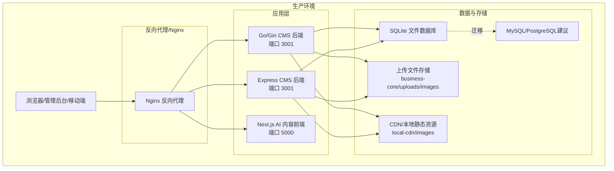
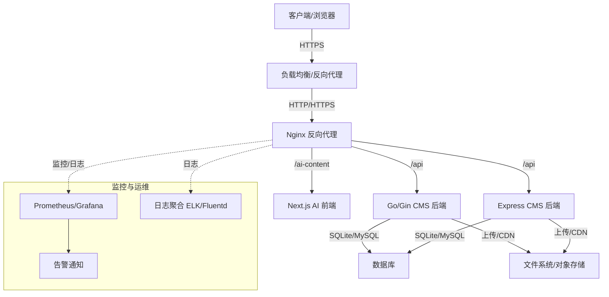
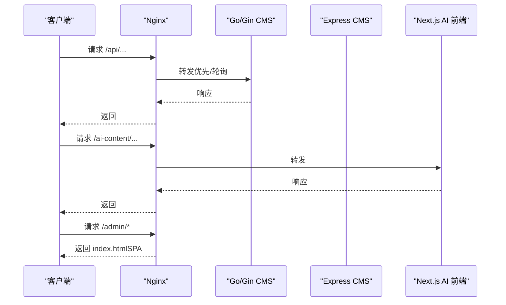
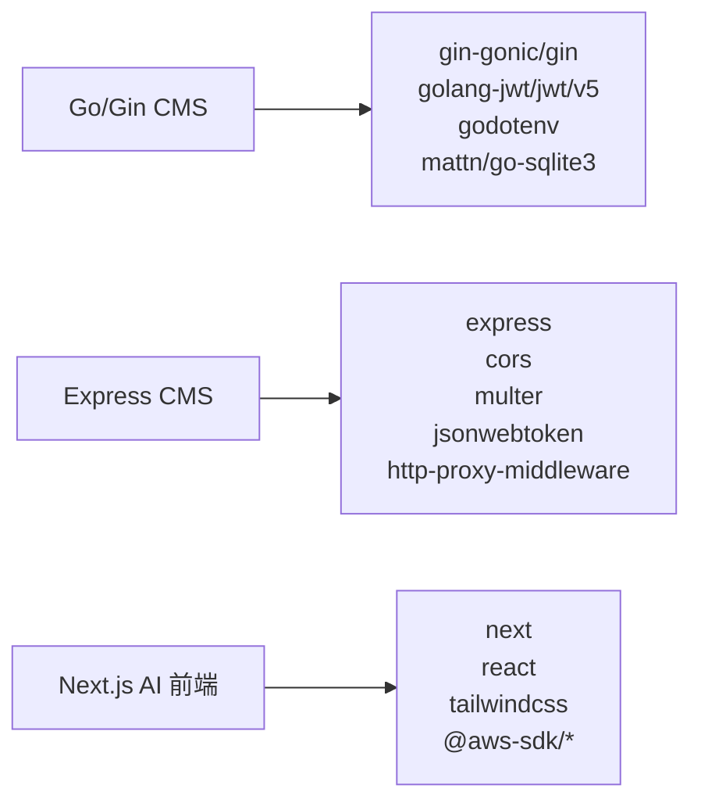

# 生产环境部署

<cite>
**本文引用的文件**
- [ai-content-project/package.json](file://ai-content-project/package.json)
- [ai-content-project/next.config.ts](file://ai-content-project/next.config.ts)
- [ai-content-project/scripts/build.sh](file://ai-content-project/scripts/build.sh)
- [ai-content-project/scripts/start.sh](file://ai-content-project/scripts/start.sh)
- [ai-content-project/scripts/dev.sh](file://ai-content-project/scripts/dev.sh)
- [business-core/cms-server/package.json](file://business-core/cms-server/package.json)
- [business-core/cms-server/app.js](file://business-core/cms-server/app.js)
- [business-core/cms-server/db/setup.js](file://business-core/cms-server/db/setup.js)
- [business-core/cms-server-go/main.go](file://business-core/cms-server-go/main.go)
- [business-core/cms-server-go/config/config.go](file://business-core/cms-server-go/config/config.go)
- [business-core/cms-server-go/db/setup.go](file://business-core/cms-server-go/db/setup.go)
- [business-core/cms-server-go/middleware/auth.go](file://business-core/cms-server-go/middleware/auth.go)
- [business-core/cms-server-go/go.mod](file://business-core/cms-server-go/go.mod)
- [ZSTS-CMS-后端移交说明书.md](file://ZSTS-CMS-后端移交说明书.md)
</cite>

## 目录
1. [简介](#简介)
2. [项目结构](#项目结构)
3. [核心组件](#核心组件)
4. [架构总览](#架构总览)
5. [详细组件分析](#详细组件分析)
6. [依赖分析](#依赖分析)
7. [性能考虑](#性能考虑)
8. [故障排查指南](#故障排查指南)
9. [结论](#结论)
10. [附录](#附录)

## 简介
本文件面向ZSTS-CMS项目的生产环境部署，覆盖数据库迁移（SQLite到MySQL/PostgreSQL）、HTTPS配置、文件存储策略、PM2进程管理、Docker容器化部署、Nginx反向代理与负载均衡、CDN资源管理、性能优化、安全加固、SSL证书配置与监控告警等主题。同时提供可直接参考的部署脚本与配置示例路径，帮助快速落地。

## 项目结构
ZSTS-CMS由三个主要子系统构成：
- CMS后端（Node.js/Express，SQLite）：提供管理后台API、JWT认证、文件上传、静态资源托管与AI内容生成代理。
- CMS后端（Go/Gin，SQLite）：提供与Express版本并行的Go实现，功能一致，便于后续迁移与扩展。
- AI内容生成前端（Next.js 16）：独立的AI生成前端应用，通过反向代理接入CMS后端。



图表来源
- [business-core/cms-server/app.js:155-230](file://business-core/cms-server/app.js#L155-L230)
- [business-core/cms-server-go/main.go:72-114](file://business-core/cms-server-go/main.go#L72-L114)
- [ai-content-project/next.config.ts:3-22](file://ai-content-project/next.config.ts#L3-L22)

章节来源
- [ZSTS-CMS-后端移交说明书.md:13-22](file://ZSTS-CMS-后端移交说明书.md#L13-L22)

## 核心组件
- Go/Gin CMS后端
  - 配置加载与静态资源托管、CORS、JWT认证中间件、AI内容生成代理、管理后台SPA路由兜底。
  - 环境变量驱动端口、JWT密钥、数据库路径、上传目录、内容目录、AI代理地址等。
- Express CMS后端
  - 与Go版本功能对齐，提供上传、预览、代理、页面快照、管理后台SPA等能力。
- Next.js AI内容前端
  - 通过basePath配置挂载到“/ai-content”，构建产物运行于独立端口，由Nginx反代转发至CMS后端。

章节来源
- [business-core/cms-server-go/main.go:22-114](file://business-core/cms-server-go/main.go#L22-L114)
- [business-core/cms-server/app.js:155-230](file://business-core/cms-server/app.js#L155-L230)
- [ai-content-project/next.config.ts:3-22](file://ai-content-project/next.config.ts#L3-L22)

## 架构总览
生产环境推荐采用“Nginx反向代理 + 多实例PM2/Docker + 数据库迁移 + CDN”的组合方案，确保高可用、可扩展与安全。



图表来源
- [business-core/cms-server-go/main.go:72-114](file://business-core/cms-server-go/main.go#L72-L114)
- [business-core/cms-server/app.js:155-230](file://business-core/cms-server/app.js#L155-L230)
- [ai-content-project/next.config.ts:3-22](file://ai-content-project/next.config.ts#L3-L22)

## 详细组件分析

### 数据库迁移（SQLite到MySQL/PostgreSQL）
- 现状
  - Express后端使用better-sqlite3；Go后端使用go-sqlite3。
  - 初始表结构包含用户、页面权限、审计日志、AI通道等。
- 迁移建议
  - 使用ORM（如Drizzle ORM/TypeORM）抽象数据库访问，统一SQL方言。
  - 逐步将SQLite文件路径映射为MySQL/PostgreSQL连接串，保留相同表结构与索引。
  - 迁移期间双写校验与回滚策略，确保数据一致性。
  - 生产环境启用连接池与只读副本，提升并发与可用性。
- 关键表结构要点
  - users：用户名唯一、角色字段、创建/登录时间。
  - page_permissions：联合主键(user_id, page_key)，外键约束。
  - audit_log：审计日志，记录操作者、动作、目标、详情与时间戳。
  - ai_channels：AI通道配置，支持模型列表与默认通道。

```mermaid
erDiagram
USERS {
int id PK
string username UK
string password_hash
string role
datetime created_at
datetime last_login
}
PAGE_PERMISSIONS {
int user_id FK
string page_key
constraint pk PRIMARY KEY(user_id, page_key)
}
AUDIT_LOG {
int id PK
int user_id FK
string username
string action
string target
text detail
datetime timestamp
}
AI_CHANNELS {
int id PK
string name
string api_url
string api_key
json model_list
int is_default
datetime created_at
int created_by FK
}
USERS ||--o{ PAGE_PERMISSIONS : "拥有"
USERS ||--o{ AUDIT_LOG : "产生"
USERS ||--o{ AI_CHANNELS : "创建"
```

图表来源
- [business-core/cms-server/db/setup.js:18-68](file://business-core/cms-server/db/setup.js#L18-L68)
- [business-core/cms-server-go/db/setup.go:46-108](file://business-core/cms-server-go/db/setup.go#L46-L108)

章节来源
- [business-core/cms-server/db/setup.js:18-108](file://business-core/cms-server/db/setup.js#L18-L108)
- [business-core/cms-server-go/db/setup.go:46-175](file://business-core/cms-server-go/db/setup.go#L46-L175)
- [ZSTS-CMS-后端移交说明书.md:559](file://ZSTS-CMS-后端移交说明书.md#L559)

### HTTPS配置与SSL证书
- Nginx启用HTTPS，配置强加密套件与TLS版本。
- 使用Let’s Encrypt自动化证书申请与续期（certbot）。
- 强制HSTS、HPKP（可选）、OCSP Stapling。
- 将80端口重定向至443，确保全站HTTPS。

章节来源
- [ZSTS-CMS-后端移交说明书.md:560](file://ZSTS-CMS-后端移交说明书.md#L560)

### 文件存储策略
- 上传文件
  - Express后端：默认上传目录business-core/uploads/images，文件名随机化，限制大小与类型。
  - Go后端：通过配置项UPLOAD_DIR指定上传目录，确保目录存在且权限正确。
- 静态资源
  - images与local-cdn目录通过静态路由暴露，建议CDN加速。
- 对象存储（推荐）
  - 使用S3兼容存储（AWS S3/MinIO），将上传与CDN结合，提升可靠性与全球分发能力。
- 备份与归档
  - 定期备份上传目录与数据库；审计日志表体量增长较快，建议定期归档。

章节来源
- [business-core/cms-server/app.js:24-53](file://business-core/cms-server/app.js#L24-L53)
- [business-core/cms-server-go/config/config.go:47-52](file://business-core/cms-server-go/config/config.go#L47-L52)
- [ZSTS-CMS-后端移交说明书.md:561-563](file://ZSTS-CMS-后端移交说明书.md#L561-L563)

### PM2进程管理
- 部署脚本
  - Express后端：使用pm2 start启动，配置ecosystem.config.js（建议基于以下参数定制）。
  - Next.js AI前端：使用scripts/start.sh启动，监听DEPLOY_RUN_PORT（默认5000）。
- 推荐配置要点
  - 启用cluster模式，按CPU核数启动多实例。
  - 启用PM2日志轮转与健康检查。
  - 与Nginx配合实现平滑重启与零停机发布。

章节来源
- [business-core/cms-server/package.json:6-8](file://business-core/cms-server/package.json#L6-L8)
- [ai-content-project/scripts/start.sh:10-17](file://ai-content-project/scripts/start.sh#L10-L17)

### Docker容器化部署
- 构建镜像
  - Express后端：基于Node官方镜像，安装依赖后启动app.js。
  - Go后端：基于golang:alpine编译后复制二进制，运行main。
  - Next.js AI前端：基于node:alpine，执行build.sh生成dist，使用start.sh运行。
- 容器网络
  - 通过docker-compose编排，定义服务、端口映射、卷挂载（上传目录、日志）。
- 环境变量
  - 通过环境文件注入PORT、JWT_SECRET、DB_PATH、UPLOAD_DIR、AI_PROXY_URL等。

章节来源
- [ai-content-project/scripts/build.sh:8-17](file://ai-content-project/scripts/build.sh#L8-L17)
- [business-core/cms-server-go/go.mod:1-39](file://business-core/cms-server-go/go.mod#L1-L39)

### Nginx反向代理与负载均衡
- 反向代理
  - /api → Go/Gin或Express后端（二选一或双实例）
  - /ai-content → Next.js AI前端
  - /admin → 管理后台SPA（静态）
  - /uploads /images /local-cdn → 静态资源
- 负载均衡
  - upstream多实例，健康检查，权重与故障转移。
  - WebSocket支持（AI代理ws: true）。
- 缓存与压缩
  - 静态资源开启长缓存与ETag；启用gzip/br压缩。
  - 预览模式禁用缓存，确保实时更新。



图表来源
- [business-core/cms-server-go/main.go:72-114](file://business-core/cms-server-go/main.go#L72-L114)
- [business-core/cms-server/app.js:155-230](file://business-core/cms-server/app.js#L155-L230)
- [ai-content-project/next.config.ts:3-22](file://ai-content-project/next.config.ts#L3-L22)

### CDN资源管理
- images与local-cdn通过Nginx静态托管，建议绑定CDN域名。
- 对上传文件与动态资源，建议使用对象存储+CDN，缩短边缘节点延迟。
- 预览模式禁用缓存，避免CDN缓存陈旧内容。

章节来源
- [business-core/cms-server-go/main.go:51-58](file://business-core/cms-server-go/main.go#L51-L58)
- [business-core/cms-server/app.js:55-63](file://business-core/cms-server/app.js#L55-L63)

### 性能优化建议
- 应用层
  - 启用Gin Release模式（生产环境），限制请求体大小，合理设置超时。
  - 使用连接池与只读副本，减少热点查询压力。
- 网络层
  - 启用HTTP/2与ALPN；开启gzip/br压缩；合理设置缓存头。
- 存储层
  - 上传目录与CDN分离；冷热数据分层；定期清理临时文件。
- 监控与压测
  - 基准测试与容量规划；建立P95/P99延迟与错误率阈值。

章节来源
- [business-core/cms-server-go/main.go:35-49](file://business-core/cms-server-go/main.go#L35-L49)
- [ZSTS-CMS-后端移交说明书.md:565-574](file://ZSTS-CMS-后端移交说明书.md#L565-L574)

### 安全加固措施
- 认证与授权
  - 更换JWT_SECRET为高强度随机字符串；严格校验令牌格式与签名。
  - 页面编辑权限通过数据库校验，超级管理员豁免。
- 传输安全
  - 强制HTTPS；禁用弱加密套件；启用HSTS。
- 文件与输入
  - 上传文件类型白名单与大小限制；路径规范化防止目录穿越。
- 日志与审计
  - 审计日志表记录关键操作；定期归档与留存策略。

章节来源
- [ZSTS-CMS-后端移交说明书.md:557-558](file://ZSTS-CMS-后端移交说明书.md#L557-L558)
- [business-core/cms-server-go/middleware/auth.go:17-132](file://business-core/cms-server-go/middleware/auth.go#L17-L132)
- [business-core/cms-server/app.js:36-44](file://business-core/cms-server/app.js#L36-L44)

### SSL证书配置与监控告警
- 证书
  - 使用certbot自动申请与续期；配置证书链与私钥权限。
- 监控
  - Prometheus抓取Nginx/应用指标；Grafana可视化；告警规则（错误率、延迟、连接数）。
- 告警
  - 邮件/IM通知；分级响应；演练与预案。

章节来源
- [ZSTS-CMS-后端移交说明书.md:560](file://ZSTS-CMS-后端移交说明书.md#L560)

## 依赖分析
- Go后端依赖
  - Gin Web框架、JWT、godotenv、SQLite驱动等。
- Node后端依赖
  - Express、CORS、Multer、JWT、http-proxy-middleware等。
- 前端依赖
  - Next.js 16、React 19、TailwindCSS、AWS SDK等。



图表来源
- [business-core/cms-server-go/go.mod:5-11](file://business-core/cms-server-go/go.mod#L5-L11)
- [business-core/cms-server/package.json:10-20](file://business-core/cms-server/package.json#L10-L20)
- [ai-content-project/package.json:15-75](file://ai-content-project/package.json#L15-L75)

章节来源
- [business-core/cms-server-go/go.mod:1-39](file://business-core/cms-server-go/go.mod#L1-L39)
- [business-core/cms-server/package.json:10-21](file://business-core/cms-server/package.json#L10-L21)
- [ai-content-project/package.json:15-75](file://ai-content-project/package.json#L15-L75)

## 性能考虑
- 数据库
  - SQLite适合低并发；高并发建议迁移至MySQL/PostgreSQL，启用连接池与只读副本。
- 应用
  - Gin Release模式、限流与熔断、异步任务队列（如需）。
- 网络
  - Nginx启用gzip/br、缓存策略、上游健康检查。
- 存储
  - 上传与CDN分离；对象存储分层；定期清理。

章节来源
- [ZSTS-CMS-后端移交说明书.md:569-570](file://ZSTS-CMS-后端移交说明书.md#L569-L570)
- [business-core/cms-server-go/main.go:35-49](file://business-core/cms-server-go/main.go#L35-L49)

## 故障排查指南
- 启动失败
  - 检查端口占用与防火墙；确认环境变量（PORT/JWT_SECRET/DB_PATH）。
- 上传异常
  - 检查上传目录权限与磁盘配额；确认文件类型与大小限制。
- 鉴权失败
  - 核对JWT_SECRET；检查令牌格式与签名；确认用户角色与页面权限。
- 预览模式资源404
  - 确认images/local-cdn静态目录映射；预览模式禁用缓存。
- 审计日志膨胀
  - 定期归档与清理；设置保留周期。

章节来源
- [business-core/cms-server/app.js:305-308](file://business-core/cms-server/app.js#L305-L308)
- [business-core/cms-server-go/main.go:117-129](file://business-core/cms-server-go/main.go#L117-L129)
- [ZSTS-CMS-后端移交说明书.md:563](file://ZSTS-CMS-后端移交说明书.md#L563)

## 结论
通过Nginx反向代理与负载均衡、PM2/Docker容器化、数据库迁移与CDN优化、完善的HTTPS与安全加固、以及监控告警体系，ZSTS-CMS可在生产环境中实现高可用、高性能与易维护。建议按本文步骤逐步实施，并结合业务流量与合规要求持续优化。

## 附录
- 部署脚本与配置示例路径
  - Express后端启动脚本：[business-core/cms-server/package.json:6-8](file://business-core/cms-server/package.json#L6-L8)
  - Next.js构建脚本：[ai-content-project/scripts/build.sh:8-17](file://ai-content-project/scripts/build.sh#L8-L17)
  - Next.js启动脚本：[ai-content-project/scripts/start.sh:10-17](file://ai-content-project/scripts/start.sh#L10-L17)
  - Next.js开发脚本（调试用）：[ai-content-project/scripts/dev.sh:10-34](file://ai-content-project/scripts/dev.sh#L10-L34)
  - Go后端入口与路由：[business-core/cms-server-go/main.go:22-114](file://business-core/cms-server-go/main.go#L22-L114)
  - Go后端配置加载：[business-core/cms-server-go/config/config.go:26-56](file://business-core/cms-server-go/config/config.go#L26-L56)
  - Express后端路由与静态资源：[business-core/cms-server/app.js:155-230](file://business-core/cms-server/app.js#L155-L230)
  - Express后端数据库初始化：[business-core/cms-server/db/setup.js:14-108](file://business-core/cms-server/db/setup.js#L14-L108)
  - Go后端数据库初始化：[business-core/cms-server-go/db/setup.go:18-175](file://business-core/cms-server-go/db/setup.go#L18-L175)
  - Next.js配置（basePath）：[ai-content-project/next.config.ts:3-22](file://ai-content-project/next.config.ts#L3-L22)
  - 移交说明（生产注意事项与改造建议）：[ZSTS-CMS-后端移交说明书.md:536-574](file://ZSTS-CMS-后端移交说明书.md#L536-L574)