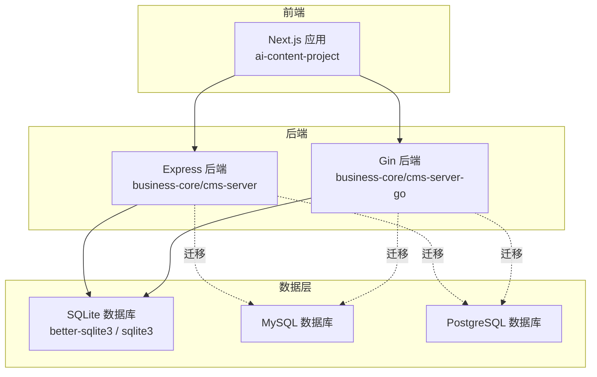
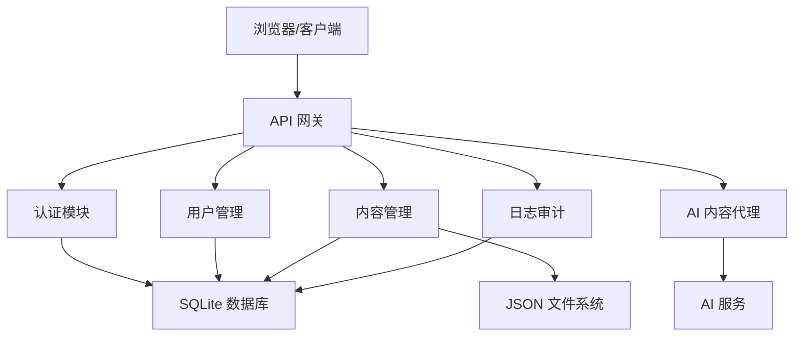
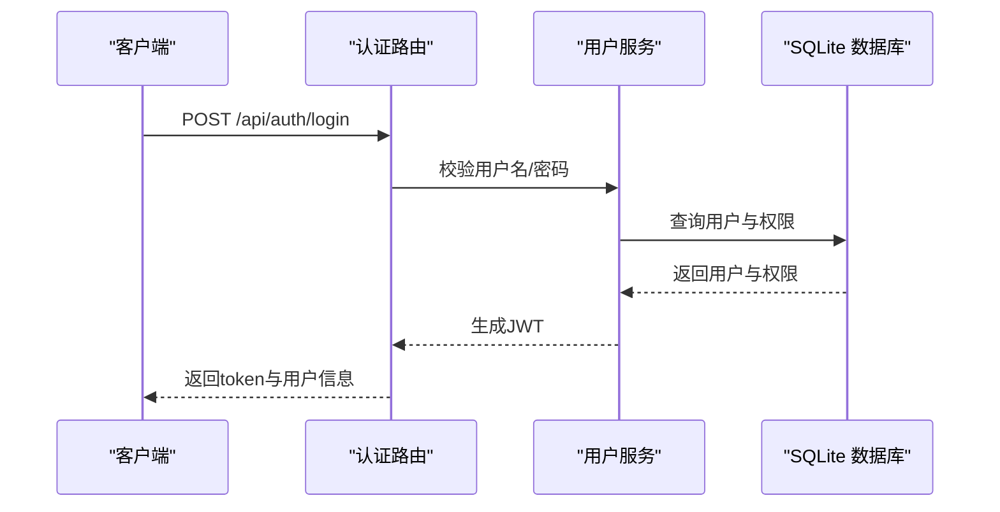
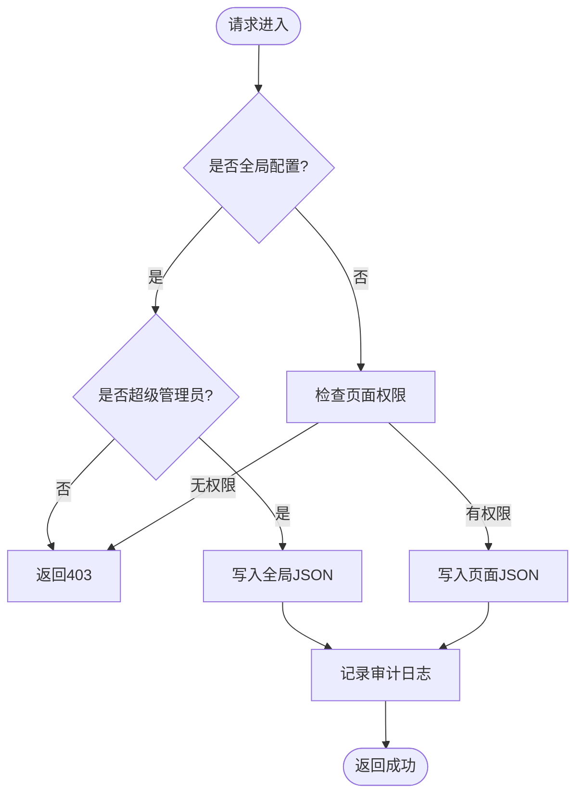
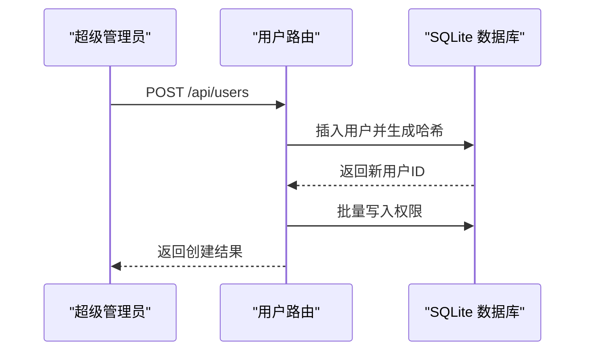
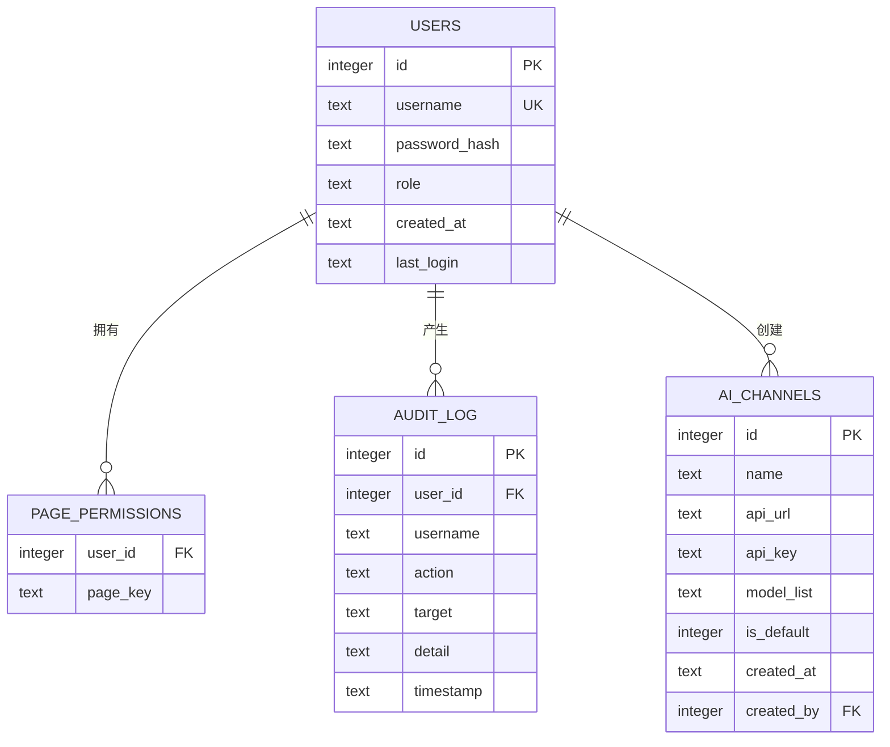
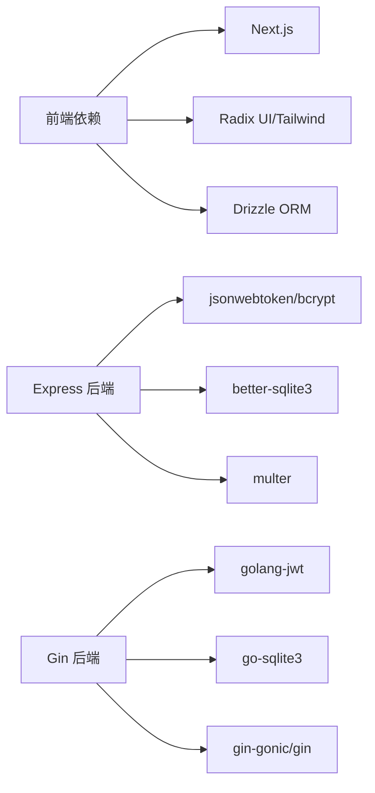
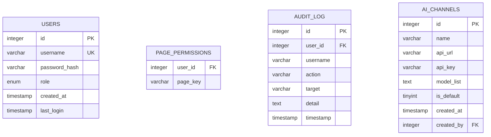
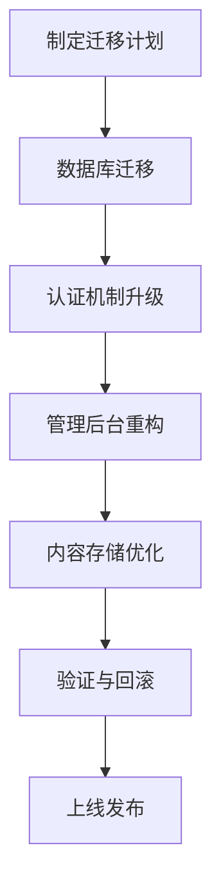

# 系统迁移建议

<cite>
**本文档引用的文件**
- [package.json](file://ai-content-project/package.json)
- [app.js](file://business-core/cms-server/app.js)
- [setup.js](file://business-core/cms-server/db/setup.js)
- [auth.js](file://business-core/cms-server/middleware/auth.js)
- [auth.js](file://business-core/cms-server/routes/auth.js)
- [content.js](file://business-core/cms-server/routes/content.js)
- [users.js](file://business-core/cms-server/routes/users.js)
- [main.go](file://business-core/cms-server-go/main.go)
- [config.go](file://business-core/cms-server-go/config/config.go)
- [setup.go](file://business-core/cms-server-go/db/setup.go)
- [models.go](file://business-core/cms-server-go/models/models.go)
- [auth.go](file://business-core/cms-server-go/routes/auth.go)
- [content.go](file://business-core/cms-server-go/routes/content.go)
- [users.go](file://business-core/cms-server-go/routes/users.go)
</cite>

## 目录
1. [引言](#引言)
2. [项目结构](#项目结构)
3. [核心组件](#核心组件)
4. [架构总览](#架构总览)
5. [详细组件分析](#详细组件分析)
6. [依赖分析](#依赖分析)
7. [性能考虑](#性能考虑)
8. [故障排除指南](#故障排除指南)
9. [结论](#结论)
10. [附录](#附录)

## 引言
本文件面向ZSTS-CMS项目，提供从原型阶段向稳定生产环境演进的系统迁移建议。重点覆盖以下方面：
- 技术债务与现状评估：当前原型采用原生JS管理后台、SQLite数据库、基于JWT的认证与内容存储为JSON文件等。
- 数据库迁移方案：从SQLite平滑迁移到MySQL/PostgreSQL，包含兼容性与风险评估。
- 管理后台重构：从原生JS SPA迁移到Vue/React生态，提升开发效率与维护性。
- 认证机制升级：强化JWT安全实践，完善会话与权限控制。
- 内容存储优化：从JSON文件迁移到结构化数据库，提升一致性与扩展性。
- 渐进式迁移策略：分阶段实施，保障业务连续性。
- 数据迁移脚本与兼容性保证：提供可执行的迁移步骤与回滚预案。
- 风险评估与实施计划：明确各技术栈升级的风险点与推进节奏。

## 项目结构
项目由三个主要部分组成：
- ai-content-project：Next.js前端应用，包含UI组件库与工具模块。
- business-core/cms-server：Node.js + Express后端（原型阶段），负责认证、内容管理、静态资源与AI代理。
- business-core/cms-server-go：Go/Gin后端（Go版本实现），提供与Express后端一致的功能集。

**图表来源**
- [app.js:1-315](file://business-core/cms-server/app.js#L1-L315)
- [main.go:1-317](file://business-core/cms-server-go/main.go#L1-L317)
- [setup.js:1-115](file://business-core/cms-server/db/setup.js#L1-L115)
- [setup.go:1-187](file://business-core/cms-server-go/db/setup.go#L1-L187)

**章节来源**
- [app.js:1-315](file://business-core/cms-server/app.js#L1-L315)
- [main.go:1-317](file://business-core/cms-server-go/main.go#L1-L317)

## 核心组件
- 认证与授权：基于JWT的登录、会话恢复、超级管理员校验与页面权限检查。
- 内容管理：页面内容与全局配置的读写，采用JSON文件存储。
- 用户管理：用户增删改、密码重置、权限分配。
- 静态资源与预览：上传文件服务、预览客户端JS注入、静态资源托管。
- AI内容代理：通过JWT进行认证，转发至AI服务。

**章节来源**
- [auth.js:1-86](file://business-core/cms-server/middleware/auth.js#L1-L86)
- [auth.js:1-99](file://business-core/cms-server/routes/auth.js#L1-L99)
- [content.js:1-104](file://business-core/cms-server/routes/content.js#L1-L104)
- [users.js:1-154](file://business-core/cms-server/routes/users.js#L1-L154)
- [auth.go:1-174](file://business-core/cms-server-go/routes/auth.go#L1-L174)
- [content.go:1-298](file://business-core/cms-server-go/routes/content.go#L1-L298)
- [users.go:1-249](file://business-core/cms-server-go/routes/users.go#L1-L249)

## 架构总览
当前原型采用前后端分离架构，Express/Gin分别提供REST API，前端Next.js消费API并渲染界面；内容以JSON文件形式存储于本地文件系统。

**图表来源**
- [app.js:155-225](file://business-core/cms-server/app.js#L155-L225)
- [main.go:72-87](file://business-core/cms-server-go/main.go#L72-L87)
- [content.go:80-157](file://business-core/cms-server-go/routes/content.go#L80-L157)

## 详细组件分析

### 认证与授权组件
- Express版本：JWT密钥、令牌校验、超级管理员与页面权限检查。
- Go版本：与Express一致的JWT流程，统一了认证逻辑。

**图表来源**
- [auth.js:22-66](file://business-core/cms-server/routes/auth.js#L22-L66)
- [auth.go:27-104](file://business-core/cms-server-go/routes/auth.go#L27-L104)

**章节来源**
- [auth.js:20-44](file://business-core/cms-server/middleware/auth.js#L20-L44)
- [auth.js:22-66](file://business-core/cms-server/routes/auth.js#L22-L66)
- [auth.go:27-104](file://business-core/cms-server-go/routes/auth.go#L27-L104)

### 内容存储与管理
- 页面内容与全局配置均以JSON文件存储，读写通过API暴露。
- Go版本与Express版本在内容读写上保持一致行为。

**图表来源**
- [content.js:67-101](file://business-core/cms-server/routes/content.js#L67-L101)
- [content.go:110-157](file://business-core/cms-server-go/routes/content.go#L110-L157)

**章节来源**
- [content.js:48-101](file://business-core/cms-server/routes/content.js#L48-L101)
- [content.go:80-157](file://business-core/cms-server-go/routes/content.go#L80-L157)

### 用户管理
- 支持用户列表、创建、密码重置、权限更新与删除。
- 删除自身账号被拒绝，权限变更通过事务批量写入。

**图表来源**
- [users.js:44-87](file://business-core/cms-server/routes/users.js#L44-L87)
- [users.go:74-135](file://business-core/cms-server-go/routes/users.go#L74-L135)

**章节来源**
- [users.js:26-151](file://business-core/cms-server/routes/users.js#L26-L151)
- [users.go:31-248](file://business-core/cms-server-go/routes/users.go#L31-L248)

### 数据库初始化与表结构
- Express版本使用better-sqlite3，Go版本使用go-sqlite3。
- 初始化包含users、page_permissions、audit_log、ai_channels等表。

**图表来源**
- [setup.js:18-68](file://business-core/cms-server/db/setup.js#L18-L68)
- [setup.go:46-108](file://business-core/cms-server-go/db/setup.go#L46-L108)

**章节来源**
- [setup.js:14-108](file://business-core/cms-server/db/setup.js#L14-L108)
- [setup.go:18-175](file://business-core/cms-server-go/db/setup.go#L18-L175)

## 依赖分析
- 前端依赖：Next.js、Radix UI组件、TailwindCSS、React 19、Drizzle ORM等。
- 后端依赖：Express/Go生态、better-sqlite3/go-sqlite3、JWT、bcrypt、Multer等。
- 两端认证与内容API保持一致，便于迁移与替换。

**图表来源**
- [package.json:15-75](file://ai-content-project/package.json#L15-L75)
- [app.js:10-21](file://business-core/cms-server/app.js#L10-L21)
- [main.go:3-20](file://business-core/cms-server-go/main.go#L3-L20)

**章节来源**
- [package.json:15-75](file://ai-content-project/package.json#L15-L75)
- [app.js:10-21](file://business-core/cms-server/app.js#L10-L21)
- [main.go:3-20](file://business-core/cms-server-go/main.go#L3-L20)

## 性能考虑
- SQLite适合原型与小规模场景，但在高并发、复杂查询与事务一致性方面存在局限。
- MySQL/PostgreSQL具备更强的并发能力、索引优化与扩展性，适合生产环境。
- 前端Next.js具备SSR/ISR能力，结合后端API可实现更好的首屏性能与SEO。

## 故障排除指南
- 认证失败：检查JWT密钥配置、令牌格式与过期时间。
- 权限不足：确认用户角色与页面权限映射。
- 内容写入失败：检查JSON文件权限与磁盘空间。
- 数据库初始化异常：确认SQLite驱动安装与数据库路径。

**章节来源**
- [auth.js:20-44](file://business-core/cms-server/middleware/auth.js#L20-L44)
- [auth.go:106-173](file://business-core/cms-server-go/routes/auth.go#L106-L173)
- [content.js:67-101](file://business-core/cms-server/routes/content.js#L67-L101)
- [setup.js:14-108](file://business-core/cms-server/db/setup.js#L14-L108)

## 结论
ZSTS-CMS当前处于原型阶段，具备清晰的前后端分离架构与基础功能。为支撑后续规模化运营，建议按“渐进式迁移”策略，优先完成数据库与认证体系的升级，再逐步替换管理后台技术栈，最终实现内容存储的结构化改造。此方案可在保障业务连续性的前提下，显著提升系统的稳定性、安全性与可维护性。

## 附录

### 数据库迁移方案（SQLite到MySQL/PostgreSQL）

#### 迁移目标
- 从SQLite切换至MySQL/PostgreSQL，保留现有业务逻辑与API不变。
- 保证数据一致性、事务完整性与权限模型兼容。

#### 迁移策略
- 并行双写：在API层同时写入SQLite与目标数据库，持续同步一段时间。
- 切换读写：先切换读取逻辑至目标数据库，再切换写入逻辑。
- 验证与回滚：通过自动化测试与灰度发布验证，准备回滚方案。

#### 数据模型映射
- users、page_permissions、audit_log、ai_channels四张核心表保持字段一致。
- JSON字段（如ai_channels.model_list）在关系型数据库中以TEXT存储。

**图表来源**
- [setup.js:18-68](file://business-core/cms-server/db/setup.js#L18-L68)
- [setup.go:46-108](file://business-core/cms-server-go/db/setup.go#L46-L108)

#### 迁移脚本与兼容性
- 数据迁移脚本：导出SQLite数据，转换为目标数据库格式，导入目标数据库。
- 兼容性保证：在API层抽象数据访问层，屏蔽底层差异；在配置中切换DB驱动与连接参数。

#### 风险评估与应对
- 风险：并发写入导致的数据不一致。
  - 应对：双写期间严格监控与对账，必要时回退至单写。
- 风险：目标数据库连接不稳定。
  - 应对：增加重试与熔断，设置降级读取SQLite。
- 风险：索引缺失影响查询性能。
  - 应对：迁移后补建索引并压测验证。

### 管理后台重构（原生JS到Vue/React）

#### 目标
- 使用Vue/React构建现代化管理后台，提升开发效率与用户体验。
- 保持与现有API的兼容，避免业务逻辑改动。

#### 实施步骤
- 基础框架：引入Vite/Vue CLI或Create React App，搭建工程化环境。
- 组件化：将现有原生JS组件拆分为可复用的UI组件。
- 状态管理：引入Pinia/Redux Toolkit管理全局状态。
- 路由与鉴权：基于现有JWT实现登录态与权限控制。
- 集成测试：与后端API联调，确保接口一致。

#### 风险评估
- 风险：第三方库版本冲突。
  - 应对：锁定依赖版本，定期安全扫描。
- 风险：UI与后端API不一致。
  - 应对：建立契约测试与接口文档。

### 认证机制升级（JWT增强）

#### 增强点
- 密钥轮换：定期更换JWT密钥，支持多密钥并行验证。
- 令牌刷新：引入refresh token与短期access token，降低泄露风险。
- 多因子认证：为超级管理员启用MFA。
- 会话审计：记录登录IP、UA与时间戳，异常登录触发告警。

#### 实施要点
- 在Express与Go两端统一实现新的认证流程。
- 保持对外API签名不变，内部流程可调整。

### 内容存储优化（JSON文件到结构化数据库）

#### 目标
- 将页面内容与全局配置从JSON文件迁移到关系型数据库，提升一致性与可查询性。
- 保留现有API不变，仅变更存储层。

#### 方案
- 新增内容表：page_content、global_config等，字段映射JSON结构。
- 迁移脚本：遍历JSON文件，解析结构化写入数据库。
- 读写策略：先读数据库，回退读JSON文件，逐步淘汰文件存储。

#### 风险与应对
- 风险：迁移过程中内容丢失。
  - 应对：全量备份与增量校验，失败快速回滚。
- 风险：并发写入导致脏读。
  - 应对：引入分布式锁或乐观锁。

### 渐进式迁移策略与实施计划

- 第一阶段：数据库迁移与认证增强（2-4周）
  - 完成SQLite到MySQL/PostgreSQL的双写与切换。
  - 引入JWT刷新与密钥轮换。
- 第二阶段：管理后台重构（4-6周）
  - 基于Vue/React搭建新后台，集成现有API。
- 第三阶段：内容存储优化（2-3周）
  - 新增结构化内容表，迁移历史数据。
- 第四阶段：验证与回滚（1-2周）
  - 全链路压测、监控告警、回滚预案演练。
- 第五阶段：上线发布（1周）
  - 分批灰度发布，逐步关闭旧路径。

### 数据迁移脚本示例（概念性描述）
- 导出：从JSON目录导出为CSV/SQL。
- 转换：根据目标数据库Schema转换字段类型与约束。
- 导入：批量导入目标数据库，校验数量与唯一键。
- 对账：比对源与目标数据，修复差异。

### 兼容性保证方案
- 接口兼容：保持API签名不变，内部实现可替换。
- 配置驱动：通过环境变量切换存储后端与认证方式。
- 版本化：为关键变更打标签，便于回滚。