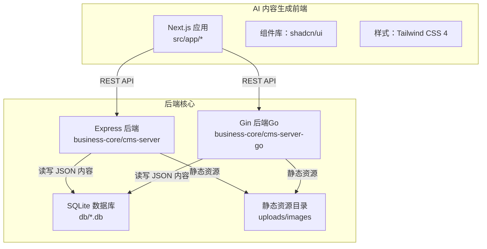
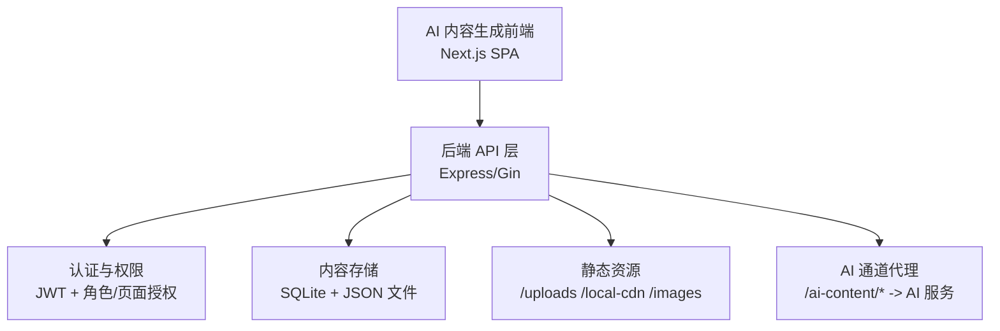
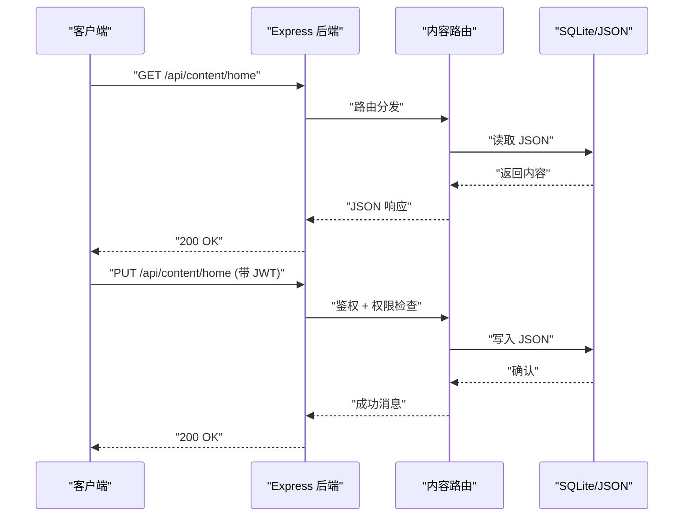
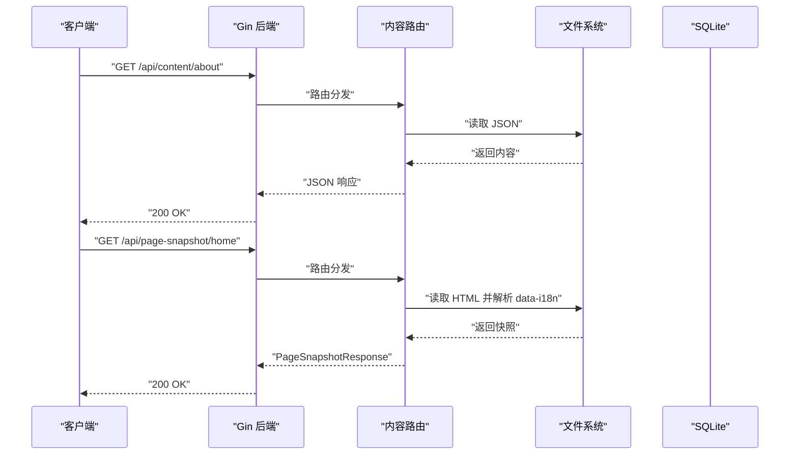
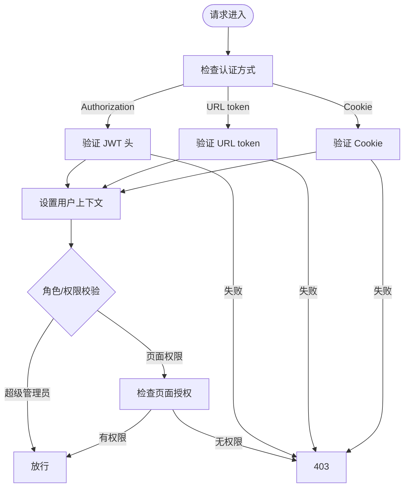
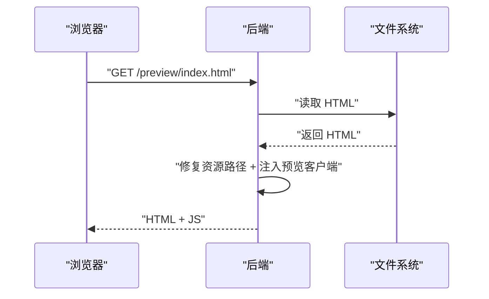
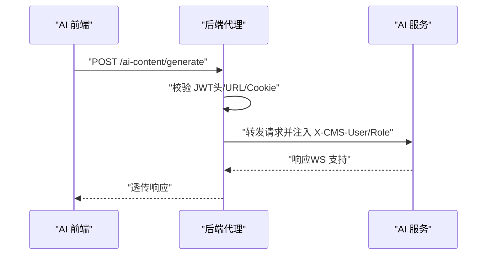
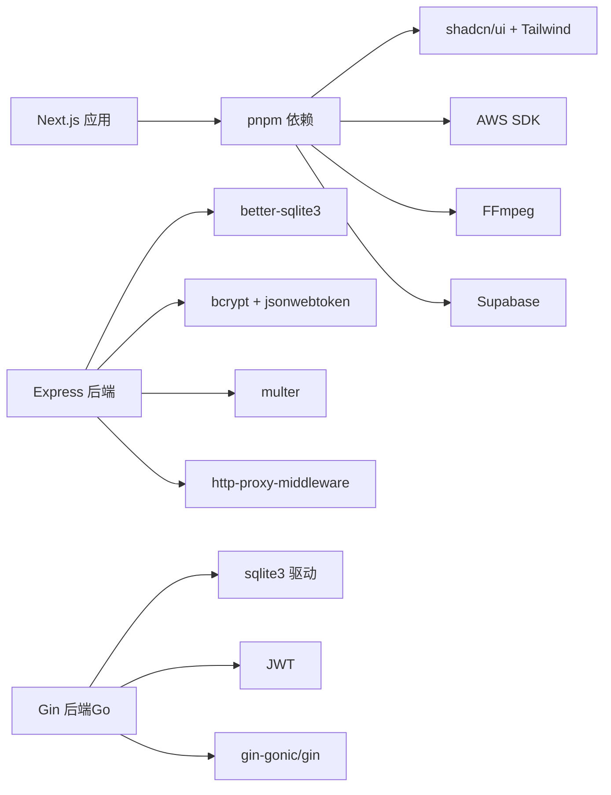

# 项目概述

<cite>
**本文引用的文件**
- [ai-content-project/package.json](file://ai-content-project/package.json)
- [business-core/cms-server/package.json](file://business-core/cms-server/package.json)
- [business-core/cms-server-go/main.go](file://business-core/cms-server-go/main.go)
- [business-core/cms-server/app.js](file://business-core/cms-server/app.js)
- [ai-content-project/src/app/layout.tsx](file://ai-content-project/src/app/layout.tsx)
- [business-core/cms-server/routes/content.js](file://business-core/cms-server/routes/content.js)
- [business-core/cms-server-go/config/config.go](file://business-core/cms-server-go/config/config.go)
- [business-core/cms-server-go/models/models.go](file://business-core/cms-server-go/models/models.go)
- [business-core/cms-server-go/routes/content.go](file://business-core/cms-server-go/routes/content.go)
- [ai-content-project/DESIGN.md](file://ai-content-project/DESIGN.md)
- [ai-content-project/AGENTS.md](file://ai-content-project/AGENTS.md)
- [business-core/cms-server/db/setup.js](file://business-core/cms-server/db/setup.js)
- [business-core/cms-server-go/db/setup.go](file://business-core/cms-server-go/db/setup.go)
- [ai-content-project/scripts/dev.sh](file://ai-content-project/scripts/dev.sh)
- [ai-content-project/next.config.ts](file://ai-content-project/next.config.ts)
</cite>

## 目录
1. [引言](#引言)
2. [项目结构](#项目结构)
3. [核心组件](#核心组件)
4. [架构总览](#架构总览)
5. [详细组件分析](#详细组件分析)
6. [依赖关系分析](#依赖关系分析)
7. [性能考虑](#性能考虑)
8. [故障排查指南](#故障排查指南)
9. [结论](#结论)
10. [附录](#附录)

## 引言
ZSTS-CMS 是一套面向签证业务的内容管理系统，围绕“配置式内容管理、AI 内容生成、多页面模块统一管理”的理念构建。系统采用三层架构：
- CMS 后端服务：提供统一的认证、内容存储、日志审计与 AI 通道代理能力
- 管理后台 SPA：基于 Next.js 的单页应用，负责内容编辑、分发与可视化管理
- AI 内容生成前端：独立的 AI 创作助手前端，提供文章/海报等多类型内容的生成与分发

系统通过 JSON 驱动的内容模型实现页面与全局配置的统一管理；通过 JWT 实现跨服务认证；通过反向代理打通 AI 生成服务与管理后台的协作。

## 项目结构
项目分为三大子工程：
- ai-content-project：AI 内容生成前端（Next.js App Router）
- business-core：后端核心（包含 Node.js Express 与 Go Gin 两套实现）
- uploads/images：静态资源上传目录（由后端统一暴露）

图表来源
- [ai-content-project/package.json:15-75](file://ai-content-project/package.json#L15-L75)
- [business-core/cms-server/package.json:10-20](file://business-core/cms-server/package.json#L10-L20)
- [business-core/cms-server-go/main.go:51-58](file://business-core/cms-server-go/main.go#L51-L58)

章节来源
- [ai-content-project/AGENTS.md:15-39](file://ai-content-project/AGENTS.md#L15-L39)
- [business-core/cms-server/app.js:55-62](file://business-core/cms-server/app.js#L55-L62)
- [business-core/cms-server-go/main.go:51-58](file://business-core/cms-server-go/main.go#L51-L58)

## 核心组件
- 内容管理 API：提供页面内容与全局配置的读写接口，支持权限校验与审计日志
- 认证与权限：基于 JWT 的认证体系，区分普通编辑者与超级管理员，并按页面维度授权
- 静态资源与预览：统一暴露上传图片与本地 CDN 资源，支持预览模式下的资源路径修复与客户端注入
- AI 通道代理：在后端统一鉴权后，将请求转发至 AI 生成服务，注入用户身份信息
- 设计与交互：统一的视觉语言与交互规范，强调“有序的创造力”

章节来源
- [business-core/cms-server/routes/content.js:48-101](file://business-core/cms-server/routes/content.js#L48-L101)
- [business-core/cms-server-go/routes/content.go:80-157](file://business-core/cms-server-go/routes/content.go#L80-L157)
- [business-core/cms-server/app.js:163-225](file://business-core/cms-server/app.js#L163-L225)
- [business-core/cms-server-go/main.go:209-289](file://business-core/cms-server-go/main.go#L209-L289)

## 架构总览
系统采用“前后端分离 + 代理层”的三层设计：
- 前端层：AI 内容生成前端（Next.js SPA），通过 /ai-content 前缀部署
- 代理层：后端统一暴露 REST API 与静态资源，内置 AI 通道代理
- 存储层：SQLite 数据库存储用户、权限、审计与 AI 渠道配置；JSON 文件存储页面与全局内容

图表来源
- [ai-content-project/next.config.ts:4](file://ai-content-project/next.config.ts#L4)
- [business-core/cms-server/app.js:155-161](file://business-core/cms-server/app.js#L155-L161)
- [business-core/cms-server-go/main.go:72-84](file://business-core/cms-server-go/main.go#L72-L84)

## 详细组件分析

### 内容管理 API（Express）
- GET /api/content/:pageKey：读取页面或全局配置 JSON
- PUT /api/content/:pageKey：更新页面或全局配置 JSON（需认证与权限）
- 支持页面键值集合与全局键值集合，权限校验区分超级管理员与普通编辑者

图表来源
- [business-core/cms-server/routes/content.js:48-101](file://business-core/cms-server/routes/content.js#L48-L101)
- [business-core/cms-server/app.js:155-161](file://business-core/cms-server/app.js#L155-L161)

章节来源
- [business-core/cms-server/routes/content.js:1-104](file://business-core/cms-server/routes/content.js#L1-L104)

### 内容管理 API（Go/Gin）
- 与 Express 版本等价的路由与权限逻辑，支持页面快照抓取（从 HTML 提取 data-i18n）
- 提供 /api/page-snapshot/:pageKey 接口，用于编辑器首次回显默认值

图表来源
- [business-core/cms-server-go/routes/content.go:80-157](file://business-core/cms-server-go/routes/content.go#L80-L157)
- [business-core/cms-server-go/routes/content.go:213-274](file://business-core/cms-server-go/routes/content.go#L213-L274)

章节来源
- [business-core/cms-server-go/routes/content.go:1-298](file://business-core/cms-server-go/routes/content.go#L1-L298)

### 认证与权限（JWT）
- Express/Gin 均支持三种认证方式：Authorization 头、URL 查询参数 token、Cookie 回退
- 超级管理员拥有全局配置写权限；普通编辑者按页面维度授权

图表来源
- [business-core/cms-server/app.js:168-196](file://business-core/cms-server/app.js#L168-L196)
- [business-core/cms-server-go/main.go:227-289](file://business-core/cms-server-go/main.go#L227-L289)

章节来源
- [business-core/cms-server/app.js:155-161](file://business-core/cms-server/app.js#L155-L161)
- [business-core/cms-server-go/main.go:72-84](file://business-core/cms-server-go/main.go#L72-L84)

### 静态资源与预览模式
- 后端统一暴露 /uploads、/local-cdn、/images，并在预览模式下修复资源相对路径
- 注入预览客户端 JS，确保编辑器与预览一致

图表来源
- [business-core/cms-server/app.js:104-153](file://business-core/cms-server/app.js#L104-L153)
- [business-core/cms-server-go/main.go:146-207](file://business-core/cms-server-go/main.go#L146-L207)

章节来源
- [business-core/cms-server/app.js:55-62](file://business-core/cms-server/app.js#L55-L62)
- [business-core/cms-server-go/main.go:51-58](file://business-core/cms-server-go/main.go#L51-L58)

### AI 通道代理
- 后端统一拦截 /ai-content 前缀，进行 JWT 校验并注入用户身份到代理请求头
- 支持 WebSocket 代理，便于实时对话场景

图表来源
- [business-core/cms-server/app.js:163-225](file://business-core/cms-server/app.js#L163-L225)
- [business-core/cms-server-go/main.go:209-289](file://business-core/cms-server-go/main.go#L209-L289)

章节来源
- [business-core/cms-server/app.js:198-225](file://business-core/cms-server/app.js#L198-L225)
- [business-core/cms-server-go/main.go:209-289](file://business-core/cms-server-go/main.go#L209-L289)

### 设计与交互规范
- 视觉风格：浅色系、简洁有序，强调“专业内容生产工坊”的气质
- 配色与字体：提供主/次操作色、警示/成功色及内容源与生成类型的标识色
- 页面结构：单栏居中布局，Dashboard、内容创建、海报编辑器、结果页等页面职责清晰

章节来源
- [ai-content-project/DESIGN.md:3-53](file://ai-content-project/DESIGN.md#L3-L53)

## 依赖关系分析
- 前端依赖：Next.js 16、React 19、TypeScript、shadcn/ui、Tailwind CSS 4、AWS SDK、FFmpeg、Supabase 等
- 后端依赖：Express 或 Gin、Better-SQLite3 或 sqlite3、JWT、Multer、http-proxy-middleware 等

图表来源
- [ai-content-project/package.json:15-75](file://ai-content-project/package.json#L15-L75)
- [business-core/cms-server/package.json:10-20](file://business-core/cms-server/package.json#L10-L20)

章节来源
- [ai-content-project/package.json:15-75](file://ai-content-project/package.json#L15-L75)
- [business-core/cms-server/package.json:10-20](file://business-core/cms-server/package.json#L10-L20)

## 性能考虑
- 请求体大小限制：后端统一限制上传与请求体大小，避免内存压力
- 缓存策略：预览模式禁用缓存，确保编辑器与预览一致性
- 数据库外键约束：启用外键保证数据一致性
- 文件上传：严格过滤图片格式与大小，保障安全与性能

章节来源
- [business-core/cms-server/app.js:20-22](file://business-core/cms-server/app.js#L20-L22)
- [business-core/cms-server-go/main.go:48-49](file://business-core/cms-server-go/main.go#L48-L49)
- [business-core/cms-server-go/db/setup.go:39-42](file://business-core/cms-server-go/db/setup.go#L39-L42)

## 故障排查指南
- 端口占用：开发脚本提供端口清理逻辑，避免冲突
- 跨域问题：后端统一配置 CORS，确保前端与后端通信正常
- 认证失败：检查 Authorization 头、URL token 或 Cookie 是否正确传递
- 静态资源 404：确认 /uploads、/local-cdn、/images 目录映射与权限
- AI 代理 401：确认 JWT 有效且后端已注入用户身份信息

章节来源
- [ai-content-project/scripts/dev.sh:12-34](file://ai-content-project/scripts/dev.sh#L12-L34)
- [business-core/cms-server/app.js:20-21](file://business-core/cms-server/app.js#L20-L21)
- [business-core/cms-server/app.js:168-196](file://business-core/cms-server/app.js#L168-L196)
- [business-core/cms-server/app.js:55-62](file://business-core/cms-server/app.js#L55-L62)
- [business-core/cms-server-go/main.go:209-289](file://business-core/cms-server-go/main.go#L209-L289)

## 结论
ZSTS-CMS 通过“配置式内容管理 + AI 内容生成 + 多页面模块统一管理”的设计，实现了内容生产的标准化与效率化。三层架构清晰、前后端解耦、代理层统一鉴权，既满足初学者的快速上手，也为经验丰富的开发者提供了可扩展的技术基础。

## 附录

### 快速开始
- 环境要求
  - Node.js 与 pnpm（前端）
  - Go 1.21+（可选，若使用 Go 后端）
- 安装步骤
  - 安装前端依赖：使用 pnpm 安装 ai-content-project 的依赖
  - 启动后端：Express 或 Go 后端均可运行
  - 初始化数据库：后端启动时自动初始化 SQLite 表与默认超级管理员
- 基本使用
  - 访问管理后台：http://localhost:端口/admin/
  - 在 AI 内容生成前端创建内容：通过 /ai-content 前缀访问
  - 使用 JWT 进行认证，编辑页面内容或全局配置

章节来源
- [ai-content-project/package.json:5-14](file://ai-content-project/package.json#L5-L14)
- [business-core/cms-server/db/setup.js:14-108](file://business-core/cms-server/db/setup.js#L14-L108)
- [business-core/cms-server-go/db/setup.go:18-175](file://business-core/cms-server-go/db/setup.go#L18-L175)
- [business-core/cms-server/app.js:310-314](file://business-core/cms-server/app.js#L310-L314)
- [business-core/cms-server-go/main.go:104-114](file://business-core/cms-server-go/main.go#L104-L114)